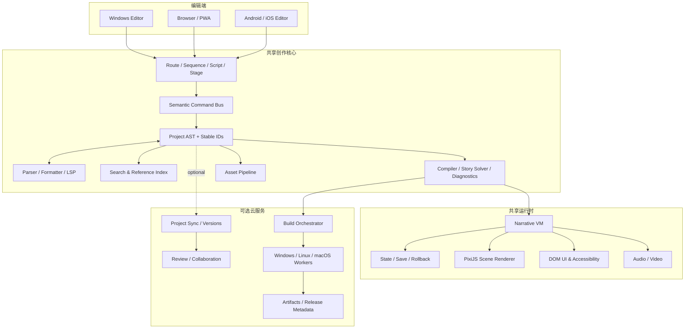
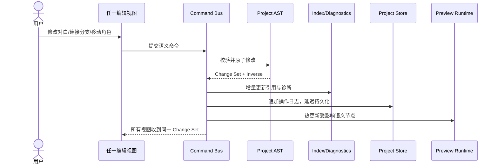
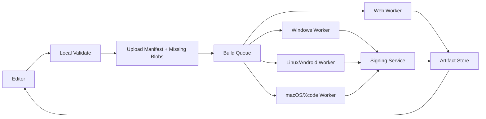

# 技术架构

> 本文定义总体技术方向；模块依赖、协议、事务、状态机和云构建边界见[程序工程详细设计](13-program-engineering-blueprint.md)。具体技术选型仍须通过 S0 Spike，不代表已经开始实现。
>
> 已确认的 M1 边界：无账户、无云同步、无云构建；Windows 与 Android 编辑，Windows 本地发布 Web、Windows、Android。云端章节是未来设计储备，不进入当前实施。

## 1. 架构目标

1. M1 同一工程在 Windows、浏览器和 Android 编辑端具有一致语义；未来 iOS 接入时不得分叉工程格式。
2. 编辑器、编译器、运行时和平台包装解耦。
3. 工程在无账户、离线、没有云服务时仍可编辑，并由 Windows 本地发布 Web、Windows 和 Android。
4. 四种编辑视图只能通过统一语义命令修改 AST。
5. 运行时必须确定、可回放、可保存、可回滚。
6. 平台差异收敛在 Capability Adapter 和 Build Adapter。
7. 插件与不可信工程内容不能取得无限本机权限。

## 2. 总体架构

## 3. 分层设计

### 3.1 Presentation

负责 Route、Sequence、Script、Stage、资源、本地化、QA 和构建界面。

约束：

- 不直接修改磁盘文件；
- 不保存独立的“节点图数据副本”；
- 所有修改发出语义命令，例如 RenameCharacter、InsertDialogue、ConnectChoice；
- UI 状态（选中项、面板位置、缩放）与项目语义分开保存。

### 3.2 Application

包含：

- 命令执行与撤销/重做；
- 工作区、选择和上下文同步；
- 自动保存、快照和恢复；
- 平台能力抽象；
- 同步、构建和插件编排。

### 3.3 Domain

包含：

- Project AST；
- 稳定 ID；
- 场景、语句、资源、变量、函数和 UI 组件模型；
- 引用解析；
- 诊断规则；
- 项目迁移；
- 运行时语义定义。

Domain 层不能依赖浏览器、Electron、Capacitor 或具体 UI 框架。

### 3.4 Infrastructure

包含：

- 文件系统与 OPFS；
- SQLite/索引缓存；
- 云对象存储；
- 平台壳；
- 构建节点；
- 崩溃与性能遥测。

## 4. 技术基线（提案，需 Spike 验证）

| 领域 | 首选方案 | 原因 | 备选/风险 |
|---|---|---|---|
| 语言 | TypeScript；平台敏感部分 Rust/Swift/Kotlin | 编辑器与 Web 运行时共享类型和编译器 | 需要限制共享包依赖 DOM |
| 前端 | React + TypeScript | 编辑器生态、复杂状态和组件资源成熟 | 与 Svelte 做 10k 节点和移动内存对比 |
| 文本编辑 | CodeMirror 6 + 自研语言服务 | 移动友好、模块化、可嵌入 | Monaco 桌面能力强但移动负担更重 |
| 路线图 | 虚拟化图层；原型可用 React Flow | 快速验证交互 | 10k 节点需局部加载或自研渲染 |
| 舞台渲染 | PixiJS WebGL/WebGPU + DOM UI | 2D 演出跨 WebView；DOM 更适合 CJK/无障碍 | WebGPU 不能作为首发唯一后端 |
| 音频/视频 | Web Audio + HTML Media，平台桥补充 | 跨端一致、易于 Web 发布 | 后台音频、解码格式需逐平台处理 |
| Windows 编辑器 | Electron 作为稳定基线 | Chromium/Node/自动更新和开发工具成熟 | 体积与内存较高；同时评估 Tauri v2 |
| 移动编辑器 | Capacitor 壳 + 同一 Web UI | 官方支持 iOS/Android/PWA 与原生插件 | 大文件、后台任务和键盘需实机验证 |
| 浏览器编辑 | PWA + File System API/OPFS | 零安装、跨设备、离线 | Safari 文件 API 能力差异 |
| Windows 玩家 | Tauri/WebView2 轻量壳 | 比把 Electron 随每个游戏发布更轻 | 需要工具链和 WebView 兼容测试 |
| 移动玩家 | Capacitor Build Adapter | 移动生态与签名流程成熟 | iOS 仍必须走 Xcode/macOS |
| 本地索引 | SQLite；浏览器使用 OPFS/WASM 适配 | 搜索、引用和缓存，不作为源文件 | 必须可安全重建 |
| 云构建（未来储备） | 队列 + 隔离 Windows/Linux/macOS Worker | 将来可支持任意设备发起目标构建 | 不属于 M1；账户、成本、签名和治理均暂不实施 |

依据：

- [Capacitor](https://capacitorjs.com/docs)以 Web 为中心并支持 iOS、Android 与 PWA。
- [PixiJS](https://pixijs.download/dev/docs/rendering.html)提供 WebGL/WebGL2、WebGPU 和 Canvas 2D 渲染路径。
- [File System API/OPFS](https://developer.mozilla.org/en-US/docs/Web/API/File_System_API)可支撑浏览器文件访问与高性能私有存储；权限和配额必须显式处理。
- Construct 3 已公开其[使用 File System Access API 取代桌面文件层的实践](https://developer.chrome.com/blog/how-construct3-uses-the-file-system-access-api)。
- [GitHub Actions](https://github.com/features/actions)等系统证明 Windows、Linux、macOS 隔离构建矩阵可行。
- iOS 产物依赖 Xcode，且 [Xcode 具有明确的 macOS 系统要求](https://developer.apple.com/xcode/system-requirements)，所以手机本地不能直接完成 iOS/Windows 全目标编译。

## 5. 编辑器数据流

### 5.1 为什么必须有 Command Bus

- 撤销/重做不依赖 UI 组件；
- 协作可传递语义操作，而不是整文件覆盖；
- 自动保存可以先记录小操作，再批量序列化；
- 插件命令可以加入权限、验证和审计；
- 语义 Diff 能描述“角色改名”，而非大量字符串变化。

## 6. Parser、Compiler 与 IR

### 6.1 Parser

- 容错增量解析；
- 保留注释、未知插件命令和格式必要信息；
- 为每个语义节点生成源范围和稳定 ID；
- 外部文件变化后产出 AST Diff；
- 不完整输入只影响局部，不阻断整个项目。

### 6.2 Compiler

阶段：

1. Schema 与引用解析；
2. 类型和命令参数检查；
3. 控制流图与版本化 Story Graph 生成；
4. 资源依赖、Gallery/Replay/Music/Ending Catalog 收集；
5. Story QA；
6. 优化与运行时 IR；
7. Source Map 和构建清单。

### 6.3 Runtime IR

要求：

- 与编辑器 UI 无关；
- 版本化且可迁移；
- 命令使用稳定整数/字符串 Opcode；
- 资源引用按内容/资源 ID，不使用绝对路径；
- 包含 Source Map 以回到场景和语句；
- Debug 产物保留丰富诊断，Release 可裁剪。

## 7. 运行时

### 7.1 Narrative VM

> CL-04 的最小 IR、Runtime State、Effect、History、Save 和 State Hash 证据门见[《CL-04 Narrative VM 确定性证据契约》](64-cl04-narrative-vm-evidence-contract.md)；本节为架构摘要。

采用确定性指令机：

- 输入：编译后的场景、用户选择、时间和平台事件；
- 输出：状态变化、画面命令、音频命令和 UI 请求；
- 不允许命令直接任意修改全局对象；
- 随机数使用可保存种子；
- 异步命令具有取消、等待和恢复语义。

### 7.2 保存与回滚

保存文件记录：

- project build ID；
- save schema 版本；
- 当前语句稳定 ID；
- 调用栈；
- 变量与自定义状态；
- 场景可见对象；
- 音频状态；
- 已读文本集合；
- 随机种子；
- 插件状态版本。

回滚与前进以“Story Step 检查点 + 双向命令日志 + 确定性重放”实现，不在每帧复制完整状态：

- 每句对白、选择、场景跳转和显式检查点拥有稳定 `stepId`；
- 后退恢复剧情变量、调用栈、画面、音频、随机种子和异步命令状态；
- 前进只沿已记录历史恢复；用户产生新选择/输入后截断旧的前进分支；
- 已读、CG/结局解锁等持久元状态默认不因剧情回滚撤销，但由项目策略控制；
- 插件命令必须声明 `pure`、`reversible` 或 `barrier`，不能静默越过不可逆副作用；
- Debugger 与玩家 Runtime 共享状态机制，但调试器可以按每条 Opcode 单步。

### 7.3 渲染

- PixiJS：背景、角色、CG、滤镜、粒子和过渡。
- DOM：对白、选项、设置、存档、历史和可访问性节点。
- CSS/设计 Token：主题和响应式 UI。
- 平台适配：安全区、横竖屏、输入、字体和媒体格式。

混合渲染需要统一层级、截图、缩放和输入命中规则，必须在 Spike 中验证。

### 7.4 派生资源优化流水线

源素材先进入不可变内容寻址层，再由构建 Profile 生成可删除派生产物：

1. 分析尺寸、Alpha、色彩空间、标签、引用范围和相似度；
2. 按角色、CG、章节和同时加载范围形成候选组；
3. 多 Cell Size 试切，使用标准化像素哈希合并完全相同块并省略透明块；
4. 打包 Atlas 和重建 Manifest，计算 Padding、Draw Call、加载组和平台纹理成本；
5. 与原图/常规编码比较发布体积和内存，仅在超过收益门槛时采用；
6. 对无损模式进行逐像素重建验证，有损 Profile 进行差异图、感知指标和真机验证；
7. 以输入哈希、算法版本和 Profile 参数缓存，源图变化时只重建受影响组。

Runtime 资源加载器理解普通图片与 Dicing/Delta Manifest，但剧情始终只引用稳定 asset ID，不感知具体压缩形式。

## 8. 本地存储

### 8.1 Windows

- 源工程保存在用户可见目录；
- 自动保存写操作日志，短间隔原子落盘；
- 大资源不写进项目数据库；
- SQLite 只保存可重建索引、缩略图状态和本地缓存。

### 8.2 浏览器/PWA

- OPFS 保存工作副本和索引；
- 用户授权后同步到选定目录；
- 显示配额、持久化权限和备份状态；
- 清理站点数据前提供风险提示和导出入口。

### 8.3 移动端

- 应用沙箱保存工程；
- 通过系统 Document Picker 导入/导出；
- 相册/相机/录音需逐项权限；
- 大文件分块复制并可恢复；
- 后台上传遵循平台任务限制。

## 9. 同步与协作

### 9.1 第一阶段：版本化同步

- 工程由 Manifest、场景文本和内容寻址资源组成；
- 客户端计算变化清单，只上传变更文件/资源；
- 服务器生成不可变版本；
- 同场景冲突进入语义合并界面；
- 离线操作保持本地，联网后再同步。

### 9.2 第二阶段：实时协作

- 文本使用 CRDT；
- 结构化内容使用稳定 ID + 有序集合操作；
- 角色/资源元数据使用字段级合并；
- Stage 高频拖动只广播临时 Presence，松手后提交语义值；
- 删除与编辑并发时保留可恢复 Tombstone；
- 发布版本必须冻结到一致快照。

不在 M1 直接实现全量 CRDT，先证明文件格式和语义命令可支持。

## 10. 云构建

### 10.1 构建任务

每个任务固定：

- 项目版本；
- 编译器/运行时版本；
- 平台模板版本；
- 依赖锁文件；
- 构建 Profile；
- 签名配置引用；
- 资源处理配置。

### 10.2 签名安全

- 凭据单独加密保管，构建任务只得到短期访问令牌；
- Worker 为一次性环境，完成后销毁；
- 日志自动脱敏；
- 用户可选择不托管证书，每次临时上传；
- 支持密钥轮换、撤销和审计；
- 产物提供哈希、SBOM 和构建证明。

### 10.3 失败恢复

- 构建分阶段缓存；
- 相同输入跳过已完成阶段；
- 平台工具错误翻译为可操作建议；
- 原始日志可下载；
- 构建服务版本升级前运行模板项目矩阵。

## 11. 插件架构

### 11.1 插件类型

- Editor：面板、命令、Inspector 控件；
- Compiler：语法、验证、IR 转换；
- Runtime：命令处理器、系统服务；
- Asset：导入、转换、预览；
- Build：平台导出和发布；
- Integration：翻译、网盘、版本控制。

### 11.2 权限模型

权限示例：

- project.read / project.write；
- filesystem.scoped；
- network.domains；
- process.spawn（高风险，仅桌面受信插件）；
- build.credentials（默认禁止）；
- runtime.native。

默认插件运行在 Worker/隔离上下文；原生插件必须签名并明确提示。

### 11.3 Live2D/Spine

它们采用独立适配插件：

- Core 不捆绑专有 SDK；
- 用户按官方许可安装；
- 工程记录插件依赖和版本；
- 构建节点只在授权条件满足时注入 SDK；
- 不承诺规避任何出版或运行时许可。

## 12. 安全边界

工程、资源、插件和云构建输入均视为不可信：

- 防止 Zip Slip、路径穿越和符号链接逃逸；
- 限制压缩包展开大小、图片尺寸和媒体时长；
- 禁止预览 HTML/脚本获得编辑器同源权限；
- 对 SVG、字体、视频和着色器进行验证；
- 项目脚本默认无任意网络和文件权限；
- 插件依赖锁定并生成 SBOM；
- 构建 Worker 禁止访问其他用户任务；
- 云端资源加密、可删除、有保留期限。

## 13. 性能预算

> 2026-08-12：本节摘要由[《CL-01 目标设备矩阵与预算冻结》](62-cl01-target-device-budget.md)具体化；冲突时以后者的设备分档、采样和软/硬预算为准。

| 场景 | 目标 |
|---|---|
| 冷启动到可编辑 | Windows < 4 s；中端手机 < 6 s |
| 打开 10 万字项目 | < 3 s 后可输入，其余索引后台完成 |
| 输入到可见反馈 | P95 < 100 ms |
| 输入到完整诊断更新 | P95 < 150 ms |
| 视图间语义同步 | P95 < 300 ms |
| 全局搜索首屏 | < 300 ms |
| 路线图 | 只渲染视口/当前层级；不一次加载全项目 |
| 自动保存 | 不阻塞输入超过 16 ms |
| 预览热更新 | 普通对白/参数 < 500 ms |
| 移动内存 | AND-L 编辑器 300 MB PSS 软预算 / 450 MB 硬预算；玩家 220/320 MB |
| Web 首屏玩家包 | 核心运行时压缩后目标 < 2 MB，不含作品资源 |
| 已预载场景切换 | P95 < 300 ms |
| 冷资源场景切换 | P95 < 2 s，显示可解释进度 |
| Runtime 稳定性 | Stable crash-free sessions ≥ 99.8% |
| 长时间运行 | 2 小时 0 崩溃、0 OOM、无持续内存增长 |

## 14. 必做技术 Spike

开发承诺前完成：

1. 10,000 场景 Route Map 的局部渲染和搜索；
2. 100,000 行脚本增量解析、格式化和双向编辑；
3. Android 中端机的键盘、拖拽、文件导入和内存；
4. PixiJS + DOM 混合缩放、截图和输入；
5. 保存/回滚跨 Web、Windows、Android 一致性；
6. Electron 与 Tauri v2 的启动、内存、文件和自动更新比较；
7. Capacitor 大工程导入/导出与后台上传；
8. Windows 本地 Web/Windows/Android 最小构建链；另行验证 Android 端直接生成 APK/AAB 的可行性；
9. 插件 Worker 沙箱和未知命令往返保存；
10. OPFS 配额、崩溃恢复和用户目录同步；
11. PNG/JPEG/WebP/AVIF 与 KTX2/Basis/平台纹理的体积、画质、解码和显存对比；
12. Dicing/Atlas 的并发解码、GPU 上传、显式释放和低内存降级；
13. 内容哈希分包、断点续传、损坏包、原子切换与旧包回退；
14. 语言字体子集、语音包、视频 Profile 和缺失回退；
15. Benchmark Episode 的 2 小时 Soak 与前后台/音频设备恢复。

Spike 失败时优先修改技术方案，不修改产品承诺来掩盖问题。
