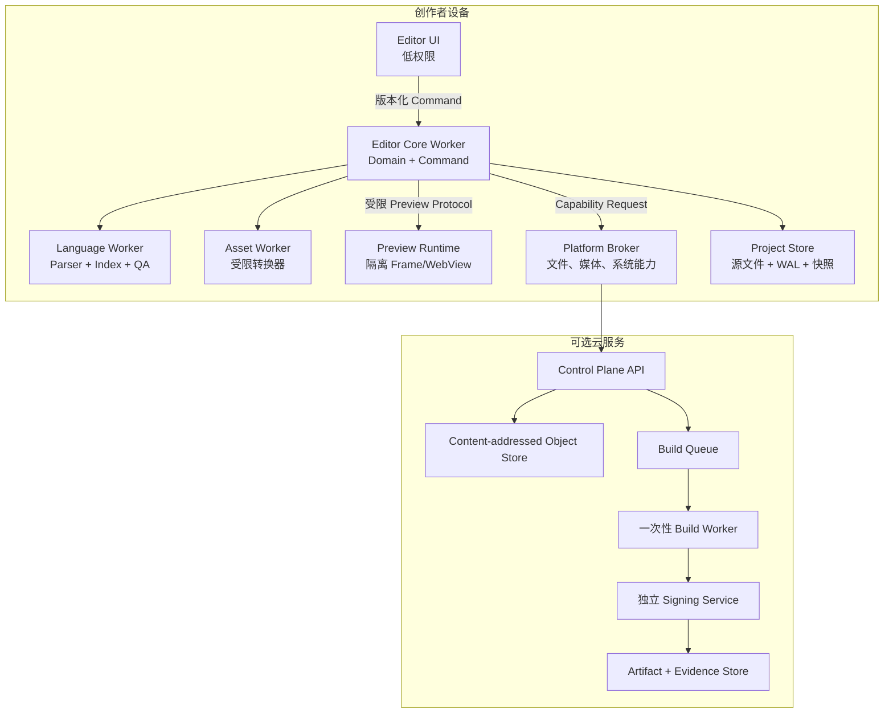
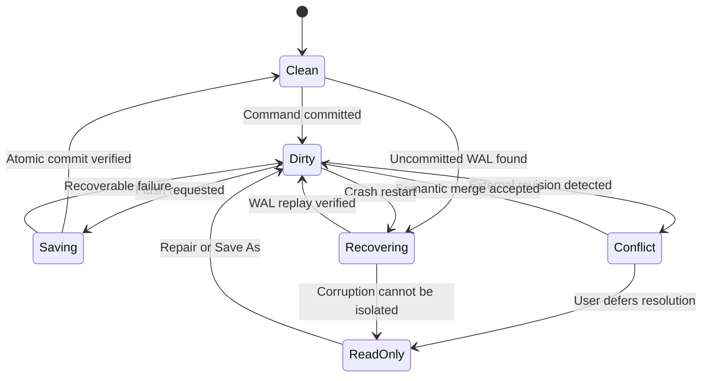
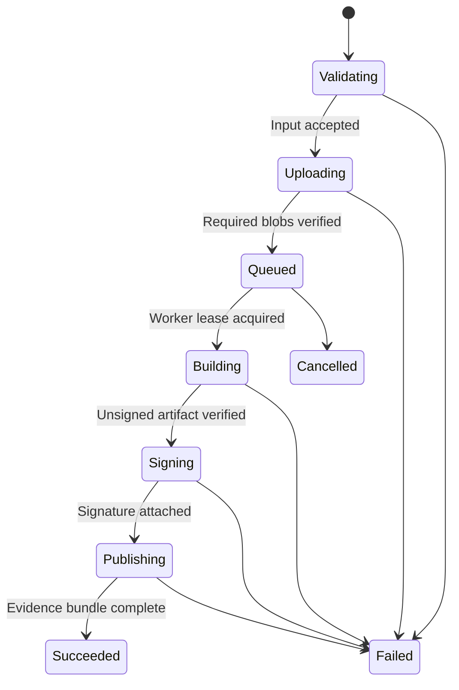

# 程序工程详细设计（开发前蓝图）

> 状态：D0 工程设计草案，不代表已经开始开发。
>
> 冻结条件：D1 交互验证与 S0 技术 Spike 通过，并由产品负责人明确批准。
> 目的：把产品能力翻译为模块边界、数据契约、状态机、失败语义和可验证约束。

## 1. 规范语言与设计原则

本文中的“必须”“禁止”“应当”“可以”分别对应 MUST、MUST NOT、SHOULD、MAY。关键规范在进入实现前必须转成机器可检查的 Schema、架构测试或验收测试，不能只留在文档里。

发生冲突时按以下顺序决策：

1. 用户源工程与存档不丢失；
2. 剧情语义、保存、回滚和跨平台结果正确；
3. 权限、隔离、签名与隐私安全；
4. 构建和运行可复现、可诊断；
5. 编辑效率与无障碍；
6. 性能、容量和视觉表现；
7. 开发便利性。

不能为了动画效果、缓存命中、代码简短或赶进度破坏更高优先级约束。

## 2. 质量属性与工程不变量

| 属性 | 工程不变量 | 证明方式 |
|---|---|---|
| 数据安全 | 唯一源工程不被派生任务覆盖；写入失败保留最后有效版本 | 故障注入、恢复测试、快照校验 |
| 语义一致 | Route、Sequence、Script、Stage 不能形成各自的数据真相 | Command 契约、Round-trip、跨视图属性测试 |
| 确定性 | 相同 IR、输入、种子、能力集得到相同剧情状态 | 重放哈希、跨平台测试向量 |
| 兼容性 | 工程、IR、存档、插件、构建模板分别版本化 | N-2/N-1 迁移矩阵与旧包回归 |
| 可恢复 | 崩溃、断电、磁盘不足、弱网和 Worker 退出均有明确恢复状态 | Fault Injection 与演练记录 |
| 隔离 | 工程、预览、插件、转换器、构建任务均按不可信输入处理 | 威胁模型、沙箱逃逸测试、权限审计 |
| 可观测 | 一次编辑、保存、构建和发布可用相关 ID 贯穿定位 | Trace、结构化事件、支持包 |
| 可移植 | Domain、Compiler、VM 不依赖 DOM、Node、具体壳或云服务 | 包依赖图和架构测试 |
| 性能 | 预算是接口契约，不是上线前才检查的优化项 | 基准、P95/P99、内存曲线和回归门禁 |
| 可访问 | 完整、简化、减少动效具有同等功能结果 | WCAG 2.2 AA、键盘和辅助技术实测 |

## 3. 运行单元与信任边界



边界要求：

- UI 不直接读写工程文件，不掌握云构建密钥；
- Preview 与编辑器不同源或使用等价隔离，禁止访问编辑器对象和任意本机 API；
- Parser、索引、图片分析和第三方转换器不在 UI 主线程运行；
- Platform Broker 只接受声明式、可审计、最小权限请求；
- 云端 Control Plane 不直接持有平台签名私钥；
- 每个构建任务使用独立工作目录、独立身份、资源限额和到期清理策略；
- 本地编辑路径不依赖云服务可用性。

## 4. 代码库逻辑分区提案

下表是未来代码库的逻辑边界，不是本阶段要创建的目录。

| 分区 | 职责 | 允许依赖 | 禁止依赖 |
|---|---|---|---|
| `domain-model` | 项目实体、稳定 ID、值对象、不变量 | 基础类型 | UI、DOM、文件、网络 |
| `command-kernel` | 命令、事务、ChangeSet、Undo/Redo | domain-model | 具体视图和平台壳 |
| `story-language` | Lexer、Parser、Formatter、Source Map、LSP | domain-model | React、运行时渲染 |
| `story-compiler` | 引用、CFG、Story QA、Catalog、Runtime IR | domain-model、story-language | 编辑器 UI |
| `runtime-vm` | 确定性执行、状态、回滚、前进、存档 | IR/协议类型 | DOM、云 API、编辑器状态 |
| `runtime-presentation` | 画面、DOM UI、音频、输入、动效 | runtime-vm 输出协议 | 源工程与编辑器内部类型 |
| `asset-pipeline` | 分析、Dicing、转码、Atlas、Manifest | 资源契约、平台能力 | 修改唯一源素材 |
| `project-store` | WAL、快照、原子写、恢复、迁移编排 | domain/协议 | 业务 UI |
| `platform-api` | 文件、权限、生命周期、系统能力抽象 | 版本化协议 | Domain 反向依赖 |
| `plugin-sdk` | Manifest、权限、扩展点、兼容适配 | 公共契约 | 内部未稳定实现 |
| `build-protocol` | 构建请求、状态、产物和证明 | 公共 Schema | UI 组件 |
| `telemetry-schema` | 事件、指标、Trace 和脱敏规则 | 基础类型 | 剧情内容 |
| `test-kits` | Golden Project、测试向量、故障注入 | 公共契约 | 正式运行路径反向依赖 |

架构检查必须自动验证：

- Domain 不得导入浏览器、Node、Electron、Capacitor、Tauri 或云 SDK；
- Runtime 不得导入编辑器包；
- 公共包不得读取未声明环境变量；
- 包之间禁止循环依赖；
- 任何跨进程消息必须来自版本化协议包；
- 任何平台专用实现必须位于 Adapter/Broker 边界；
- 测试辅助代码不得进入 Release 依赖图。

## 5. 数据真相与派生层

| 层 | 是否权威 | 是否可删除重建 | 说明 |
|---|---|---|---|
| 源工程 | 是 | 否 | 人类可读脚本、清单、配置和源素材 |
| Canonical AST | 会话内权威 | 可从源工程重建 | 所有编辑视图共享的语义模型 |
| Operation Log/WAL | 恢复权威 | 提交后可压缩 | 未完全落盘命令与事务记录 |
| Reference Index | 否 | 是 | 搜索、引用、诊断缓存 |
| Runtime IR | 否 | 是 | 编译器生成、面向运行时 |
| Asset Derivatives | 否 | 是 | 缩略图、代理、Atlas、转码、Dicing |
| Runtime Save | 玩家进度权威 | 否 | 与源工程分离，按 Save Schema 迁移 |
| Telemetry | 否 | 不用于恢复 | 禁止作为业务状态真相 |

核心规则：

- 图形视图不能保存额外语义副本；布局信息只保存坐标、折叠和视口等非语义数据；
- Asset ID 与文件路径分离，移动文件不改变剧情引用；
- 用户可见名称不是主键；角色改名必须是语义重构；
- 派生对象记录输入哈希、算法版本、参数、工具链和输出哈希；
- 缓存损坏只能导致重建或性能下降，不能改变项目内容；
- 运行时存档不得包含绝对本机路径或编辑器私有对象。

## 6. 稳定 ID 与版本标识

每类标识用途必须单一：

| 标识 | 生命周期 | 用途 |
|---|---|---|
| `projectId` | 项目创建到显式克隆 | 项目身份 |
| `entityId` | 实体创建到删除 | 角色、场景、变量、资源等引用 |
| `statementId` | 语义语句生命周期 | 本地化、配音、历史、断点和 Source Map |
| `stepId` | 编译后可回滚步骤 | 玩家前进/后退和 Debugger |
| `revisionId` | 每次已提交项目版本 | 乐观并发、同步和构建输入 |
| `buildId` | 每次构建 | 存档兼容、诊断和产物追踪 |
| `artifactDigest` | 内容不变时稳定 | 下载、缓存、签名和校验 |
| `commandId` | 一次用户意图 | 幂等、撤销、审计和重试 |
| `correlationId` | 一次跨组件操作 | 日志、Trace 与支持包关联 |

复制语句时生成新 `statementId`；移动、格式化和重命名不改变 ID。删除使用 Tombstone 保留迁移和合并所需最小信息，保留期结束后再压缩。

## 7. 统一命令与事务契约

所有语义修改均使用版本化命令信封：

```json
{
  "schemaVersion": 1,
  "commandId": "cmd_...",
  "projectId": "prj_...",
  "baseRevision": "rev_...",
  "actor": { "kind": "user", "id": "local" },
  "kind": "story.insertDialogue",
  "payload": {},
  "clientTime": "仅用于展示，不参与确定性排序"
}
```

命令处理结果必须包含：

- `acceptedRevision`；
- 原子 `changeSet`；
- 可撤销时的语义逆操作或恢复材料；
- 受影响实体、文件、索引和预览范围；
- 新增/消失诊断；
- 是否需要完整重编译、资源重建或保存；
- 安全审计标签和性能测量标签。

事务规则：

1. 校验 Schema、权限、`baseRevision` 与领域前置条件；
2. 在内存副本上计算 ChangeSet；
3. 验证所有领域不变量；
4. 追加 WAL；
5. 一次提交 AST Revision；
6. 异步更新索引、预览和派生资源；
7. 按批次原子序列化源文件；
8. 持久化成功后推进可压缩检查点。

任一步失败都必须返回稳定错误码，不得只返回自由文本或静默忽略。

## 8. 错误模型

错误分为：

- `validation`：用户输入或工程不满足约束；
- `conflict`：基准版本过期、外部修改或同步冲突；
- `capability`：设备/平台不支持；
- `resource`：内存、磁盘、配额、网络或超时；
- `security`：权限、签名、隔离或完整性失败；
- `compatibility`：Schema、Runtime、Plugin 或 Save 版本不兼容；
- `internal`：不变量被破坏，必须生成诊断 ID；
- `cancelled`：用户或生命周期取消，不显示为系统故障。

跨进程和云 API 错误采用统一 Problem 契约，可映射到 [RFC 9457](https://www.rfc-editor.org/rfc/rfc9457.html)：

- 稳定 `type/code`；
- 面向用户的本地化 `title`；
- 不泄露路径、密钥、堆栈和剧情的安全 `detail`；
- `retryable`、`retryAfter` 和 `recoveryActions`；
- `correlationId` 与安全的诊断附件引用；
- 机器可定位的字段/实体/Source Range。

## 9. 保存、自动保存与恢复状态机



实现约束：

- 单项目同一 Revision 只有一个语义写入者；其他视图和 Worker 提交命令，不直接写文件；
- 写入使用临时文件、校验、原子替换；平台不保证原子替换时必须采用双槽/版本指针；
- WAL 记录命令 Schema、校验和、前后 Revision，不记录无法重放的闭包或对象地址；
- 恢复先复制证据，再在隔离工作副本重放，不在原文件上试修；
- 磁盘不足时停止创建新派生物并保护最后有效快照；
- 浏览器关闭、移动端挂起和系统杀进程必须进入同一恢复协议；
- 每次迁移前创建快照，迁移后重新打开并执行语义校验才算成功；
- “保存成功”必须表示可重新读取，不只是写系统调用返回成功。

## 10. 外部文件变化与多端并发

- 文件监听事件只是“需要复查”的提示，不能作为唯一变更来源；
- 通过内容哈希和 Revision 判断真实变化，避免重复/乱序监听事件；
- 未保存本地修改与外部修改并存时不得自动覆盖；
- 文本可做稳定 ID 辅助的三方合并，结构变更进入语义冲突界面；
- 同一 `commandId` 重试必须幂等；
- 云同步以不可变 Revision 为提交单元，上传 Blob 与发布 Revision 分离；
- 实时协作前先证明离线日志可重放、操作可重排、删除可恢复；
- Undo 在多人模式中表达“撤销我的意图”，不是把整个项目回退到旧快照。

## 11. Parser、Compiler 与增量构建

编译管线固定为：

```mermaid
flowchart LR
    Source["Source + Manifest"] --> Parse["Parse CST/AST"]
    Parse --> Resolve["ID / Reference Resolve"]
    Resolve --> Type["Schema / Type / Capability Check"]
    Type --> Graph["CFG + Story Graph"]
    Graph --> Catalog["Gallery / Replay / Music / Ending"]
    Catalog --> QA["Story Solver + Diagnostics"]
    QA --> Lower["Lower to Runtime IR"]
    Lower --> Optimize["Safe IR Optimization"]
    Optimize --> Emit["IR + Source Map + Asset Manifest"]
```



每阶段必须定义：输入 Schema、输出 Schema、确定性规则、可缓存键、诊断代码、失败是否阻断、性能预算和测试向量。

增量规则：

- 缓存键至少包含输入内容哈希、编译器版本、插件集合、能力 Profile 与选项；
- 修改一条对白不得使无关章节失效；
- 影响全局变量、命令定义或插件语义时必须显式扩大失效范围；
- 并行阶段只能并行处理无顺序依赖的纯任务；
- 输出排序固定，时间戳、路径和线程完成顺序不得影响语义产物；
- Debug 与 Release 必须共享语义，只能在 Source Map、诊断和安全裁剪上不同；
- 编译器崩溃时保留最后成功预览，并清晰标记“预览不是最新版本”。

## 12. Narrative VM 与副作用调度

VM 核心保持单线程逻辑顺序；资源加载、解码和平台调用可并行，但必须通过版本化 Effect 返回。

每个 Story Step 执行：

1. 读取不可变 IR 指令与当前 State；
2. 生成新的 State、Effect 列表和可选检查点；
3. Effect Scheduler 按通道、优先级和取消域执行；
4. 返回结果时校验 `executionId`、`stepId` 与 State Revision；
5. 过期结果被丢弃或安全回收，不修改新状态；
6. 所有可见结果完成后进入下一等待点。

时间、随机和平台事件必须抽象：

- 游戏时钟、动画时钟与真实墙钟分离；
- 随机数只来自可保存种子；
- 快进可以压缩表现时间，不能跳过状态变更；
- 后退恢复状态与演出检查点，前进只恢复已记录历史；
- 玩家改选后截断旧前进分支；
- `pure` 插件可重放，`reversible` 插件提供逆操作，`barrier` 插件阻止越过；
- 外部购买、网络发布、系统通知等不可逆副作用禁止成为普通剧情命令。

## 13. 渲染与预览一致性

Runtime VM 只发出声明式表现命令；Renderer 不得反向修改剧情变量。

- Stage Preview 与玩家包使用同一 VM、布局引擎、动效定义和资源 Manifest；
- 编辑器 Overlay、选框和辅助线属于 Debug Layer，不进入玩家产物；
- Pixi/WebGL/WebGPU 与 DOM UI 使用统一坐标、缩放、层级和输入命中协议；
- Capability Adapter 报告纹理、音频、视频、字体和 GPU 能力，禁止使用 User-Agent 猜测作为唯一依据；
- 资源未就绪时使用明确 Placeholder/等待状态，不允许随机黑屏；
- 截图、画廊缩略图和视觉回归必须指定色彩空间、DPR、字体和渲染后端；
- 完整、简化、减少动效只改变表现路径，不改变命令结果与可操作性。

## 14. 资源处理 DAG

每项处理是内容寻址的纯任务：

```text
Source Blob -> Inspect -> Normalize Metadata -> Candidate Analysis
            -> Transform Variant -> Verify -> Package -> Manifest
```

约束：

- Source Blob 只读；方向、色彩空间、Alpha 和采样率先标准化描述，不静默重写；
- 转换工具在受限进程/Worker 中运行，限制 CPU、内存、时间、输出数和展开体积；
- Dicing/Delta 输出必须记录 Cell、Padding、Atlas、重建坐标和引用组；
- 无损 Profile 逐像素/逐样本验证；有损 Profile 保存差异指标与人工抽检结论；
- 输出收益同时比较下载、安装、解码峰值、GPU 内存、Draw Call 和首帧时间；
- 平台不支持的格式必须在构建前解析为确定回退，不在玩家设备上试错；
- 任何失败只使该候选方案失效，不损坏其他派生物或源文件；
- 工具链升级必须使相关缓存失效，并在 Golden Assets 上做差异审计。

## 15. 插件 ABI、权限与生命周期

插件包必须包含：

- 唯一 ID、版本、发布者和签名状态；
- `engineRange`、`apiVersion` 与所需能力；
- 权限列表、网络域、文件作用域和资源配额；
- Editor/Compiler/Runtime/Asset/Build 扩展点；
- Schema、迁移器、卸载行为和状态版本；
- 确定性、可回滚和离线兼容声明；
- 许可证与依赖 SBOM。

默认规则：

- 未签名插件可在开发沙箱试用，不能进入 Stable 构建；
- 插件只能通过 Capability API 工作，不暴露编辑器内部对象；
- 权限首次使用时解释目的，高风险权限逐项目授权；
- 网络默认拒绝，按域名与用途授权；
- 运行时插件不得动态下载并执行未知代码；
- 超时、崩溃和内存超限由宿主隔离，编辑器进入安全模式而非一起崩溃；
- 删除插件前执行依赖分析，未知命令以可读占位保留，不能静默丢弃；
- API 废弃至少经过 Preview 警告、迁移期和一个 Stable 大版本。

## 16. 平台能力协议

平台能力不是布尔散点，而是版本化描述：

- 文件：目录访问、原子替换、持久授权、最大对象、剩余配额；
- 计算：Worker、线程、SIMD、GPU 后端、后台任务时长；
- 媒体：可解码格式、硬件能力、音频焦点、录音与相册；
- UI：安全区、键盘、输入法、触控笔、横竖屏、多窗口；
- 分发：签名、安装包、分包、自动更新和商店限制；
- 安全：凭据存储、设备证明、Keychain/Keystore/Windows Credential；
- 无障碍：屏幕阅读器、减少动效、高对比、动态字体。

业务功能必须声明最低能力与回退。例如：不能进行本地视频转码时，可使用代理预览、排队云转换或保留原文件，禁止直接隐藏功能。

## 17. 云构建控制面与数据面

本节是未来架构储备。M1 已确认不建设账户或云构建，只实现 Windows 本地 Web/Windows/Android 构建链；本节不得被解释为当前开发范围。

构建状态机：



任务不可变输入包括：Source Revision、Compiler、Runtime、Build Template、锁文件、Profile、目标平台、插件集合和签名策略。

- 上传按 Blob 哈希去重，服务端再次计算哈希；
- Queue Lease 有到期、心跳和幂等接管，重复执行不得生成冲突发布；
- Worker 默认断开横向网络，只访问任务对象、固定依赖镜像和允许的构建服务；
- 用户构建脚本不接触签名服务凭据；
- Signing Service 只对满足策略、来源和 Artifact Digest 的请求签名；
- 日志、产物、SBOM、Provenance 和签名有独立保留期；
- 取消必须撤销 Lease、终止 Worker、删除临时密钥并保留最小审计记录；
- 失败产物不能进入可下载的正式通道。

## 18. 配置优先级与密钥规则

配置层级从低到高：产品默认、模板、项目、构建 Profile、平台、用户本机、一次会话。每个字段必须声明可覆盖层级和是否进入构建哈希。

- 剧情语义、资源处理和发布参数必须进入构建哈希；
- 面板位置、最近文件和主题等个人偏好不得污染项目语义；
- 密钥、证书、Token 只保存引用，不写入工程、日志、IR 或支持包；
- 环境变量只作为部署注入入口，必须有显式白名单和启动校验；
- 配置未知字段按兼容策略保留或拒绝，禁止悄悄丢弃；
- 所有默认值属于公共契约，改变默认语义需要迁移和 ADR。

## 19. 可观测性与隐私

采用与 OpenTelemetry 兼容的 Trace、Metric、Log 语义，但默认本地可诊断、云上传可关闭。

最小关联字段：

- `app.version`、`runtime.version`、`schema.version`；
- `platform`、`capability.profile`、匿名设备档位；
- `project.local_id_hash`，禁止项目名与路径；
- `revisionId`、`buildId`、`command.kind`、`correlationId`；
- 结果代码、耗时、队列时间、缓存命中和资源预算；
- 内容长度桶，不记录台词、变量值、资源名和用户媒体。

支持包必须先在本地展示清单，允许用户取消字段；崩溃转储进入独立敏感流程，设到期删除并进行密钥与内容扫描。

## 20. 兼容与演进

| 契约 | 兼容目标 | 破坏性变更要求 |
|---|---|---|
| Project Schema | Stable 至少支持 N-2 读取并迁移 | 迁移器、快照、Round-trip、降级说明 |
| Runtime IR | Editor 可生成多个受支持版本 | Capability 报告与重新构建路径 |
| Save Schema | 已发行作品按支持政策长期迁移 | 固定存档语料、跨版本重放 |
| Plugin API | 大版本内向后兼容 | 废弃期、适配层、市场兼容报告 |
| Build Protocol | 客户端/服务端滚动升级 | 双版本协商与幂等测试 |
| Telemetry Schema | 字段只增不改语义 | Schema URL、迁移和仪表盘校验 |

未知新字段默认保留；未知语义命令不能伪装成功。只读打开必须尽可能保住内容，为旧版或缺插件工程提供导出和诊断。

## 21. 设计产物与冻结顺序

进入产品编码前，按顺序冻结：

1. 质量属性优先级和不变量；
2. 进程/Worker/云服务信任边界；
3. Domain 包依赖规则；
4. 稳定 ID 与源工程 Schema；
5. Command、ChangeSet、Error、Capability 契约；
6. Parser/Compiler/IR 阶段契约；
7. VM Step、Effect、Save、Rollback 状态机；
8. Asset DAG 与验证契约；
9. Plugin Manifest、权限和沙箱；
10. Build Request、Artifact、SBOM、Provenance 与签名契约；
11. Telemetry Schema、隐私清单和支持包；
12. 兼容政策、弃用政策和恢复政策。

每项产物至少包含：Owner、ADR、Schema/状态图、正常流程、失败流程、安全假设、预算、测试向量、开放问题和批准记录。

## 22. S0 必须回答的工程问题

- React/Svelte 与路线图渲染方案能否满足 10k 节点局部编辑预算；
- CodeMirror 6 在 Android/iOS 输入法、选区、撤销和大文件下是否可靠；
- Electron 与 Tauri 的文件、更新、内存、插件隔离和调试成本；
- Pixi + DOM 在 DPR、截图、输入命中和动画中断时是否一致；
- OPFS、可见目录和移动沙箱是否能实现同一 WAL/恢复协议；
- Command + AST 的 Round-trip 能否保留注释、未知命令与稳定 ID；
- VM 的回滚/前进、异步取消和插件 Barrier 能否确定重放；
- Dicing/KTX2/平台纹理的体积收益是否抵消解码、显存和 Draw Call 成本；
- Worker/转换器沙箱能否处理恶意媒体与资源上限；
- M1 Web/Windows/Android 最小构建是否能输出完整 SBOM、Provenance、签名和可重复 Manifest；
- 构建和同步在重试、重复提交、乱序和中断下是否幂等；
- 最低档手机能否在预算内完成核心编辑、预览、保存和恢复。

S0 的结论必须是“采用、替代、推迟或取消”，并附测量数据；“以后再优化”不算结论。
