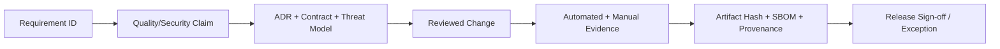

# 工程审计与质量保证体系

> 状态：开发前审计制度草案。
>
> 原则：没有证据的“完成”视为未完成；没有恢复演练的“安全”视为未证明。
> 范围：M1 编辑器、运行时、项目格式、资源管线、本地构建和发布产物；插件、账户、云构建与运营流程仅作为未来审计储备。

## 1. 审计目标

审计不是发布前集中找 Bug，而是持续回答六个问题：

1. 产品要求是否被准确翻译成工程契约？
2. 实现是否保持架构边界与核心不变量？
3. 测试是否覆盖真实失败、跨平台差异和恶意输入？
4. 发布产物能否追溯到已批准的源码、依赖和构建环境？
5. 出错后是否能保护工程、存档、密钥和上一稳定版本？
6. 所有“通过”结论是否有可重复、可归档的证据？

## 2. 标准基线与适用范围

| 基线 | WorLd Studio 用途 | 目标 |
|---|---|---|
| ISO/IEC 25010:2023 | 功能、性能、兼容、交互、可靠、安全、可维护等质量模型 | 建立统一质量分类，不宣称认证 |
| NIST SSDF 1.1 | 安全需求、开发环境、组件保护、漏洞响应 | 全生命周期映射；跟踪 1.2 草案但不作为稳定基线 |
| OWASP ASVS 5.0.0 | Web/PWA、账户、同步、构建 API 和控制面 | 云服务以 Level 2 为默认审计深度，高风险控制单独加强 |
| OWASP MASVS 2.1.0 | M1 Android 编辑器与玩家壳；未来 iOS | STORAGE、CRYPTO、AUTH、NETWORK、PLATFORM、CODE、PRIVACY 全覆盖 |
| OWASP TCASVS | Windows 桌面编辑器、更新器和本机集成 | 桌面权限、IPC、文件、更新、二进制与本地秘密审计 |
| WCAG 2.2 | 编辑器和 Web 玩家界面 | P0/P1 流程达到 AA；游戏表现的例外需单独说明 |
| SLSA 1.2 | 构建来源和防篡改 | M1 输出基础 Provenance；Build L2/L3 为未排期愿景 |
| SPDX 3 | 组件、许可证和 SBOM | 每个正式产物附机器可读 SBOM |
| TUF 原则 | 编辑器自动更新与资源包更新 | 阈值签名、回滚保护、密钥轮换和元数据过期 |
| OpenTelemetry | Trace、Metric、Log 与相关性 | 采用稳定语义，自定义字段有版本和隐私分级 |

这些标准提供检查框架，不替代 WorLd Studio 自身的剧情确定性、存档兼容、Dicing 重建和跨视图一致性测试。

## 3. Assurance Case：主张—论据—证据

每项重大质量结论用三层记录：

- **Claim**：要证明的主张，例如“崩溃不会损坏最后有效工程”；
- **Argument**：为什么设计能成立，例如 WAL、原子替换、校验和恢复状态机；
- **Evidence**：实际证据，例如 500 次故障注入、产物哈希、失败样本和恢复结果。

缺失任一环节时，审计面板显示“未证明”，不能显示绿色通过。

## 4. 变更风险分级

| 级别 | 例子 | 最低审计要求 |
|---|---|---|
| R0 文档 | 文字、链接、非规范示意 | 一人审阅、链接与格式校验 |
| R1 局部低风险 | 图标、无语义样式、隔离帮助文案 | 单元/视觉测试、无障碍抽检 |
| R2 功能 | 新面板、普通命令、非核心资源处理 | Owner 审阅、集成、跨视图和回归 |
| R3 核心/数据 | AST、Compiler、VM、Save、WAL、迁移、权限 | 两人审阅、ADR、属性/故障测试、平台矩阵 |
| R4 发布/密钥 | 签名、更新、构建隔离、生产迁移、安全边界 | 独立安全审阅、演练、双人批准、回退证明 |

变更风险由受影响的不变量决定，不由代码行数决定。一个默认值变化可能是 R3，一次大规模文档整理可能只是 R0。

自动升为 R3/R4 的条件：

- 改变持久化格式、稳定 ID、存档或迁移；
- 改变 Command 排序、回滚、随机、时间或异步语义；
- 扩大插件、文件、网络、进程或云权限；
- 改变签名、更新、发布、密钥或租户隔离；
- 改变资源无损/有损判断或删除策略；
- 绕过已有门禁、降低测试强度或扩大遥测数据范围。

## 5. 职责分离

| 角色 | 主要责任 | 不能单独完成的动作 |
|---|---|---|
| Feature Owner | 需求、设计、实现和自测 | 独自批准 R3/R4 |
| Domain Owner | 语义、Schema、VM 和兼容性 | 忽略产品验收 |
| QA Owner | 风险测试、矩阵和证据完整性 | 修改通过标准以迁就结果 |
| Security Owner | 威胁模型、权限、依赖、密钥和响应 | 独自接受业务数据损失风险 |
| Release Owner | 候选冻结、签名、发布和回退 | 在证据不完整时发布 Stable |
| Product Owner | 范围、风险接受和阶段准入 | 用产品优先级绕过安全/数据红线 |

早期人员不足时可以一人兼任多个角色，但 R4 的提交人与最终发布批准人必须分离；确实无法分离时只能发布 Preview，并记录显式风险。

## 6. 需求与设计审计

每个 P0/P1 能力必须具备：

- 唯一 Requirement ID；
- 用户结果和明确非目标；
- 正常、取消、失败、恢复与无权限流程；
- 数据分类和威胁边界；
- 性能、容量、可访问性与兼容预算；
- 受影响 Schema、命令、事件和状态机；
- 可自动验证的验收条件；
- 支持平台与能力回退；
- Owner、依赖、开放问题和批准记录。

设计审查拒绝以下表述：

- “支持大型项目”但没有规模、设备和延迟；
- “不会丢数据”但没有故障点与恢复验证；
- “安全沙箱”但没有权限和逃逸边界；
- “跨平台一致”但没有测试向量；
- “自动优化”但没有原始/输出、质量和内存对比；
- “兼容旧版”但没有版本范围和迁移语料；
- “已完成”但只有顺畅 Demo。

## 7. 架构审计

每次 R2 以上合并检查：

- 包依赖图无新增循环和反向依赖；
- Domain、Compiler、VM 无平台/UI 泄漏；
- 跨进程 API 有版本、Schema、超时、取消和错误语义；
- 新状态有唯一 Owner，不形成双写；
- 缓存与派生层可删除重建；
- 新后台任务有资源上限、优先级、取消和生命周期；
- 新权限有最小作用域、用户说明和撤销路径；
- 新默认值已判断是否改变项目/存档/构建语义；
- 新依赖有许可证、维护性、体积和供应链评估；
- ADR 记录被放弃方案和回退触发条件。

每个 Stable 大版本前生成一次架构快照：包图、进程图、信任边界、公共 API、数据存储、第三方组件和平台能力矩阵。

## 8. 代码审计规则

未来实现阶段启用以下基线：

- TypeScript `strict`；核心包禁止隐式 `any`，不安全类型断言需局部封装和测试；
- Rust `unsafe` 仅允许在小型隔离模块中使用，必须写出安全不变量并单独审阅；
- Swift/Kotlin 原生桥所有外部输入先校验，再进入共享协议；
- 公共函数描述失败、取消、幂等、线程/Worker 和所有权语义；
- 不吞异常，不用日志代替返回错误，不把用户错误报告成内部崩溃；
- 不在日志、异常、Telemetry、快照和测试附件中写剧情、路径、Token、证书或用户媒体；
- 不依赖未固定的系统时间、随机、目录遍历顺序和区域设置生成语义产物；
- 临时兼容分支必须带移除版本、Owner 和测试；
- 禁止无期限 TODO 绕过数据、安全、兼容和发布门禁；
- 自动生成代码必须可追溯到 Schema 与生成器版本，不接受手工改生成物。

审阅者必须检查行为与风险，而不是只检查格式。

## 9. 核心语义验证金字塔

### 9.1 单元与示例测试

- 每条命令的前置条件、ChangeSet 和逆操作；
- Parser/Formatter/Compiler 的规范示例；
- VM Opcode、Effect 与 Save 编解码；
- 每个诊断的正例、反例、Source Range 和修复建议；
- 每个平台 Capability 的允许、拒绝和回退。

### 9.2 属性测试

关键属性：

- `parse(format(parse(x)))` 语义等价；
- `apply(command); apply(inverse)` 恢复原语义状态；
- 同一 `commandId` 重试不重复产生副作用；
- 同一输入与构建环境生成相同 IR/Manifest；
- Save 编码后解码保持状态等价；
- Dicing 无损重建逐像素一致；
- 更换非语义布局不改变 Runtime IR；
- 未引用派生资源删除后重建结果一致。

### 9.3 模型测试

对以下状态机生成随机操作序列并验证不变量：

- 编辑、Undo、Redo、自动保存、崩溃和恢复；
- 运行、选择、快进、后退、前进、重新选择；
- 上传、排队、重试、取消、签名和发布；
- 同步、离线编辑、重连、冲突和语义合并；
- 安装、更新、中断、回退和密钥轮换。

### 9.4 Fuzz 与恶意语料

- 脚本、Manifest、IR、Save、插件包和协议消息；
- Zip、图片、SVG、字体、音频、视频和 Shader；
- 极深嵌套、循环引用、超长字符串、Unicode 边界和畸形编码；
- 截断、重复字段、未知版本、旧版本、乱序消息与超大声明；
- 目标：无崩溃、无越界、无失控内存/CPU、无目录逃逸、错误可定位。

### 9.5 差分测试

- Editor Preview 与 M1 Web/Windows/Android Player；未来平台加入后复用同一差分套件；
- Debug 与 Release VM；
- 增量与全量编译；
- 优化前与无损优化后；
- 迁移前旧版本读取与迁移后新版本读取；
- WebGL/WebGPU 或平台媒体回退；
- 本地构建与受控云构建 Manifest。

## 10. 覆盖率与变异测试

覆盖率只作为盲区指标，不作为质量结论。初始门槛在 S0 校准：

| 范围 | 语句/分支目标 | 变异测试目标 |
|---|---:|---:|
| Domain、Command、Parser、Compiler、VM、Store 纯核心 | ≥95% / ≥90% | 存活变异 ≤20% |
| 安全、迁移、签名策略和权限判断 | 关键分支 100% | 每个存活变异人工归因 |
| UI 与平台桥 | 不设虚假全局百分比 | 以任务、状态与设备矩阵为主 |

被排除代码必须有理由；生成代码、不可达平台分支和防御性崩溃路径分别统计。新增 R3 逻辑不能靠提高无关文件覆盖率通过。

## 11. 数据完整性与恢复审计

故障注入点至少包括：

- WAL 写前、写中、校验后、源文件替换前后；
- 多文件事务只完成一部分；
- 磁盘满、配额不足、只读、文件被占用和权限撤销；
- 进程/Worker 被强制终止、设备重启、移动端挂起；
- 重复/乱序文件监听事件和外部编辑；
- 云同步上传完成但 Revision 未发布，或反向情况；
- 迁移器崩溃、旧插件缺失、未知字段和损坏快照。

每个场景验证：

1. 最后有效工程仍可打开；
2. 未提交操作被恢复、隔离或明确列出，不能静默丢失；
3. 不产生两个都被称为“最新”的不可区分版本；
4. 恢复过程不修改原始证据；
5. 用户能选择继续、另存、导出诊断或回到快照；
6. 修复后能再次保存、关闭、重开并构建。

Stable 前必须完成一次从备份到可编辑、可预览、可构建的全链路恢复演练。

## 12. 剧情状态、存档与回滚审计

> S0 取证必须执行[《CL-04 Narrative VM 确定性证据契约》](64-cl04-narrative-vm-evidence-contract.md)的 VM-01–VM-15、生成序列和三宿主 Hash 门；编辑器撤销、工程备份或 Preview 播放测试不能替代。

固定测试向量包含：

- 选择、嵌套条件、循环、函数调用、随机和时间；
- 音频淡入淡出、视频、镜头、角色动画和可取消转场；
- 自动、已读跳过、全部快进、逐句后退与前进；
- `pure`、`reversible`、`barrier` 插件命令；
- 切换语言、语音包、章节包和显示模式；
- 后台/恢复、音频焦点、横竖屏和低内存回收。

每一步记录标准化 State Hash、可见对象、音频逻辑状态、调用栈、随机种子和解锁元状态。M1 Web/Windows/Android 的差异必须属于批准的表现容差，剧情 State Hash 必须一致。

旧存档策略：

- 每个 Stable 版本保留匿名固定存档语料；
- 新 Runtime 批量迁移并沿固定路线继续运行；
- 迁移失败保留原存档并生成可操作报告；
- 不允许以“重新开始游戏”作为一般兼容方案；
- 有意不兼容必须在发布前公告范围、原因、导出与补救路径。

## 13. 资源与容量审计

每个资源 Profile 归档：

- 源文件、派生文件、输入/输出哈希和工具链；
- 下载、安装、补丁、磁盘缓存、CPU 内存与 GPU 内存；
- 解码时间、首帧、场景切换、Draw Call 和耗电/发热抽样；
- 无损像素/样本验证或有损感知指标、差异图和人工结论；
- 采用/拒绝候选的收益阈值；
- 平台回退和低内存策略；
- 原始素材保留、回退和重新构建证明。

资源审计禁止只展示“压缩率”。若包更小但峰值内存、加载或画质越界，Optimization Center 必须标为回归。

## 14. 性能审计

### 14.1 测量方法

- 固定设备、系统、浏览器/WebView、分辨率、电源和温度范围；
- 区分冷启动、热启动、冷缓存、热缓存、首次 Shader/字体；
- 报告 P50/P95/P99、最大值、样本数和置信范围，不只报平均数；
- 单独记录主线程长任务、输入延迟、内存峰值、GPU 资源、GC 和后台队列；
- Benchmark 数据、工具版本和原始结果可归档重跑；
- 结果按提交、平台和 Profile 画趋势，防止慢性退化。

### 14.2 回归门禁

- 超出硬预算：阻止合并/发布；
- 相对批准基线恶化超过 10%：必须解释并批准；
- 指标改善但用户任务变慢：以端到端任务为准；
- 通过降低文本清晰度、关闭无障碍或跳过状态更新得到的性能不被接受；
- Flaky 性能结果先诊断环境，不能反复重跑直到绿色；
- 性能例外必须有设备范围、到期时间、Owner 和补救计划。

## 15. 可靠性与混沌测试

本地：Worker 崩溃、主线程卡顿、媒体解码失败、GPU Context Lost、低内存、磁盘不足、权限撤销、系统时钟跳变。

云端：队列重复投递、Lease 过期、Worker 消失、对象存储延迟/损坏、网络分区、依赖镜像缺失、签名服务拒绝、日志服务不可用、区域故障。

每个系统必须定义：

- 超时、重试、退避、抖动和最大尝试；
- 幂等键和重复结果处理；
- 熔断、降级和人工接管；
- 数据保留与补偿动作；
- 对用户显示的可玩/可编辑范围；
- 恢复时间目标和可接受数据损失目标；
- 故障解除后的自动一致性检查。

## 16. 安全审计

### 16.1 威胁建模

每个 R3/R4 功能按数据流图逐边界检查 STRIDE：身份伪造、篡改、抵赖、信息泄露、拒绝服务和权限提升，并增加隐私滥用、供应链和多租户混淆。

重点资产：

- 未发布剧情、图片、音频和配音；
- 本地工程、自动保存、云版本和玩家存档；
- 账户、分享链接、团队权限；
- 插件、依赖、构建模板和发布产物；
- M1 Windows/Android 签名凭据；未来加入 iOS 时扩展；
- Telemetry、崩溃转储和支持包。

### 16.2 自动安全门禁

- Secret Scan；
- SAST 与危险 API 规则；
- 依赖和容器漏洞扫描；
- 许可证与来源扫描；
- IaC/Workflow 权限扫描；
- 恶意包、路径穿越、解压炸弹和媒体 Fuzz；
- Web DAST、鉴权和租户隔离测试；
- M1 Android MASVS 检查；未来加入 iOS 时复用并扩展；
- Windows 桌面 IPC、更新与本地权限检查；
- 产物签名、SBOM 和 Provenance 验证。

### 16.3 人工安全验证

- M1 Stable 前完成一次独立的 Windows/Android、工程/媒体输入、本地构建、签名和更新/回退评估；无法做到职责独立时只能发布 Preview；
- M2 前对新增的 Web/API、插件、分包和云边界完成扩展评估；
- M3 长篇与四平台扩展门前完成桌面、插件、云构建、签名和更新链的完整渗透测试；
- 重大信任边界变更、关键漏洞或安全事故后重测相关范围；
- 修复必须做根因、变体搜索和回归测试，不能只堵一个样本。

## 17. 供应链与发布来源

依赖准入记录：维护活跃度、许可证、下载来源、签名/哈希、传递依赖、已知漏洞、替代方案、包体与运行权限。

发布要求：

- 锁定直接与传递依赖；CI Action/容器/工具链固定不可变摘要；
- 正式构建不从未批准网络动态取“最新版本”；
- 每个产物生成 SPDX SBOM；
- M1 生成基本 Provenance、SBOM、产物哈希和签名；SLSA Build L2/L3 留在未排期愿景池；
- 编辑器、运行时模板、插件索引和更新元数据分别签名；
- Sigstore 或平台等价机制用于可验证签名与身份审计；
- 关键产物进行第二环境重建或可复现性检查；
- 更新系统采用 TUF 类角色分离、元数据过期、回滚保护和密钥轮换；
- 撤销签名或发现恶意依赖时能阻断新安装并发布安全公告。

正式构建证据至少含：Source Revision、完整输入摘要、Builder Identity、Build Template、工具链、依赖、环境、Artifact Digest、SBOM、Provenance、签名和时间戳。

## 18. 隐私审计

建立数据清单：数据项、目的、来源、默认开关、保存位置、访问角色、加密、保留期、删除和导出。

红线：

- 本地工程默认不上传；
- Telemetry 默认不包含剧情文本、资源名、文件路径和媒体；
- 用户主动提交支持包前必须预览内容；
- 云构建输入不能被用于训练或其他项目；
- 删除请求必须覆盖数据库、对象、缓存和派生副本，并记录可验证完成状态；
- 团队管理员权限不能静默扩大数据收集；
- 新数据用途需要重新同意，不能藏在普通版本更新里。

每个 Stable 版本做一次实际导出与删除演练，不只审查接口存在。

## 19. 无障碍与动效审计

- Web/PWA 与 DOM 玩家 UI 对照 WCAG 2.2 AA；
- 桌面 P0 流程全键盘完成，焦点顺序和快捷键冲突有测试；
- 屏幕阅读器可识别控件名称、角色、状态和错误；
- 200% 缩放、窄屏、横竖屏和动态字体不丢功能；
- 不以颜色、声音或动画作为唯一信息；
- 多点/路径手势有单指替代；
- 完整、简化、减少动效都跑同一任务套件；
- 动画可被输入打断，焦点与语义状态在中断后正确；
- 光敏风险、闪烁、眩晕和长距离运动进行人工评估。

## 20. CI 审计层级

| 层级 | 目标时长 | 必跑内容 | 阻断范围 |
|---|---:|---|---|
| 本地/预提交 | 3 分钟内 | 格式、类型、受影响单元、Schema | 提交前 |
| PR 快速门 | 15 分钟内 | 架构、单元、属性抽样、Round-trip、安全快速扫 | 合并 |
| 合并门 | 45 分钟目标 | 全量核心、集成、Golden Tiny/State/CJK、SBOM | 主分支 |
| Nightly | 数小时 | Fuzz、平台矩阵、性能、资源、迁移、混沌抽样 | 次日开发/Preview |
| Release Candidate | 完整周期 | 全 Golden、M1 三平台、Soak、恢复、安全、签名、可复现 | Stable 发布 |

Flaky 测试：

- 不允许“失败后自动无限重跑”；
- 首次失败保留证据；
- 隔离测试必须有 Owner 和最长 7 天到期；
- 涉及数据、安全、迁移和签名的测试不得隔离后继续发布；
- Stable 候选的阻断套件要求 0 个未解释 Flaky。

## 21. Golden Projects 与测试资产治理

除现有 Tiny、Foundation、State、CJK、Dicing、Size、LowMemory、Delivery、Soak、Capability 外，新增：

- **Migration Museum**：每个历史 Stable 的工程、IR、插件和存档样本；
- **Hostile Project**：路径穿越、炸弹、畸形媒体、未知命令和超限输入；
- **Concurrency Lab**：外部编辑、离线同步、重复命令和冲突；
- **Release Chain**：构建、SBOM、Provenance、签名、更新、撤销和回退；
- **Accessibility**：键盘、屏幕阅读器、缩放、触控、减少动效和多语言；
- **Cinematic Benchmark**：高密度镜头、音画同步、滤镜、视频、语音和中断。

测试项目和预期结果必须版本化；修改 Golden 预期需像修改产品语义一样审阅，不能用批量更新截图掩盖回归。

## 22. 阶段准入审计

> 2026-08-12 纠偏：S0.41 仅是 Web 技术证据原型。当前按[《S0 收口与方向纠偏审计》](61-s0-closure-course-correction.md)执行 CL-01–CL-12；D1、S0、M1 均未通过。

### 阶段防漂移控制

- 阶段状态只由退出证据改变，不由提交数、代码量、测试数、文档编号或界面完成度改变；
- S0 PR 必须绑定一个登记风险、预先写明阈值与失败替代，并在结束时形成 ADR；
- 浏览器模拟移动视口不能作为 Android 平台证据，Node 文件适配器不能作为 Windows 壳证据；
- 未取得 D1 用户证据、目标设备数据或真实发布产物时，对应 Claim 保持“未通过”；
- 未通过 S0 → M1 门时，只允许可抛弃 Spike，不允许以“原型”名义持续建设产品功能；
- 阶段偏移由任何审阅者发现后应停止扩展，登记纠偏记录并回写路线图；不得用补写总结文档追认未批准的开发。

### D0 → D1

- 产品、UX、技术、格式、质量、性能和工程审计文档完整；
- 开放决策有 Owner 和截止门；
- 核心不变量、信任边界、测试策略和标准基线获批准；
- 仍不创建产品代码。

### D1 → S0

- 关键桌面/手机任务和动效原型通过用户验证；
- 错误、恢复、冲突、权限和构建失败流程已设计；
- Prototype 结论反映到工程契约；
- S0 每项 Spike 有假设、数据、通过阈值和替代方案。

### S0 → M1

- 所有高风险技术有数据结论与 ADR；
- Command、Schema、VM、Store、Asset、Capability 和 Build 契约冻结为 v0；
- 威胁模型、目标设备、性能预算和兼容政策冻结；
- CI、测试工具、Golden Project 和证据归档方案就绪；
- 产品负责人明确发出开始开发指令。

### M1 Stable 发布门

M1 是首个允许正式公开发布的 Stable 版本，必须同时满足：

- 无 P0 数据损坏、安全和剧情状态缺陷；
- Windows/Android 一周连续编辑与 2 小时 Soak；
- 恢复、迁移、固定路线、回滚和前进通过；
- Golden Dicing 通过自动分组、无收益回退、逐像素重建、三端视觉与资源预算门禁；
- Windows/Android 编辑器与 Web/Windows/Android 玩家构建产物有 SBOM、基本 Provenance、哈希和签名；
- 原创校园短篇 Benchmark Episode 完成 Web/Windows/Android 发布并通过质量门；
- 许可证/IP、隐私、第三方声明、发布说明、安装/升级/卸载与回退清单完整；
- R3/R4 关键变更完成独立审阅；没有独立审阅能力时只能发布 Preview；
- Release Assurance Bundle 完整且红线例外为零。

### M1 → M2

当前没有进入 M2 的开发承诺。只有 M1 Stable 正式发布并复盘后，才决定是否进入后续愿景池。

### M2 → M3

未排期愿景门。

- 100 名创作者与 20 个完整短篇验证生产流；
- 大型资源库 Dicing/Delta、分包、补丁和低内存扩展矩阵通过；
- SLSA Build L2、外部安全评估、隐私删除演练完成；
- 旧工程与存档博物馆迁移通过；
- 无过期 R3/R4 例外。

### M3 长篇与四平台扩展门

未排期愿景门。

- 三个 10 万字项目与 Benchmark Episode 四平台完成；
- 外部渗透、插件/构建/签名/更新链审计通过；
- 四平台状态哈希、存档、画廊和本地化一致；
- Crash-free、性能、内存和可访问性达到冻结指标；
- 回退、撤销和事故响应演练完成；
- Release Assurance Bundle 可供内部复核。

## 23. 发布审核清单

Release Candidate 必须回答：

1. 发布的是哪个 Source Revision、Runtime、Template 和 Schema？
2. 哪些需求、风险和已知问题包含在内？
3. 本次范围内的 Web、Windows、Android 具体测试了哪些设备、系统和路线？
4. 所有迁移、存档、更新和回退是否实测？
5. 是否存在可利用 Critical/High 漏洞或过期例外？
6. SBOM、Provenance、签名和 Artifact Digest 是否互相匹配？
7. 数据、密钥、租户和隐私控制是否通过？
8. 性能、容量、内存和 Crash-free 是否达到预算？
9. 支持团队是否拥有诊断、回退、公告和修复流程？
10. 发布批准人是否独立于关键 R4 变更提交人？

任何答案为“不知道”时，Stable 不得发布。

## 24. 例外与风险接受

例外记录必须包含：

- 失败的具体 Requirement/Control；
- 影响用户、平台、数据和攻击面；
- 为什么现在无法修复；
- 临时补偿控制；
- Owner、批准人、创建时间和不超过一个里程碑的到期时间；
- 自动检测到期的规则；
- 修复计划和验证方法；
- 是否禁止 Stable、云端或特定平台。

数据损坏、密钥泄露、租户越权、未签名更新、不可回退迁移和可复现的剧情状态错误默认不可接受。

## 25. 漏洞与事故响应

初始响应目标，最终按团队与发布规模冻结：

| 等级 | 示例 | 初始目标 |
|---|---|---|
| Critical | 已利用、密钥泄露、远程执行、跨租户读取 | 4 小时内分级，24 小时内缓解/阻断 |
| High | 高影响权限提升、更新/插件链绕过 | 1 个工作日分级，7 天内修复或强控制 |
| Medium | 需复杂条件的泄露或可用性问题 | 5 个工作日分级，30 天内处理 |
| Low | 低影响加固缺口 | 纳入正常版本并跟踪 |

事故流程：保存证据、停止扩散、轮换凭据、评估产物和用户范围、修复与变体搜索、签名发布、通知、恢复、根因复盘、将教训转成测试与规则。不得通过删除日志或重写历史“解决”事故。

## 26. Release Assurance Bundle

每个 Stable 归档：

- 范围与变更摘要；
- Requirement/Claim/Evidence 追踪表；
- ADR、威胁模型和批准的例外；
- 平台/设备/路线测试矩阵；
- 核心、Fuzz、迁移、恢复、性能、Soak、无障碍和安全结果；
- 体积、内存、加载、画质/音质与 Optimization 报告；
- Source、依赖、工具链、SBOM、Provenance、签名和 Artifact Digest；
- 发布、更新、撤销与回退演练；
- 已知问题、支持策略、Owner 和批准记录。

Bundle 只包含脱敏证据；真实剧情、用户素材、证书和访问 Token 不进入归档。

## 27. 审计制度自身的审计

每个里程碑复盘：

- 哪些缺陷被用户发现但门禁没有发现；
- 哪些测试昂贵却没有提供有效信号；
- 哪些失败因环境 Flaky、需求模糊或证据缺失被拖延；
- 哪些例外反复延期；
- 哪些指标诱导了错误优化；
- 哪些标准版本或平台要求已经变化；
- 哪些流程可以自动化但仍依赖人工记忆。

审计规则可以迭代，但降低门槛必须有 ADR、风险说明和批准；不能为了让流水线变绿而删除能发现真实问题的测试。
