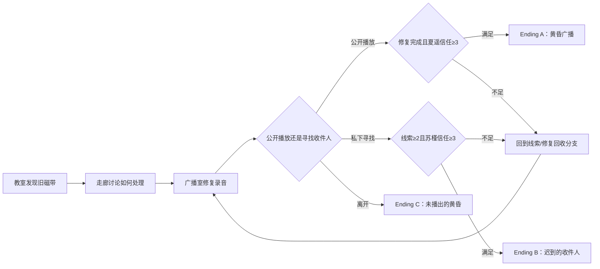

# 校园 Benchmark Episode 设计

> 工作标题：《黄昏广播》
> 状态：D1 候选故事，等待产品负责人批准后冻结分镜、语言、配音与素材预算。
> 目标时长：20–30 分钟。

## 1. 为什么选择这个故事

故事发生在放学后的教室、走廊/天台与旧广播室。主角和两名同学发现一段没有送出的毕业广播录音，必须决定公开播放、私下寻找收件人，还是放弃介入。

它的世界观和美术成本小，但能够自然覆盖：

- 公共线、两个主路线、三个结局和回收分支；
- 选择、变量、条件、可达性、回滚/前进与路线图；
- 角色表情、CG 差分、口型/眨眼和 Dicing；
- BGM、Voice、SFX、Ambient、UI 五类音频；
- 时间线、镜头、遮罩、滤镜、屏幕闪烁和音画同步；
- 中文/英文文本长度差异、字体回退和配音 ID；
- CG 画廊、Scene Replay、Music Room 与 Ending 自动生成；
- Windows/Android 共同编辑和 Web/Windows/Android 正式构建。

故事不是营销宣传片，而是工具的 Golden Project 和商业制作证据。

## 2. 角色

| ID | 名称 | 身份与目标 | 视觉/音频验证价值 |
|---|---|---|---|
| `ch_protagonist` | 林澈 | 可改名主角；想尽快回家，却被旧录音牵住 | 名称变量、内心/旁白、无固定立绘方案 |
| `ch_xiayao` | 夏遥 | 广播社最后一名成员；希望完成前辈没有播出的节目 | 主要语音、丰富表情、广播麦克风口型/眨眼 |
| `ch_sujin` | 苏槿 | 班长兼档案志愿者；重视隐私，主张先找到收件人 | 第二路线、手机/文件道具、冷静到动摇的表情差分 |
| `ch_senior_voice` | 未知学姐 | 只存在于旧录音和照片中的毕业生 | 录音滤波、噪声、字幕、身份揭示 |

名字和人物关系均为原创工作设定，D1 可修改；不得使用竞品角色或美术风格。

## 3. 变量与状态

| 变量 | 类型 | 初始值 | 用途 |
|---|---|---:|---|
| `tape_repaired` | Bool | false | 是否完成旧录音修复 |
| `clue_count` | Int 0–3 | 0 | 找到的年份、社团和收件人线索 |
| `trust_xiayao` | Int 0–4 | 1 | 公开播放路线条件 |
| `trust_sujin` | Int 0–4 | 1 | 私下寻找路线条件 |
| `privacy_warned` | Bool | false | 是否讨论未经允许公开录音的风险 |
| `heard_full_message` | Bool | false | 是否听完整录音；解锁回收分支 |
| `ending_id` | Enum | none | `broadcast/private/silent` |

每个变量至少在 Route、Script、Debugger 和 QA 中出现一次；关键选择改变后，旧前进历史必须截断并重新计算结局。

## 4. 场景与节奏

| Scene ID | 地点/时间 | 时长 | 剧情作用 | 工具能力 |
|---|---|---:|---|---|
| `sc_classroom_sunset` | 教室·黄昏 | 3–4 分钟 | 发现旧磁带和广播社钥匙 | 对话、道具、镜头推进、环境声 |
| `sc_corridor_rooftop` | 走廊/天台·暮色 | 4–5 分钟 | 夏遥与苏槿提出不同处理方式 | 角色进退场、选择、条件摘要 |
| `sc_broadcast_room` | 旧广播室·入夜 | 7–9 分钟 | 修复录音、收集线索、形成主分支 | 多轨音频、波形、变量、Dicing CG |
| `sc_broadcast_live` | 广播室/校园蒙太奇 | 3–4 分钟 | 公开播放高潮 | 60–90秒高密度演出、回想解锁 |
| `sc_archive_delivery` | 档案室/校门 | 3–4 分钟 | 私下寻找并交付录音 | 本地化长文本、手机画面、镜头切换 |
| `sc_empty_room` | 广播室·停电后 | 2–3 分钟 | 放弃介入的安静结局 | 低信息演出、声音留白、坏/中性结局 |

美术层面只冻结三个主背景族：教室、通道、广播室；天台/档案室/校门优先通过同背景重构、近景遮挡或CG表达，避免无限增加素材。

## 5. 路线结构

玩家流程图必须隐藏未解锁结局名称；创作者 Route Map 显示完整条件、变量和不可达原因。

## 6. 60–90 秒高密度演出分镜

场景：`sc_broadcast_live`。夏遥按下播放键，旧录音在停电前最后一次传遍校园。

| 时间 | 画面 | 音频 | 编辑器验证 |
|---:|---|---|---|
| 0–8s | 麦克风指示灯亮起，镜头从控制台推进 | 开关SFX、房间底噪、呼吸 | Stage拖动、关键帧、近景景深模拟 |
| 8–22s | 夏遥犹豫表情→坚定，指尖按下播放 | Voice入场，BGM自动ducking | 表情差分、口型、音量曲线 |
| 22–38s | 波形与旧照片叠化，尘埃粒子掠过 | 旧录音带噪声与女声 | 遮罩、滤镜、字幕、音频效果 |
| 38–55s | 教室/走廊/空操场三段蒙太奇 | BGM展开、Ambient跨场景 | 镜头预设、转场、资源预热 |
| 55–70s | 苏槿看向广播室，手机上的年份线索高亮 | UI SFX、Voice停顿 | 变量条件、特写、文本排版 |
| 70–85s | 广播灯熄灭前完成最后一句，画面收至校舍外景 | BGM尾奏、磁带停转 | 音画同步、Ending标记、回想解锁 |

所有关键帧都必须能从最终预览回到源命令；Reduced Motion 版本减少推拉和叠化，但保留叙事节奏与字幕。

## 7. 美术与 Dicing 样本

### 7.1 候选素材预算

| 类型 | 数量候选 | 备注 |
|---|---:|---|
| 背景主图 | 3 | 教室、通道、广播室 |
| 背景时间/灯光变体 | 6–8 | 黄昏、暮色、停电、应急灯 |
| 主要角色立绘 | 2 套 | 夏遥、苏槿；主角默认无立绘 |
| 每角色表情 | 8–10 | 基础脸+嘴眼差分优先 |
| 服装/道具差分 | 2–3/人 | 制服、广播耳机、档案夹 |
| 事件 CG 基图 | 2 | 播放键近景、广播高潮 |
| CG 差分 | 每组 6–10 | 灯光、表情、手部、字幕/指示灯分离 |
| UI 页面 | 11 基础页 | 标题至结局列表，自动生成内容优先 |

以上仅为D1候选；最终数量要同时满足制作预算和Golden Dicing覆盖，不以堆素材证明工具能力。

### 7.2 Golden Dicing 组

1. `xiayao_broadcast_*`：同尺寸立绘，基础身体相同，眼/嘴/眉变化；
2. `sujin_phone_*`：人物相同，手机屏幕和手部差分；
3. `cg_play_button_*`：大面积相同，指示灯、手指和阴影变化；
4. `cg_broadcast_live_*`：灯光、字幕和表情差分；
5. `bg_classroom_photo`：不适合 Dicing 的噪点背景，必须自动判断无净收益并回退。

每组保留源图，记录 Cell、Atlas、Manifest、像素验证、体积、峰值内存、Draw Call 与加载时间。

## 8. 语言与配音候选

推荐 D1 冻结方案：

- 完整简体中文与英文文本；
- 角色 Voice 使用简体中文，主角不配音；
- D1 原型先使用明确标记的临时语音，不把临时资产带入 Stable；
- 正式 Benchmark 的配音范围在 D1 分镜和成本评估后冻结；
- 所有 Voice 以稳定对白 ID 关联，不按文件顺序猜测；
- 英文测试扩展率至少覆盖 130%，关键按钮同时验证长词和窄屏。

这是推荐而非已批准订单；产品负责人可以选择中日或中英，但必须保留至少两种语言的完整排版证据。

## 9. 工具能力覆盖

| 能力 | 故事中的证据 |
|---|---|
| 四视图同源 | 同一分支在 Route/Sequence/Script/Stage修改并同步 |
| 前进/后退 | 在主选择前后逐句移动，改选后截断旧历史 |
| 快进 | 四种快进模式以相同最终 State Hash 到达分支 |
| 自动路线图 | 创作者全图与玩家防剧透图均由故事模型生成 |
| 自动附加页面 | 两张CG、三结局、高潮回想和音乐曲目自动收录 |
| Dicing/Delta | 角色和CG差分无损重建，无收益背景自动回退 |
| 本地化/配音 | 中英文本、Voice ID、溢出和缺失映射检查 |
| Scene Director | 高密度广播高潮的镜头、音画、滤镜和关键帧 |
| Story QA | 不可达回收分支、未初始化读取和缺失资源 |
| 优化/稳定 | 三平台包、低内存Soak、前后台恢复和音频恢复 |

## 10. 商业评分表

每项 1–5 分，任何红线失败均不能用平均分抵消。

| 维度 | 权重 | 4分标准 |
|---|---:|---|
| 剧情可读性与节奏 | 15% | 分支动机清楚、20–30分钟内无明显拖沓 |
| 演出与镜头 | 15% | 关键情绪由镜头/时间线支撑，无工具限制痕迹 |
| 音频层次与同步 | 10% | 五总线清楚、Voice/BGM ducking和切场恢复正确 |
| UI完整性与输入 | 15% | 标题、设置、存档、历史、鉴赏、回想、结局均完整 |
| 排版与本地化 | 10% | 中英无阻断溢出，CJK规则和字体回退有效 |
| 路线/存档确定性 | 15% | 三平台固定路线、回滚、存档和解锁一致 |
| 容量/性能/稳定 | 15% | 达到冻结预算，2小时无崩溃/OOM/持续增长 |
| 可访问性 | 5% | 键盘、触控、减少动效、对比度和字幕通过 |

红线：数据损坏、确定性剧情错误、不可恢复存档、密钥泄露、未签名更新、阻断级崩溃或无法回退的迁移。

## 11. D1 需要批准的内容

1. 工作标题与核心冲突；
2. 三名可见/可听角色的数量与关系；
3. 两主路线、三结局和回收分支；
4. 60–90秒广播高潮；
5. 中英文本与中文角色配音的推荐方向；
6. 三背景族、两角色立绘、两CG基图的候选预算；
7. Golden Dicing 五组素材策略。
