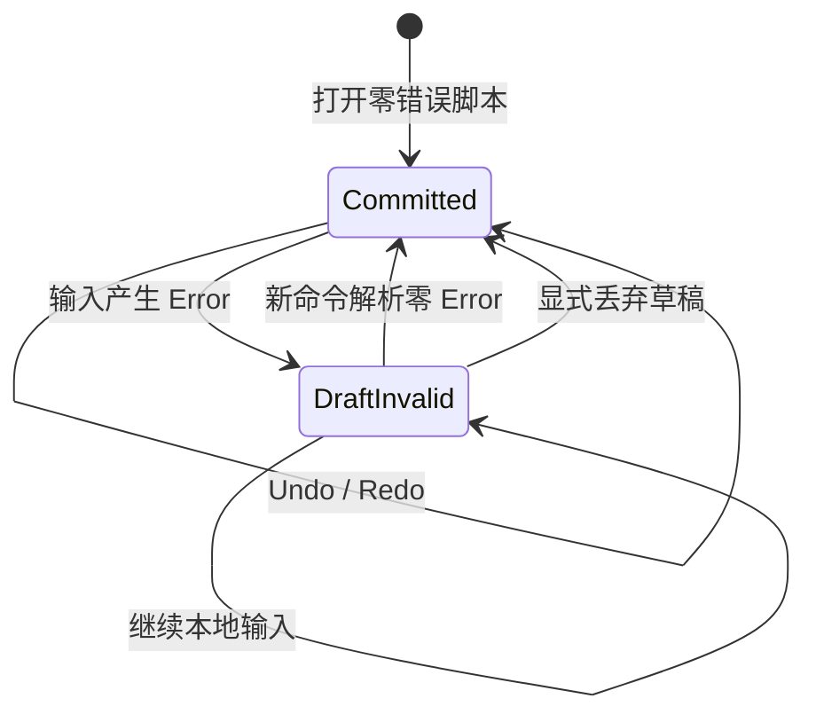

# S0.3 Script Source Transaction 与审计记录

> 状态：已实现、通过本地门禁并完成远端分支与 PR 证据回读。
> 决策日期：2026-08-11。
> 风险等级：R3（涉及 Canonical CST、revision、幂等、诊断与撤销语义）。本轮仍是 S0 技术证据，不是 M1 正式 Command/Schema 冻结。

## 1. Problem Brief

真实脚本编辑器会持续产生暂时不合法的文本，例如 IME Composition、未闭合引号和只输入一半的命令。如果每次键入都直接替换 Canonical CST，Preview、Flow、保存和编译会读到损坏或互相漂移的数据；如果一遇错误就丢弃文本，又会损害创作者数据。

本切片只回答：文本草稿如何安全进入已提交 CST，并同时满足错误不污染、合法修改原子提交、命令重试幂等、显式格式化和 Undo/Redo 不跨越未解决草稿。

## 2. 状态与权威边界

- `draftSource` 和 `draftDiagnostics` 保存当前文本缓冲，可包含 Error；它们不是保存、编译或预览输入。
- `committedSource` 和 `committedDocument` 是最后一次零 Error 解析结果，是脚本侧唯一已提交真相。
- `revision` 对任何已提交源变化单调递增，包括只改变格式或注释。
- `semanticRevision` 只在执行语义变化时递增；空行、注释和规范化空格不触发编译。
- Warning 可提交；Error 只进入草稿。

这仍没有宣称 `StoryDocument` 已经能无损投影为当前 `StoryProject`。对白的 `textId`、语句 `statementId`、演出命令 ID 和场内标签/跨场景跳转尚需统一映射契约。

## 3. Command v0

本切片提供两个版本化命令：

- `script.replace-source`：携带 `schemaVersion`、`commandId`、`baseRevision` 和完整 source；
- `script.format-source`：显式格式化最后已提交文档，不读取错误草稿。

处理结果分为：

| 状态 | revision | Canonical CST | 是否保存/编译 |
|---|---:|---|---|
| `committed` | 源变化时 +1 | 原子替换 | 按 ChangeSet |
| `drafted` | 不变 | 不变 | 否/否 |
| `noop` | 不变 | 不变 | 否/否 |
| `duplicate` | 不变 | 不变 | 复用原结果 |
| `rejected` | 不变 | 不变 | 否/否 |

稳定错误码：

- `EMPTY_COMMAND_ID`：validation；
- `STALE_REVISION`：conflict；
- `COMMAND_ID_REUSE`：同一 ID 携带不同载荷，conflict。
- `DRAFT_PENDING`：存在未解决草稿时拒绝格式化，validation，避免覆盖半输入文本。

同一 ID、同一载荷重试返回原 ChangeSet，不重复推进 revision 或历史；同一 ID 换载荷不会被当成新意图。

## 4. ChangeSet v0

每次可处理命令记录：

- `acceptedRevision`、`acceptedSemanticRevision`；
- draft/source/semantic 是否变化；
- 是否需要保存、是否需要编译；
- 受影响 `textId`；
- 新增与已解决诊断；
- `commandId`。

只改注释需要保存但不编译。对白文本变化同时标记对应稳定 `textId`，供未来 Preview、Voice、本地化和索引做局部失效。

## 5. Undo/Redo 边界

- 只有已提交源变化进入语义历史；错误草稿和 noop 不进入历史。
- revision 永不倒退；Undo/Redo 是新的已提交 revision，不复用旧 revision 数字。
- 未解决草稿存在时，全局 Undo/Redo 不运行；文本控件先处理自己的细粒度输入历史，或用户显式丢弃草稿。
- 未解决草稿存在时，Formatter 同样拒绝运行，不能用最后有效 CST 覆盖半输入文本。
- Undo 后的新提交清空 Redo future。

## 6. 安全与失败语义

- 所有解析与状态转换继续位于纯 TypeScript 包，不访问 DOM、文件、网络或进程。
- `set` 表达式仍只作为文本，不执行 `eval`。
- 初始源包含 Error 时拒绝创建已提交会话，调用方必须进入恢复/只读流程，不能把损坏源伪装成有效 Canonical CST。
- 本切片没有文件写入、WAL 或崩溃恢复，因此 `requiresSave` 只是后续 Store 的明确请求，不代表已经落盘。

## 7. 验收与未证明项

自动测试至少覆盖：无效草稿隔离、修复后原子提交、诊断增消、幂等重试、ID 载荷冲突、过期 revision、空 ID、noop、显式格式化、格式化草稿保护、注释免编译、稳定 `textId` 失效、Undo/Redo 与草稿边界、Warning-only Opaque 提交，以及 200 步固定混合操作模型测试。

未证明：

- CST ↔ `StoryProject` 全结构映射及跨视图属性测试；
- IME/CodeMirror/Android 真机输入历史；
- 增量 Parser、100k 行延迟和内存预算；
- WAL、原子文件替换、崩溃恢复和外部编辑三方合并；
- 多人并发中的“撤销我的意图”；
- R3 独立审阅。

下一切片为 **S0.4 Stable ID Projection**：先明确对白双 ID 与演出语句 ID，再实现拒绝式 CST → `StoryScene` 单向投影；在反向投影能保留注释/Opaque 前仍不能强行接 UI。

## 8. 本地审计结果

2026-08-11 本地证据：

- 4 个测试文件、28/28 测试通过，其中包含 200 步固定混合操作模型测试；
- TypeScript 严格类型检查与三个 workspace 生产构建通过；
- 架构审计扫描 9 个可移植生产源文件，`story-language` 仍只依赖 `story-core`，未发现 UI、DOM、平台壳、文件系统或进程依赖；
- Editor 运行时代码未变化，构建仍为 JS 206.37 kB（gzip 64.79 kB）、CSS 18.73 kB（gzip 4.78 kB）；
- 官方 npm Registry 漏洞审计为 0 vulnerabilities；
- 人工事务审阅发现“错误草稿上执行格式化会覆盖草稿”的数据安全缺口，新增 `DRAFT_PENDING` 拒绝路径与回归测试后重跑门禁；
- `git diff --check` 通过。

以上结论不替代干净锁文件安装、远端 SHA/PR 回读或独立 R3 审阅。

远端记录：`agent/visual-production-bar` 已推送，Draft PR #1 已更新并保留当前范围、验证和未证明项；最终远端 SHA 以 PR Head 回读为准。
