# S0.12 安全自动保存、备份轮换与恢复审计

> 状态：实现、仓库级、干净重装、真实浏览器、推送与 Draft PR 远端回读均通过
> 日期：2026-08-11
> 范围：Web/IndexedDB 原型与可移植备份契约；不冒充 Windows/Android 长稳完成

## 1. 需求对齐

PRD 把本地自动保存、崩溃恢复和手动快照列为 M1 P0；工程蓝图同时要求自动保存不阻塞输入、磁盘不足时保护最后有效快照、“保存成功”必须可重新读取。S0.12 只完成其中可独立证明的一段：

- 已提交输入批次在静默 1.5 秒后自动保存；IME/本地输入 buffer 未提交时绝不落盘；
- 手动与自动保存共用同一个串行入口、WAL、storage revision 和 writer lease；
- 覆盖当前项目之前，先保存上一份经过校验的完整快照；
- 最多保留五份固定槽备份，恢复旧内容时创建新的 revision；
- 配额不足或权限失效时暂停自动保存，并明确告诉用户最后有效项目没有被覆盖。

账户、云同步、多人协作、原生后台任务、系统通知和正式手动命名快照不进入本切片。

## 2. 保存状态机

```mermaid
stateDiagram-v2
    [*] --> Clean
    Clean --> Dirty: Source transaction committed
    Dirty --> Autosaving: 1.5s quiet period
    Dirty --> Saving: Manual request
    Autosaving --> Autosaved: WAL + backup + project verified
    Saving --> Saved: WAL + backup + project verified
    Autosaving --> Dirty: Edit generation changed during save
    Saving --> Dirty: Edit generation changed during save
    Autosaving --> Degraded: NO_SPACE or permission revoked
    Saving --> Degraded: NO_SPACE or permission revoked
    Degraded --> Saving: User retries manually
    Saving --> Conflict: Writer lease lost
```

实现不变量：

1. `saveInFlight` 在 React 状态更新之前同步置位，双击和定时器不能并发进入保存；
2. 每次源事务递增 `editGeneration`，保存只在完成时仍是同一代才显示 clean；
3. 保存过程中发生编辑时，当前保存可以完成，但 UI 回到 dirty 并安排下一轮；
4. 自动保存暂停不会因继续输入而反复重试；用户手动重试才解除暂停；
5. lease 失效继续沿用 S0.11 全屏冲突闸门，绝不降级为无保护保存。

## 3. 固定槽备份格式

备份路径为 `backups/slot-N.snapshot.json`，N 由 `sourceStorageRevision % retention` 决定。固定槽不依赖目录枚举，适用于当前四方法 `ProjectFileStore`，也能严格限制容量增长。

每个槽保存：

- schema version、slot、创建时间和来源 storage revision；
- 完整 `ProjectSnapshot` JSON payload；
- payload 的 SHA-256。

读取时验证 envelope、slot、时间、revision、SHA-256 和完整 ProjectSnapshot 结构；任一步失败均返回 `CORRUPT_BACKUP`，不向 UI 暴露半可信快照。Retention 必须为 1–20，当前产品策略为 5。

## 4. 覆盖与恢复顺序

正常 sN → sN+1：

1. 通过 writer lease 和 WAL 恢复检查读取当前 sN；
2. 原子写入 sN 的轮换备份；
3. 备份失败则停止，不开始覆盖项目；
4. 使用既有两阶段 WAL 保存 sN+1；
5. 完成后更新 UI storage revision 和备份计数。

恢复备份 sK：

1. 校验备份；
2. 读取当前 sN；
3. 先把 sN 写入轮换备份；
4. 把 sK 的内容写成新的 sN+1，而不是让 revision 倒退；
5. 重新构建 Studio Session，并告知当前版本仍可从轮换备份找回。

因此“恢复”是可逆的新提交，不是破坏性 checkout。

## 5. 配额与失败语义

| 失败 | 行为 |
|---|---|
| `NO_SPACE` | 备份或项目保存立即停止；自动保存进入暂停；保留最后有效项目和 WAL 证据 |
| `PERMISSION_DENIED` | 与空间不足相同，但提示恢复权限后手动重试 |
| `LEASE_REQUIRED / LEASE_LOST` | 清除 store/lease 引用，进入另一窗口冲突闸门 |
| `CORRUPT_BACKUP` | 当前项目仍可恢复，但备份面板显示需要检查，不静默提供损坏快照 |
| `STALE_STORAGE_REVISION` | 保留 dirty/error，不伪报保存成功 |
| 其他 I/O | 显示稳定错误，等待用户重试；不清除 WAL 或最后有效项目 |

## 6. UI 与可访问性

- 顶栏分别显示保存状态与 `备份 N/5`；两者不混为一个模糊的“已同步”；
- 自动保存显示 `自动保存中` / `已自动保存 · sN`；
- 备份对话框说明恢复会创建新版本，列出 revision、槽位和本机时间；
- 点击遮罩、关闭按钮或 Escape 可退出；
- 393px 手机端把备份入口收缩为保留可访问名称的图标，保存状态文本截断而不制造横向滚动；
- 减少动效设置继续由既有全局 motion token 控制。

## 7. 测试矩阵

| 场景 | 期望 |
|---|---|
| 第一次保存 | s1，无旧快照，因此 0/5 备份 |
| 第二次保存 | s2，并保存经过校验的 s1 |
| 超过 retention | 只保留 revision 最大的五个固定槽 |
| 备份被篡改 | `CORRUPT_BACKUP` |
| 备份阶段空间不足 | sN 保持不变，sN+1 不开始 |
| 恢复旧备份 | 内容回到旧状态，revision 前进为 sN+1，当前 sN 被备份 |
| 快速连续输入 | 一个提交批次、一个 debounce 自动保存 |
| 保存中继续编辑 | 完成后仍为 dirty，再进行下一轮 |
| 手机视口 | 无页面级横向溢出，备份对话框可操作 |
| 第二窗口 | 继续被 S0.11 writer lease 阻断 |

## 8. 明确未完成

- Windows/Android 后台、挂起、系统杀进程、ENOSPC 真机矩阵；
- 用户命名、钉住、导出和删除手动快照；
- 基于时间/容量的分层保留策略与备份压缩；
- Blob/CG 备份；当前快照只包含项目文本数据，大资源必须走未来内容寻址 Blob Store；
- OS 级剩余空间预检；真正写入失败仍是权威判定，预估值不能代替；
- 备份迁移、schema 升级前快照和未知字段保留；
- 低端 Android 长时间输入、后台切换和 2 小时 Soak。

这些缺口在完成前持续阻断“M1 商业级数据安全完成”的声明。

## 9. 当前审计证据

2026-08-11 本地结果：

- TypeScript strict：通过；
- `npm ci`：从锁文件干净安装 128 个包，随后完整质量门复跑通过；
- 常规测试：15 个测试文件、108/108 通过；其中真实 fake-indexeddb UI 测试证明连续自动保存 s1/s2、生成 s1 备份并恢复为新 s3；
- 备份核心验证：固定槽轮换、SHA-256 篡改检测、缺失槽位、恢复为新 revision、恢复前备份当前 head、备份阶段 `NO_SPACE` 不覆盖项目；
- 五工作区构建：通过；Editor JS 271.85 kB / gzip 84.00 kB，CSS 26.69 kB / gzip 6.17 kB；
- 架构审计：19 个 portable 文件与 2 个 Node adapter 文件未越界；
- 10k 句性能门：最终复核 192.32 ms，低于 12,000 ms 预算；
- 官方 npm Registry audit：0 vulnerabilities；
- 真实浏览器：既有 s3 编辑后 1.5 秒自动保存为 s4，实际生成并回读一份 s3 备份；
- 真实恢复：s3 内容恢复为新 s5，同时被替换的 s4 留在备份中，内容回到测试前状态；
- 393×852：`innerWidth=393`、document/body `scrollWidth=378`、dialog width 354，无横向溢出；
- 第二浏览器窗口继续只显示 writer lease conflict gate；测试标签和 viewport 已清理。

浏览器审计曾发现升级项目从 s3 首次创建备份后，UI 用 `revision - 1` 错误显示 3/5。存储槽本身正确；实现已改为每次保存后重新读取并验证真实槽位，复核显示 1/5。该缺陷在提交前完成修复并加入集成路径。

## 10. 远端证据与元数据事件

- 实现提交 `90834944126c742091631d07a6dcfdb680bc9882` 已推送到 `origin/agent/visual-production-bar`；
- 本地 HEAD、origin 跟踪分支与 Draft PR #1 head SHA 首次回读一致；
- PR 标题更新为 `Add safe autosave, verified backups, and fenced storage`，并保持 Draft；
- 首次更新 PR 时，旧正文预读发生 GitHub API TLS timeout，后续 PATCH 只保留了 S0.12 段；远端回读及时发现该元数据覆盖，代码与提交未受影响；
- PR 正文随后重建为 S0.1–S0.12 累计索引、产品边界、S0.12 验证及全局 M1 阻断项；
- 最终回读确认包含 S0.1 索引、完整 S0.12 标题、`108/108` 和“全局 M1 阻断项”，正文长度 2,946 字符；
- GitHub API 在回读期间多次出现 TLS handshake/Schannel close timeout，使用只读重试后取得一致结果，没有把网络失败误报为完成。
