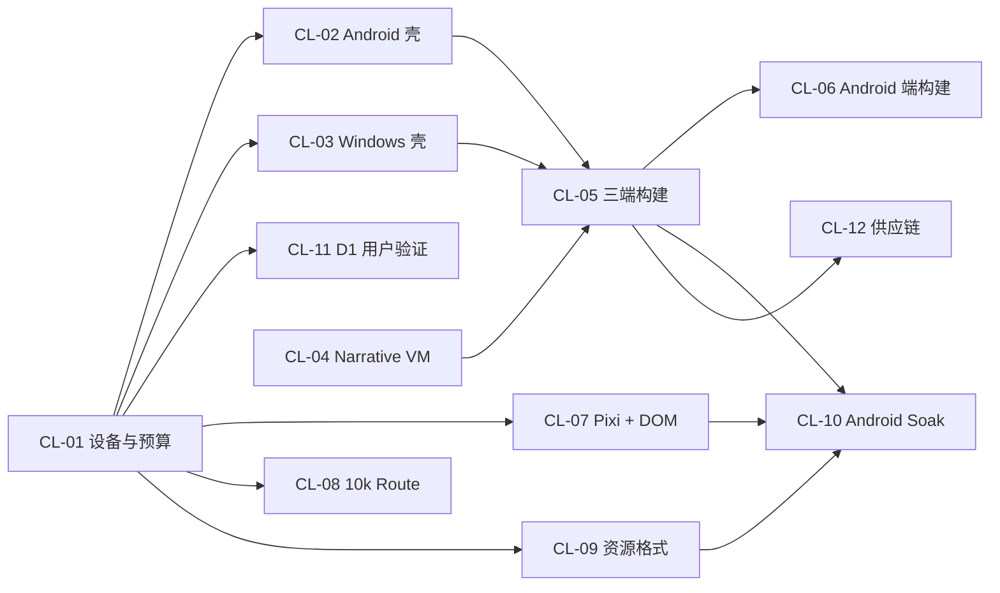

# S0 Claim / Evidence 登记表

> 建立日期：2026-08-12
> 状态：Wave A 活动登记表
> 规则：状态只由可复现证据改变；Owner 是执行责任角色，Approver 是准入责任角色。

## 1. 通用证据包

每项 CL 风险开始前必须提交：假设、适用平台、Source Revision、测试工程、环境/设备、测量命令、通过阈值、停止条件、失败替代、原始证据路径、ADR 路径、Owner、Approver 和截止评审点。

每个证据包至少保留：

- `claim.md`：要证明什么以及明确不证明什么；
- `environment.json`：工具链、OS、设备、浏览器/WebView 和依赖版本；
- `commands.txt`：可复现命令；
- `raw/`：日志、trace、截图、视频、产物与哈希；
- `result.md`：原始数据到结论的计算；
- `adr.md`：采用、替代、推迟或取消；
- `review.md`：审阅人、例外和批准时间。

证据目录在首个 CL Spike PR 中落地；本轮只冻结结构，不创建空壳目录冒充证据。

## 2. 活动风险

| ID | Claim | 状态 | Owner | Approver | 预写阈值/停止条件 | 当前证据 | 下一动作 |
|---|---|---|---|---|---|---|---|
| CL-01 | 目标设备和容量/内存/帧时间预算可执行 | 有条件通过 | Performance Owner | Product Owner + Release Owner | `62` 文档全部硬门；缺实体设备不得通过 | 能力档位与预算已冻结；本机不具代表性 | 登记 WIN-L、AND-L、AND-R 并跑基础基线 |
| CL-02 | Android 编辑壳在文件、IME、恢复和内存上可靠 | 未开始（[证据契约已冻结](67-cl02-android-editor-shell-evidence-contract.md)） | Android Platform Owner | Architecture + QA | AI-01–AI-10；AS-01–AS-19；AND-L/AND-R 安全/数据/PSS/容量硬门 | Web/Emulator 不计；当前无 Android 工具链和真机 | 安装可复现工具链，登记真机并准备 Capacitor/最小 WebView 对照 Spike |
| CL-03 | Windows 壳选型满足文件、更新、内存和隔离 | 未开始（[证据契约已冻结](65-cl03-windows-shell-evidence-contract.md)） | Windows Platform Owner | Architecture + Security | WS-01–WS-18；WIN-L 预算；安全/数据/更新硬门；通过者再评分 | Node 适配器、空壳包体和开发机结果不计 | 准备同前端 Electron/Tauri 可抛弃对照 Spike 与 WIN-L |
| CL-04 | Narrative VM 可确定回滚、前进、快进与 Barrier | 未开始（[证据契约已冻结](64-cl04-narrative-vm-evidence-contract.md)） | Runtime Owner | Architecture + QA | 三端 State Hash 0 差异；VM-01–VM-15；10k 生成序列；不可重放副作用必须显式 Barrier | Editor history、Project WAL、Preview transport 不计 | 实现可抛弃平台中立语义核 Spike |
| CL-05 | 三端最小玩家和 Windows 本地构建贯通 | 未开始 | Build Owner | Release + Security | 三端固定路线和 Manifest；缺任一 M1 平台即停止 | Web dev build 不计 | 定义最小玩家输入/产物 |
| CL-06 | Android 端直接 APK/AAB 构建可行 | 未开始 | Android Build Owner | Security + Product | 真机构建时间/空间/签名边界；失败采用 Windows 基线 | 无 | 先做威胁与 SDK 体积模型 |
| CL-07 | Pixi + DOM 在 DPR、输入和动效上可控 | 未开始 | Rendering Owner | UX + QA | Golden 差异、命中与中断；错误交互即停止 | DOM Web 原型不计 | 定义最小混合舞台 |
| CL-08 | 10k Route 图可局部编辑 | 未开始 | Graph Owner | Architecture + UX | CL-01 延迟/内存门；不是线性轨道替代 | 10k Stage 窗口不计 | 生成真实图结构数据集 |
| CL-09 | 平台资源格式/分包达到综合预算 | 未开始 | Asset Pipeline Owner | Rendering + Release | 包体、画质、解码、内存同时过门 | PNG/Dicing 算法为输入 | 冻结样本与质量评分协议 |
| CL-10 | 最低档 Android 核心流和 2h Soak 稳定 | 未开始 | Performance Owner | QA + Release | CL-01 AND-L 硬门；崩溃/OOM/ANR/持续增长即失败 | 无真机 | 依赖 CL-02/04/05 最小链路 |
| CL-11 | D1 信息架构被目标用户验证 | 未开始 | UX Research Owner | Product Owner | 至少 5 人；Severity 0/1 为 0 | 内部浏览器审计不计 | 招募并冻结测试 Build |
| CL-12 | 最小供应链产物可追溯 | 未开始 | Release Owner | Security + Independent Reviewer | SBOM/Provenance/哈希/签名同一 Revision | npm audit 不计完整链 | 依赖 CL-05 最小产物 |

## 3. 顺序和依赖

允许 CL-02、CL-03、CL-04 的设计契约并行准备，但在 CL-01 实体设备未登记前只能做环境搭建和探索测量，不能宣布通过。

## 4. 更新纪律

- 每个 PR 只把一个 CL 状态向前推进；若发现前置证据错误，允许回退状态；
- `有条件通过` 不能作为下游最终准入，只允许准备工作；
- 状态变化必须同时更新本表、[S0 收口审计](61-s0-closure-course-correction.md)和对应 ADR；
- Product Owner 不能单独批准安全、确定性、数据恢复或签名红线；
- 设备、政策或依赖版本变化不会自动使旧证据继续有效，必须按适用范围复评。
