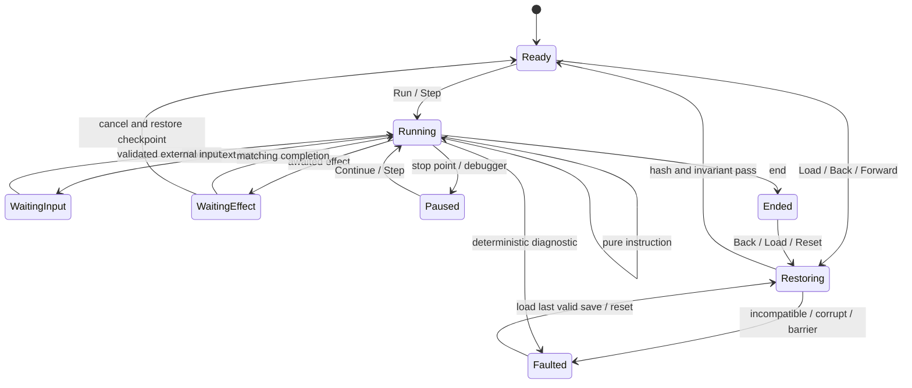

# CL-04 Narrative VM 确定性证据契约

> 决策日期：2026-08-12
> 状态：证据契约已冻结；[Spike 01](68-cl04-vm-kernel-spike-01.md)–[04](71-cl04-vm-history-spike-04.md) 已完成 VM-01–05 部分基础与 Choice/输入/History 前置语义；CL-04 进行中但未通过
> 风险：CL-04
> 决策类型：S0 可抛弃 Spike 契约，不是 VM 产品实现

## 1. Claim 与边界

CL-04 必须证明：同一版本化 IR、同一外部输入序列和同一初始状态，在 Web、Windows、Android 的最小 Runtime 上产生完全相同的剧情状态、检查点、Effect 意图和 State Hash；回滚、前进、快进、异步取消与 Barrier 不会漏执行、重复执行或污染新分支。

本轮只冻结怎么证明，不新增 `runtime-vm` 包，不把当前 Preview Transport 扩展成正式 VM。

明确区分三类历史与两类 Barrier：

| 现有/未来概念 | 权威对象 | 用途 | 禁止误用 |
|---|---|---|---|
| Editor Undo/Redo | `WorkspaceSession` / Source Session | 撤销创作者对源工程的修改 | 不是玩家剧情回滚 |
| Project WAL/Backup | Project Persistence | 保存、恢复可继续编辑的源工程 | 不是 Runtime Save |
| Runtime History | 未来 `runtime-vm` | 玩家 Step Back/Forward、Debugger、重放 | 不修改源工程 |
| Preview Stop Point | 当前 `previewTransportBarrier` | 原型在选择、结局、场景末尾或草稿时暂停 | 不表示不可逆副作用 |
| Effect Barrier | VM Effect Contract | 阻止跨越不可逆外部副作用 | 不能用普通播放暂停替代 |

命名审计要求：正式 VM 不得导入 `apps/editor/src/preview-transport.ts`，也不得复用 `WorkspaceSession.history` 或 Project WAL 作为 Runtime History/Save。

## 2. 最小输入 IR

Spike 只覆盖验证核心语义所需的版本化 IR，不追求 M1 全命令集：

```text
ProgramV0 {
  irVersion, projectId, buildId, entryIp,
  instructions[], sourceMap, opcodeRegistryDigest
}

InstructionV0 {
  ip, opcode, operands, sourceStatementId,
  stepBoundary, effectClass, stopPoint
}
```

最低 Opcode：

- `say(textId, speakerId)`：产生可见对白 Effect 和默认 Step Boundary；
- `set(variableId, value)`、`add(variableId, number)`：确定性变量变更；
- `jump(ip)`、`jumpIf(expression, trueIp, falseIp)`；
- `choice(choiceId, options)` 与外部 `ChoiceSelected` 输入；
- `call(targetIp)`、`return`，包含调用栈上限；
- `random(variableId, min, max)`，只使用保存的 PRNG 状态；
- `wait(durationTicks)`，只使用逻辑时钟；
- `emit(effectDescriptor)`；
- `checkpoint(stepId)`；
- `end(endingId)`。

Spike 禁止真实网络、购买、通知、文件写入和系统 Intent；它们只能用受控测试 Effect 模拟。表达式语义、数值范围、字符串规范化和排序规则必须由 IR 版本固定，不使用宿主语言隐式行为。

## 3. 权威状态

```text
RuntimeStateV0 {
  schemaVersion,
  buildId,
  ip,
  stateRevision,
  stepId,
  callStack[],
  variables,
  prng,
  logicalClock,
  sceneState,
  audioLogic,
  pendingRequests[],
  readSession,
  historyCursor,
  terminal
}
```

状态域规则：

- `variables`、对象 Map、音轨和 pending requests 按稳定 ID 排序后序列化；
- 数字只允许冻结的整数/定点语义；禁止把未规范化 NaN、Infinity、平台浮点或本地时区写入权威状态；
- `logicalClock` 使用整数 tick，不读取墙钟；动画帧时间是表现输入，不改变剧情结果；
- `prng` 必须指定算法、版本和完整种子/游标；禁止调用 `Math.random()` 或平台随机作为剧情随机；
- `sceneState` 保存声明式背景、角色槽位、镜头逻辑状态；不保存 DOM、Canvas、纹理句柄或 Object URL；
- `audioLogic` 保存曲目、逻辑播放位置、循环、音量/淡变意图；不保存平台音频对象；
- `pendingRequests` 只保存可恢复的请求描述与 token，不保存 Promise/线程；
- `historyCursor` 指 Runtime History，不指 Editor Undo/Redo；
- Runtime Save 与 Meta Progress 分离，默认已读、CG、结局解锁只单调增加，不因剧情回滚撤销。

## 4. 状态转换与等待模型

VM 核心是纯转换器：

```text
transition(program, state, input?) -> {
  nextState,
  effects[],
  checkpoint?,
  wait?,
  diagnostics[]
}
```

执行状态机：



每次转换只接受一个排序明确的输入。外部输入带 `inputId`、`executionId`、`expectedRevision` 和逻辑序号；重复 inputId 幂等，旧 revision、未知 request token 和已取消 execution 的返回只记录诊断，不修改状态。

## 5. Effect、取消与 Barrier

```text
EffectV0 {
  effectId, executionId, originatingRevision,
  channel, kind, payload, policy, awaitMode,
  cancellationScope, replayKey
}
```

`policy` 只能是：

- `pure`：重复调度没有持久副作用；重放可以重新发出；
- `reversible`：必须提供确定性补偿描述或从检查点重建；
- `barrier`：不可逆；执行前建立检查点并要求显式许可，执行后不能静默回退到 Barrier 之前。

Barrier 的语义：

1. 未获许可时 VM 停在 Barrier 前，Effect 不发出；
2. 获许可并提交 Effect 后，Runtime History 写入 Barrier 记录；
3. Step Back 到 Barrier 后停止，返回稳定诊断 `VM_BARRIER_BLOCKED`、Effect 名称和用户可理解原因；
4. Debug 模式可以在隔离的 mock Effect 环境跨越，不能在真实外部副作用已提交后伪装撤销；
5. 网络发布、购买、系统通知等不进入普通剧情 Opcode；M1 若引入必须单独威胁建模与批准。

取消按 `executionId + cancellationScope` 传播。场景跳转、Load、Back、Forward、改选和停止运行都使旧 scope 失效；迟到完成永远不能写入新 revision。平台 Scheduler 可以并发执行不同 channel，但完成进入 VM 前必须按逻辑序号串行归并。

## 6. Story Step、检查点与 Runtime History

`stepId` 来自编译产物，不在运行时按数组位置临时生成。默认边界：对白显示完成、选择出现、选择提交、场景跳转、显式 checkpoint、结局；Debugger 可使用独立 Opcode Cursor，但玩家历史只暴露批准的 Story Step。

每个 History Entry 保存：

```text
HistoryEntryV0 {
  stepId,
  beforeHash,
  afterHash,
  checkpointRef,
  inputRef?,
  effectLedger[],
  barrier?,
  sourceStatementId
}
```

- **Back**：取消当前 scope，恢复目标 checkpoint，确定重放到目标 Step，验证 `afterHash`；
- **Forward**：只沿已记录 input/effect ledger 恢复，不重新询问用户或读取平台；
- **Fork**：回退后收到与 ledger 不同的选择、输入或调试注入时，先截断 forward history，再执行；
- 截断的是可执行 forward 分支，不删除只读文本历史和已提交 Meta Progress；
- 历史压缩只能删除可重建的中间 checkpoint，不能删除 Barrier、Save 引用或兼容迁移所需锚点。

## 7. Skip 与 Auto 的确定性

Skip 是调度策略，不是另一套 VM：

- Skip Read/All/Hold/Toggle 共享相同 Opcode 执行与 State Hash；
- 允许压缩 `wait`、合并不可见表现 Effect、静音/缩短语音，但不得漏过变量、调用、随机、解锁或检查点；
- 选择、文本输入、错误、缺失资源、未下载内容、项目 Stop Point 和 Barrier 必须停止；
- `Instant` 仍按逻辑顺序执行，并设每批最大 instruction 数/时间片，防止主线程饿死；
- Auto 使用独立可读性计时器，不写入剧情状态；Normal、各 Skip 模式与 Auto 到相同停止点时必须产生同一剧情 Hash。

## 8. Save、Meta Progress 与兼容

Runtime Save 最低包含：

- `saveSchemaVersion`、`irVersion`、`projectId`、`buildId`、`runtimeVersion`；
- 当前规范化 Runtime State 或 checkpoint + 确定重放日志；
- History Cursor、必要 History Entries 与 Barrier Ledger；
- 独立的 Meta Progress 引用/快照版本；
- 规范编码摘要与完整性校验。

Save 不包含源工程、编辑器 revision、绝对路径、平台句柄、Promise、DOM/Canvas 或密钥。加载顺序为校验外壳、识别版本、非破坏迁移、验证稳定 ID/Opcode、恢复、重放、比较 Hash；任一步失败保留原 Save 并返回可操作诊断。Build 不兼容时不得猜测最近语句。

## 9. 规范化 State Hash

State Hash 输入使用版本化 canonical bytes：UTF-8、键按 Unicode code point 固定排序、数组保持语义顺序、整数使用规范十进制表示并明确符号/范围、缺失值与 null 区分、禁止环境路径/时间戳/对象地址。摘要算法 Spike 使用 SHA-256，并在 Hash 前加入域分离字符串：

```text
WORLd-VM-STATE\0v0\0 + canonicalStateBytes
```

剧情 Hash 包含权威 Runtime State，不包含：墙钟、渲染帧号、实际音频采样位置、GPU/DOM 对象、诊断本地化文本、性能计数器。另生成 `effectIntentHash` 和 `metaProgressHash`，避免把剧情一致误报为表现或解锁一致。

## 10. 必跑测试向量

| ID | 向量 | 必须证明 |
|---|---|---|
| VM-01 | set/add/condition/jump | 指令顺序与变量 Hash 稳定 |
| VM-02 | call/return/递归上限 | 调用栈一致，越界稳定失败 |
| VM-03 | 固定种子 random | 三端序列和 Save/Load 后序列一致 |
| VM-04 | choice → Back → Forward | 原选择不重问，Hash 回到记录值 |
| VM-05 | choice → Back → 改选 | forward 截断，旧分支 Effect 不返回 |
| VM-06 | awaited effect 延迟/乱序/重复 | 只匹配 token 和 revision 的完成生效 |
| VM-07 | 场景切换期间取消 | 迟到媒体/音频完成不能污染新场景 |
| VM-08 | pure/reversible/barrier | 重放、补偿和阻断各符合契约 |
| VM-09 | Normal/5/10/20/40/Instant Skip | 相同停止点剧情 Hash 完全一致 |
| VM-10 | Skip Read 与未读边界 | 已读集合只决定停止，不改变状态命令 |
| VM-11 | Save/Load + History Cursor | 加载 Hash、Back/Forward 与原运行一致 |
| VM-12 | 损坏/未来版本/缺 Opcode Save | fail closed，原 Save 不被覆盖 |
| VM-13 | Meta Progress + 剧情回滚 | 已读/CG/结局按策略单调且单独 Hash |
| VM-14 | 10k Step 循环与批处理 | 无主线程无限占用，最终 Hash 稳定 |
| VM-15 | 属性/变形测试 | Back→Forward 恒等、重放恒等、插入纯表现 Effect 不改剧情 Hash |

此外使用至少 10,000 个生成序列做属性测试，覆盖条件嵌套、调用、随机、取消、保存点和分支；固定失败种子进入回归语料。

## 11. 平台与证据方法

Spike 分两阶段：

### A. 平台中立语义核

在独立可移植包中执行 VM-01–VM-15，禁止 DOM、Node 文件 API、Android API 和墙钟。Node 只作为首个宿主，不算 CL-04 通过。

### B. 三宿主一致性

同一编译 IR、输入日志和 Save Corpus 在 Web Worker、Windows 壳 Runtime、Android 壳 Runtime 执行；逐 Step 比较 `stateHash`、`effectIntentHash`、`metaProgressHash`、诊断代码和 History Cursor。表现像素与真实音频时钟属于 CL-07/CL-09，可有批准容差；剧情 Hash 不允许容差。

证据包必须包含：Source Revision、IR/Opcode/Save schema、工具链、宿主版本、输入日志、每步 Hash 流、失败种子、原始日志、性能数据与 ADR。

## 12. 通过、停止与替代

CL-04 只有同时满足以下条件才通过：

- VM-01–VM-15 全部通过；
- 至少 10,000 个生成序列无未解释确定性差异；
- Web/Windows/Android 每一步剧情 Hash 0 差异；
- 迟到/重复/乱序 Effect 0 次污染新 revision；
- Back→Forward 在无 Barrier/无 Fork 时 100% 恢复原 Hash；
- Barrier 不被静默跨越，损坏/未来 Save fail closed；
- Normal 与各 Skip 模式在相同 Stop Point 的剧情 Hash 0 差异；
- 形成采用/替代 ADR，并由 Architecture + QA 独立审阅。

立即停止条件：发现宿主框架决定剧情顺序、无法保存 PRNG/异步状态、需要平台对象进入 Save、Barrier 可被重放、或浮点/时间语义无法规范化。停止后优先缩小 Opcode/Effect 集、改为整数/定点和显式输入日志；不得降低“剧情 Hash 0 差异”标准。

可接受替代：减少 M1 插件 Effect 种类、把不可靠命令改为显式 Barrier、缩短玩家 forward history。不可接受替代：删除逐句后退/前进、允许三端剧情状态漂移、快进漏执行状态、加载失败后猜测位置。

## 13. 当前审计结论

现有编辑代码提供编辑事务、Preview 播放按钮、资源调度和项目恢复候选证据；独立 `narrative-vm-spike` 的 [Spike 01](68-cl04-vm-kernel-spike-01.md)–[04](71-cl04-vm-history-spike-04.md) 已提供 VM-01–05 部分基础、`call/return/random/wait/choice`、显式 execution、严格输入、完整边界 checkpoint 及 Back/Forward/Fork。Spike 04 的 Forward 是快照恢复，不证明 replay；它仍没有 Effect Ledger、正式 Save、Skip、10k 生成序列或三宿主一致性执行，因此 CL-04 只能标记“进行中”，不得视为正式 VM 或通过。
