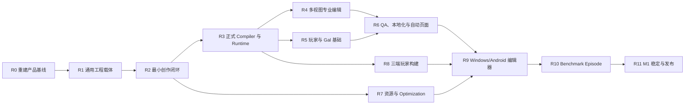

# 游戏引擎产品落地开发计划

> 生效日期：2026-08-13
> 目标版本：M1 Stable
> 上游需求：[PRD](03-prd.md)、[Gal 基础系统](11-gal-foundation-and-automation.md)、[优化规格](12-size-performance-stability.md)
> 状态权威：[M1 需求与验收追踪矩阵](90-m1-requirement-traceability.md)
> 当前审计：[N51-E6f 出口复审](235-n51-e6f-engineering-exit-reaudit.md)确认 N51 Engineering 关闭；[N51→N52 治理检查点](236-n51-n52-governance-checkpoint.md)建立的 `RA-N21-011` 只授权 N52 Player Control Engineering，[E3c3 修订 #245](245-n52-e3c3-checkpoint-authority-amendment.md)进一步只允许 checkpoint 所需的 N20/N30/N31/Save 合同变化。工程底座仍明显领先于 Android、三端构建与商业 Benchmark 产品闭环；Authority 未合入 `main`，全部 Product Acceptance、N60+、M1/发布继续阻断。
> 核心原则：进度以“能否制作并交付真实游戏”衡量，不以平台 Spike、代码行数或孤立测试衡量。

## 1. 最终交付定义

M1 必须交付一套实际可用的视觉小说游戏引擎：

1. 创作者在 Windows 和 Android 上可以创建、打开和编辑同一个本地工程；
2. 工程包含角色、场景、资源、对白、选择、条件、变量、演出、配置、本地化和 QA 数据；
3. Route、Sequence、Script、Stage、Preview 和 Debugger 是同一 Canonical Project 的不同投影；
4. Compiler 将工程确定性编译为版本化 Runtime IR、Catalog 和资源 Manifest；
5. 同一 IR 在 Web、Windows、Android 玩家中产生一致剧情状态；
6. Windows 编辑器能够生成可正式分发的 Web、Windows、Android 产物；
7. 使用该引擎完成并发布一部 20–30 分钟的 Benchmark Episode；
8. 编辑器、玩家、工程和存档均通过恢复、性能、安装、升级、安全和发布审核。

在第 7 项完成前，项目只能称为开发版本，不能称为“引擎已落地”。

## 2. 执行规则

### 2.1 节点完成规则

每个节点必须同时具备：

- `Goal`：唯一、可验证的用户或引擎目标；
- `Scope`：明确包含和排除；
- `Inputs`：依赖的 Schema、模块、设计和前序节点；
- `Implementation`：具体代码、数据、UI 和迁移任务；
- `Artifacts`：可检查的工程、程序包、报告或截图；
- `Tests`：单元、契约、集成、E2E、故障和性能中适用的层级；
- `Acceptance`：可重复命令和用户任务；
- `Stop conditions`：出现何种事实必须停止扩展并修正设计。

缺任一项时节点状态最多为“进行中”。

### 2.2 状态流

`未开始 → 设计冻结 → 实现中 → 集成中 → 验收中 → 通过`

- “设计冻结”必须有 Schema/接口和验收用例；
- “实现中”不能对外宣称功能可用；
- “集成中”要求 UI 到 Domain 已连接，但尚未形成产物；
- “验收中”要求端到端链已贯通；
- “通过”要求证据已进入追踪矩阵。

### 2.3 主分支纪律

- 产品主分支只接收当前交付节点需要的变更；
- 技术实验使用可抛弃分支，必须声明服务的产品节点；
- 禁止继续堆叠不面向主线的 Spike；
- 每个 PR 只关闭一个可描述的产品/引擎结果；
- PR 描述必须列出 `REQ-*`、`AC-*`、失败路径和复现命令；
- 功能 PR 必须同时更新追踪矩阵；
- 不允许通过放宽超时、删除断言或降低设备门槛使节点变绿。

## 3. 交付拓扑

R1–R3 是最短可玩链。它们完成前，不新增资源高级算法、平台极端恢复或 P1/P2 能力。

## 4. 里程碑总览

| 里程碑 | 用户可见结果 | 进入条件 | 退出条件 |
|---|---|---|---|
| R0 重建产品基线 | 团队知道每个需求在哪里、怎样完成 | 本计划获批 | 追踪矩阵、Repo 主线、Golden 项目和 E2E 骨架存在 |
| R1 通用工程载体 | 可创建、保存、导出、重新打开任意工程 | R0 | 空项目和示例项目都可 round-trip，无固定项目假设 |
| R2 最小创作闭环 | 可制作一个 5 分钟分支短篇 | R1 | 角色/场景/对白/选择/条件/演出/预览/保存完整 |
| R3 Compiler 与 Runtime | 编辑内容可由正式 VM 运行 | R2 | Editor → Compiler → VM → Save/Load/Back 闭环 |
| R4 专业多视图 | Route/Sequence/Script/Stage 同源编辑 | R3 | 四视图和跨视图定位/撤销/同步通过 |
| R5 玩家与 Gal 基础 | 作品具有完整视觉小说玩家体验 | R3 | 玩家 UI、配置、历史、Auto、Skip、Save、输入可用 |
| R6 制作自动化 | QA、本地化、画廊/回想/音乐室自动生成 | R4+R5 | 特色生产功能端到端通过 |
| R7 Optimization | 优化结果可解释、可回退并进入构建 | R2 | 预算/Profile/资源变体/报告贯通 |
| R8 三端玩家 | 同一工程生成三端可玩产物 | R3 | Web/Windows/Android 固定路线状态一致 |
| R9 双端编辑器 | Windows/Android 完整创作 | R4+R6+R7+R8 | 双端核心任务和工程交换通过 |
| R10 验收作品 | 20–30 分钟真实游戏完成 | R9 | 三端分发包、用户测试、设备性能通过 |
| R11 M1 Stable | 可对外发布的引擎与玩家 | R10 | AC-01–AC-27 全通过且 Release Assurance 通过 |

## 5. R0：重建产品基线

### N00 产品主线与仓库基线

> 状态：通过。实现、自审、本地完整门、推送与 Draft PR Windows CI 均完成；证据见[《N00 产品主线与仓库基线审计》](91-n00-product-baseline-audit.md)。

- **Goal**：形成一个可连续集成的产品主分支，结束堆叠实验分支代替产品主线的状态。
- **Inputs**：S0.41 Web 原型、CL-03/04 已有证据、当前依赖锁。
- **Implementation**：
  1. 选择包含全部已审计代码的基线；
  2. 将实验宿主标记为 `spikes/` 或 `conformance/`，与正式应用隔离；
  3. 建立 `apps/editor`、`apps/player-web`、`apps/player-windows`、`apps/player-android`、`packages/project-domain`、`packages/project-compiler`、`packages/runtime`、`packages/build-core` 的目标边界；
  4. 为每个 workspace 定义 owner、稳定性等级和允许依赖方向；
  5. 建立产品主线 CI：format、typecheck、unit、integration、E2E、architecture、build。
- **Artifacts**：仓库结构 ADR、依赖图、绿色基线 CI。
- **Acceptance**：全新 checkout 一条命令安装、测试并启动编辑器。
- **Stop conditions**：正式包依赖 Spike App；同一语义存在两个不兼容模型；无法从干净环境复现。

### N01 需求追踪与演示工程

> 状态：通过。50 项 M1 追踪审计、七类 Golden Seed、PR 更新纪律、每周空目录演示、本地完整门和 Draft PR Windows CI 均完成。证据见[《N01 需求追踪与 Golden 基线审计》](92-n01-requirement-golden-baseline.md)。

- **Goal**：所有 P0 和 27 条验收均有 owner、实现节点、测试和证据位置。
- **Implementation**：
  1. 使用 `REQ-*` 和 `AC-*` 标识；
  2. 建立 Tiny、Branching、Media、CJK、Recovery、Size、Benchmark 七类 Golden Project；
  3. 每个 Golden Project 保存源工程、期望 IR Hash、关键状态 Hash 和构建 Manifest；
  4. 建立每周“空目录到 Web Build”演示脚本；
  5. 所有功能 PR 更新追踪矩阵。
- **Artifacts**：`fixtures/projects/*`、追踪矩阵、E2E 测试入口。
- **Acceptance**：CI 能验证追踪表无未知 REQ/AC、每项通过状态都有证据链接。

## 6. R1：通用工程载体

### N10 Canonical Project Schema

> 状态：通过。正式 `project-domain`、`.world` v1 多文件格式、S0/七类 Golden 迁移、任意工程 Editor Session 适配、本地完整门和 Draft PR Windows CI 均完成。证据见[《N10 Canonical Project Schema 审计》](93-n10-canonical-project-schema.md)。

- **Goal**：移除 `campusStoryProject` 固定假设，定义任意项目的权威数据边界。
- **Scope**：Project、Chapter、Scene、Character、Variable、Asset、Localization、Settings、UI、Plugin、Test Route、稳定 ID 和版本。
- **Implementation**：
  1. 新建平台无关 `project-domain`；
  2. 将 Project Manifest、脚本、角色/资源清单、布局 Sidecar 分为源文件；
  3. 冻结 JSON Schema 与 `.world` 文件版本；
  4. 稳定 ID 采用可生成、可校验、重命名不变的策略；
  5. 所有派生缓存可删除重建；
  6. 实现从 S0 固定快照到通用 Schema 的一次性迁移。
- **Tests**：Schema、重复 ID、未来版本只读、迁移幂等、未知字段保留、Git diff Golden。
- **Acceptance**：两个结构不同的工程可加载、保存、重载并保持语义 Hash。
- **Stop conditions**：项目语义仍从 UI state 推断；新增场景需要修改 TypeScript 常量；未知字段静默丢失。

### N11 Project Service 与事务命令

> 状态：通过。统一 Project Service、全实体事务命令、ChangeSet、Revision 冲突、批处理、Undo/Redo、提交版本保存门、SourceSession 适配、本地完整门和 Draft PR Windows CI 均完成。证据见[《N11 Project Service 与事务命令审计》](94-n11-project-service.md)。

- **Goal**：所有视图通过同一命令修改项目，不直接写文件或维护第二份数据。
- **Implementation**：
  1. 定义 Create/Rename/Delete/Move Chapter/Scene/Character/Variable/Asset 命令；
  2. 定义 Insert/Update/Delete/Move Story Statement 命令；
  3. 命令包含 `commandId`、`expectedRevision`、稳定实体 ID 和结构化错误；
  4. 建立 ChangeSet、Undo/Redo、批处理和语义冲突；
  5. 将现有 SourceSession/patch 能力收敛为 Project Service 适配器；
  6. 保存只接收已提交 Project Revision。
- **Tests**：幂等、撤销重做、批处理原子性、陈旧 Revision、跨文件引用更新和故障注入。
- **Acceptance**：用命令从空 Project 创建两场景分支故事，撤销到空项目，再重做到相同 Hash。

### N12 项目首页与文件生命周期

> 实施状态（2026-08-13）：通过；本地完整门与 Draft PR #27 Windows CI 均成功。证据见[《N12 项目首页与文件生命周期审计》](95-n12-project-lifecycle.md)。

- **Goal**：用户可以管理真实工程，而不是自动进入固定样例。
- **Implementation**：
  1. 新建、打开、最近、示例、导入、导出入口；
  2. 项目模板只提供默认值，不锁定结构；
  3. Windows 使用目录选择器；Web 使用 File System Access/OPFS；Android 后续接 SAF；
  4. 显示项目位置、Schema、脏状态、恢复状态和只读原因；
  5. 完整工程 ZIP 导入/导出防 Zip Slip；
  6. 外部文件变化检测、增量重载和三方冲突界面；
  7. 最近项目只保存引用和权限句柄，不复制权威内容。
- **Artifacts**：可下载/可 Git 管理的工程目录。
- **E2E**：新建 → 保存 → 关闭 → 重开；导出 → 清空本地状态 → 离线导入 → 重开。
- **Acceptance**：AC-08 在 Web/Windows 基础链通过；不存在固定项目 ID。

### N13 章节、场景、角色和变量管理

> 实施状态（2026-08-13）：通过；本地完整门与 Draft PR #28 Windows CI 均成功。证据见[《N13 章节、场景、角色和变量管理审计》](96-n13-entity-management.md)。

- **Goal**：创作者可以建立故事骨架和引用对象。
- **Implementation**：
  1. 章节/场景树的创建、删除、排序、重命名和入口设置；
  2. 角色、显示名、颜色、立绘槽位和默认表达式；
  3. Boolean/Number/String 变量、默认值、作用域和引用；
  4. 删除前引用分析和安全迁移；
  5. 手机不依赖拖拽的等价操作；
  6. 全局搜索覆盖新实体。
- **Acceptance**：从空项目建立 1 章、3 场景、2 角色、3 变量，保存重开后引用不变。

## 7. R2：最小创作闭环

### N20 Story Language P0

> 状态：通过。P0 CST/AST、安全表达式、语言服务、通用 Patch、100k 增量门、本地完整门、推送与 Draft PR #29 Windows CI 均完成；证据见[《N20 Story Language P0 审计》](97-n20-story-language-p0.md)。

- **Goal**：脚本能够表达 M1 最小可玩故事。
- **Scope**：Dialogue、Narration、Choice、Label、Jump、Call/Return、Set、Condition、Wait、End、Background、Character、Audio。
- **Implementation**：
  1. 冻结语法和 CST/AST；
  2. 未知命令、注释、稳定 ID 和有效未知参数往返保留；
  3. 类型化表达式，不允许任意 JavaScript；
  4. 建立引用解析、补全、诊断、定义和引用索引；
  5. 实现所有 P0 节点的结构 Patch；
  6. Formatter 不改变语义或 ID。
- **Tests**：10 万行增量、1,000 次跨视图改写、未知插件、CJK/Ruby、嵌套条件和冲突。
- **Acceptance**：Branching Golden Project parse → edit → format → parse Hash 不变。

### N21 最小 Writer/Sequence 编辑

> 实施状态（2026-08-15）：工程实现门通过；本地完整门和 Draft PR #30 Windows CI 完成，等待 20 分钟非程序用户实测。主持人预演发现并修复了空工程对白非法角色引用，T02 已与角色前置需求对齐，详见 [N21 真人验收就绪预演审计](118-n21-human-readiness-rehearsal-audit.md)；权威记录仍为 `pending-participant`。旧 `RA-N21-001` 已关闭，`RA-N21-002` 不把 N21 标记为通过。

- **Goal**：非程序用户能完成对白、选择、条件和基础演出。
- **Implementation**：
  1. 语句卡覆盖 N20 全部 P0 类型；
  2. 插入菜单、快捷键、复制、删除、排序、批量选择、折叠；
  3. Inspector 使用类型化参数，不解析显示字符串；
  4. Choice 选项和 Condition 分支可视化编辑；
  5. 角色/变量/资源/场景引用使用稳定 ID 选择器；
  6. 错误不污染最后有效语义；
  7. 每个操作有键盘和触屏替代。
- **E2E**：创建对白 → 添加两选项 → 设置变量 → 条件进入两个结局 → 加入背景/BGM。
- **Acceptance**：不了解脚本语法的测试者能在 20 分钟内完成任务。

### N22 最小 Stage 与媒体预览

> 准入状态（2026-08-15）：旧 `RA-N21-001` 已关闭；`RA-N21-002` 在指定权威集成基线上允许推进 N23 可运行纵向切片，但不关闭 N21 真人门，不替代 Draft PR 集成，也不允许通过 N23。
> 实施状态（2026-08-15）：N22 工程验收通过。前十切片及真实 PNG/WAV Media Golden 已覆盖计划中的最小 Stage/Preview 边界；退出审计又补齐真实 WAV `paused=false`、播放时间前进、重开后继续播放和自动播放受限回退证据，并以组件测试与 Golden 登记审计固化。当前主后端为 `canvas-2d-v1`，不宣称 Pixi/WebGL、复杂关键帧或正式 Player Runtime 已实现；完整对齐见[N22 退出条件审计](113-n22-exit-condition-audit.md)。`RA-N21-002` 仍阻断 N21/N23 Product Acceptance、M1 Stable 与 Public Release。

- **Goal**：创作者看到真实资源驱动的基础舞台结果。
- **Implementation**：
  1. Pixi/Canvas 场景层与 DOM 文本/UI 分离；
  2. 背景、角色槽位、表情、位置、缩放、旋转、锚点、层级；
  3. BGM/Voice/SFX/Ambient 基础播放和停止；
  4. Fade/Move/Show/Hide 基础过渡；
  5. 设计分辨率、横竖屏、安全区；
  6. 缺失/不可信资源安全占位；
  7. 当前语句、Stage 对象和 Sequence 卡同步选中。
- **Tests**：资源生命周期、Object URL 释放、错误解码、切场景、DPR、触摸命中和视觉 Golden。
- **Acceptance**：Media Golden Project 在 Preview 中正确显示和播放，不使用 CSS 假素材替代导入资源。

### N23 五分钟可玩切片 Gate

> 实施状态（2026-08-15）：E1 可运行流程、E2 空工程创作闭环、E3 自包含资源 ZIP、E4 独立离线试玩 HTML、E5 五分钟内容量、E6 双参与者协议与 E7 一键验收启动器已贯通，详见 [N23 产品验收执行包](121-n23-product-acceptance-execution-kit.md)及 [N23-E7 审计](122-n23-e7-acceptance-launcher-audit.md)。真人状态仍为 N21 `0/1`、N23 `0/2`，N23 产品验收未通过；风险例外仅允许继续 N30 Compiler 工程候选，N31/N50 仍被阻断。

- **Goal**：第一次证明引擎主体，而不是局部组件。
- **Required artifact**：从空工程制作的 5 分钟、3 场景、2 角色、2 结局作品。
- **Required flow**：一键启动生产验收环境 → 新建 → 资源导入 → 角色/变量 → 对白/选择/条件 → 演出 → 保存 → 关闭重开 → 预览完整路线 → 构建并运行独立 HTML。
- **Acceptance**：先完成 N21，再由两名不同的非实现者各自按 `N23-PA-01` 完成编辑、保存重开、编辑器双路线、独立 HTML 构建与双路线；Severity 0/1 为 0；哈希证据有效；工程不包含硬编码样例引用。
- **Gate**：N23 未通过，不进入 R4/R6/R7 的功能扩展。

## 8. R3：正式 Compiler 与 Runtime

### N30 Project Compiler

> 实施状态（2026-08-15）：E1 最小内核与 E2 工程退出切片已形成完整工程候选。独立 portable package、Runtime IR v1、语句级 CFG/SCC 诊断、双 Hash 场景缓存、完整 Catalog、Debug/Release Artifact 差异、licenses/SBOM 输入和 Tiny/Branching/Media/CJK IR Golden 均已建立，本地完整门及 Draft PR #35 Windows / Node 22 跨机器复验均通过。`RA-N21-002` 仍阻断 N30 Product Acceptance 与 N31 Engineering，故不把工程候选登记为产品通过。详见 [E1 审计](123-n30-e1-project-compiler-audit.md)、[E2 审计](124-n30-e2-compiler-completion-audit.md)与[顺序门交接审计](125-n30-exit-human-gate-handoff-audit.md)。

- **Goal**：将权威工程确定性编译为玩家可执行数据。
- **Implementation**：
  1. Project AST → 校验后的 Story IR；
  2. 生成 Source Map、Asset Manifest、Localization Catalog、Ending/Gallery/Replay/Music Catalog；
  3. 编译不可达、悬空引用、缺失资源和无出口诊断；
  4. 所有输出排序、版本和 Hash 确定；
  5. 增量编译按场景/资源失效；
  6. Debug 与 Release Profile 分离。
- **Artifacts**：`manifest.json`、`story.ir`、`source-map.json`、Catalog、licenses、SBOM 输入。
- **Tests**：同工程跨机器 Hash、一字符变更最小失效、错误源码定位、未来 Opcode 拒绝。
- **Acceptance**：Tiny/Branching/Media/CJK 工程均生成稳定 IR。

### N31 正式 Narrative Runtime

> 实施状态（2026-08-20）：E1–E14 已完成 N31 Engineering。[E14 复审](140-n31-e14-runtime-engineering-exit-reaudit.md)逐项得到 VM-01–VM-15 `完整 15 / 部分 0 / 未对齐 0`；Draft PR #50 的 Windows / Node 22 完整门 run `32349504993` / job `96365349584` 用时 4 分 01 秒绿色。本机 Node 25 完整 check 因既有 10,000-seed 107.871 秒超过 90 秒而保持红色，没有放宽门槛，并作为非权威 CI 环境性能差异保留；根 `engines` 实际声明为 `>=22.12.0`，不能写成 Node 25 不受支持。`RA-N21-004` 继续阻断 N31 Product Acceptance，但只解除 N32 Engineering 前置，不解除任何产品、N40+、M1 或发布门。

- **Goal**：把 VM Spike 收敛成受支持的 Runtime 包。
- **Implementation**：
  1. 将 VM-01–VM-15 契约迁入正式包；
  2. 版本化 State、PRNG、Call Stack、Scene State、Meta Progress；
  3. Effect 请求、取消、Barrier 和宿主响应协议；
  4. Save/Load、Checkpoint、History、Back/Forward；
  5. Normal/Auto/Skip Read/Skip All/Instant 调度；
  6. 结构化诊断映射到 Source Statement ID；
  7. 移除正式包对 Spike Harness 的依赖。
- **Tests**：固定向量、10k corpus、损坏/未来 Save、异步竞态、Barrier、分支截断。
- **Acceptance**：同一 IR/输入在 Node 与 Web Worker State Hash 零差异，全套测试在预算内稳定通过。
- **Exit audit**：E14 复审确认 VM-01–VM-15 全部对齐，独立 Windows / Node 22 完整门绿色，N31 Engineering 通过。最终判定以 [N31-E14](140-n31-e14-runtime-engineering-exit-reaudit.md)为准；Engineering 通过不等于 Product Acceptance，也不授权进入 N32。

### N32 Editor Preview 接入正式 Runtime

> 准入状态（2026-08-20）：[N31→N32 治理与集成检查点](141-n31-n32-governance-integration-checkpoint.md)已通过，集中 Draft PR #51 的 Windows / Node 22 完整门绿色；`RA-N21-004` 只允许本节点 Engineering。N32 Product Acceptance、N40 及以后仍被阻断。

> E1 实施状态（2026-08-21）：Editor 的“完整流程试玩”已停止直接遍历 `StoryStatement`，改为从 Canonical Project 调用 N30 Project Compiler，再由 N31 Runtime 执行 IR；Choice、结局与当前语句定位来自 Runtime Event/State 和 Source Map。两条生产浏览器路线和编译失败关闭均通过。[稳定性纠偏](143-n32-e1-runtime-corpus-stability-audit.md)在不减少 10,000 seeds/20,000 replays/40 chunks/负例、不改变 digest 且不放宽 90 秒门的前提下完成；Draft PR #52 纠偏头 run `32457615078` 用时 4 分 8 秒并通过完整门，E1 Engineering 关闭。Run from Scene/Statement、状态检查器、Back/Forward/Over、热更新与共享 Player Host 仍属于 E2+。

> E2 实施状态（2026-08-21）：正式 Preview Session 已提供变量、调用栈、当前 IR/Statement、revision、逻辑时间与结构化 Compiler/Runtime/Source Map 诊断观察；现代化状态检查器在生产浏览器中实际显示 r1/r4 精确位置和经产品 UI 创建的 Number 初值 2，console error 为 0。Draft PR #53 的 Windows / Node 22 完整门 run `32459445287` / job `96703241983` 用时 4 分 16 秒并绿色，E2 Engineering 关闭。Run from Scene/Statement 明确保留给 E3，详见 [N32-E2 审计](144-n32-e2-preview-session-observability-audit.md)。

> E3 实施状态（2026-08-21）：正式 Preview 已可从所选 Scene 第一条 IR 或所选 Statement 的 Source Map 精确位置 Fresh Run；变量恢复工程默认值、调用栈为空，直接从 `return` 启动会以明确调用上下文诊断关闭。真实生产浏览器的 Scene/Statement/同目标重启路径和 console 0 error 已通过；Draft PR #54 的 Windows / Node 22 完整门 run `32461345815` / job `96708731870` 用时 4 分 16 秒并绿色，E3 Engineering 关闭，详见 [N32-E3 审计](145-n32-e3-run-from-target-audit.md)。

> E4 实施状态（2026-08-21）：Editor Preview 已直接接入正式 Runtime History/Scheduler，提供 Continue、Step Over、Back/Forward 和执行前 Run to Cursor；内部指令 transient、Choice 阻断、调用栈 Step Over、recorded future 与分支 fork 均有正反例及真实生产浏览器证据。Draft PR #55 的 Windows / Node 22 完整门 run `32464584207` / job `96718382563` 用时 4 分 15 秒并绿色，E4 Engineering 关闭，详见 [N32-E4 审计](146-n32-e4-preview-debug-controls-audit.md)。

> E5 实施状态（2026-08-21）：Editor Preview 已建立正式 Effect / Stage Host receipt，消费 Runtime Effect Intent，并提供 awaited 完成/安全取消、Barrier 原因与明确批准、Back checkpoint 通道恢复、reversible compensation 和 Forward replay；未批准时 Stage 明确保持未提交。生产 build 已真实验证 awaited、cancel、Barrier approve 与 pure Effect Back/Forward 差异修正。Draft PR #56 的实现头 `dcfe084` 已通过 Windows / Node 22 完整门 run `32467211148` / job `96726246321`，用时 4 分 9 秒，E5 Engineering 关闭，详见 [N32-E5 审计](147-n32-e5-preview-effect-host-audit.md)。E5 不包含热更新、复杂 GPU 渲染或共享 Web Player Host。

> E6 实施状态（2026-08-21）：Preview 已新增受约束热更新：仅对白/旁白正文与 Choice prompt/label 在稳定 ID、控制流、Source Map 和运行语义不变时，以记录输入重放到新 IR 并保持 State、History、分支位置与 Host receipt；Direction、变量、控制流、等待、待决 Effect/Barrier、transient 光标或编译失败均保留旧 Session，并要求用户明确重启。自动化与 production browser 已验证 `h4/4` 安全迁移、结构变化仍为 `h4/4`、明确重启后回到 `h1/1`。Draft PR #57 实现头 `34dfbf1` 的 Windows / Node 22 完整门 run `32470326283` / job `96735561264` 用时 4 分 20 秒绿色；本机 Node 25 性能差异未通过放宽门槛掩盖，E6 Engineering 关闭，详见 [N32-E6 审计](148-n32-e6-preview-hot-update-audit.md)。

> E7 实施状态（2026-08-22）：新增 portable `@world-studio/runtime-host`，Editor 正式 Preview 与真实浏览器 Worker 验证宿主已消费同一 Effect receipt/reconciliation reducer 和确定性 SHA-256 快照；Editor 私有 Host 已删除。实测同时发现并修正 N23 Benchmark 的四条旧式 Direction 与缺失 `promise_state` 声明，两条正式 Compiler/Runtime 路线均在 production browser 跑到正确结局，Back/Forward 可返回同一结局。纠偏提交 `c93514e` 已通过 Draft PR #58 的 Windows / Node 22 完整门 run `32505981631` / job `96846121361`，用时 4 分 16 秒；此前干净安装暴露的 `dist` 入口问题已按真实日志关闭。详见 [N32-E7 审计](150-n32-e7-shared-runtime-host-audit.md)。

> 出口复审状态（2026-08-22）：[N32 出口复审](151-n32-engineering-exit-reaudit.md)为 Implementation `完整 5 / 部分 1 / 未对齐 0`，Acceptance `0/1`。共享 Host 工程前置已建立，但 `apps/player-web` 仍不存在，旧“构建试玩 HTML”仍是独立 `StoryStatement` 解释器；因此不能把测试宿主称作 Player，也没有 Editor↔正式 Player 画面 Golden。N32 Engineering 总出口仍未通过。

> 顺序纠偏（2026-08-22）：正式 Player Shell 位于 N50、正式 Web 构建位于 N80，不能为了补 N32 的跨宿主 Acceptance 直接跳过 N40–N43。N32 产品门继续挂起；`RA-N21-005` 只允许按计划进入 N40 Route Map Engineering，详见 [N32→N40 治理检查点](152-n32-n40-governance-checkpoint.md)。

- **Goal**：编辑器中看到的结果就是玩家 Runtime 的结果。
- **Implementation**：
  1. Preview 只消费 Compiler 输出，不直接遍历 StoryStatement；
  2. Run from Entry/Scene/Statement；
  3. 当前变量、调用栈、语句、Effect 和舞台状态可见；
  4. Step Back/Forward/Over、Continue、Run to Cursor；
  5. 热更新保留安全状态，结构变更时明确重启；
  6. Preview 和 Player 共用渲染/音频 Host Adapter。
- **Acceptance**：Editor Preview 与 Web Player 对固定输入产生相同状态和画面关键快照。

## 9. R4：专业多视图编辑

### N40 Route Map

> E1 实施状态（2026-08-22）：已建立 portable `@world-studio/route-graph`，从 Canonical Project 调用正式 Compiler 投影场景、控制流事实、连接与诊断；Editor 已实际跑通搜索、选择、进入 Sequence，以及通过 Project Service 改名后 Route/Writer/Script 保持同一稳定 ID。完整 10k 图、布局 Sidecar、分组/折叠/局部加载、路线高亮、可撤销图编辑和 500 ms 增量门仍未完成，详见 [N40-E1 审计](153-n40-e1-route-graph-core-audit.md)。

> E2 实施状态（2026-08-22）：真实 10k 二叉分支 Canonical Project 已经正式 Compiler 投影为 10,000 节点/9,999 边/0 诊断；Route Index 与 Editor 固定窗口将 DOM 限制为 64 节点/256 相关边，并实测分页和搜索。该能力是编译后有界查询，不是存储层 lazy loading；布局 Sidecar、10k 局部编辑和 500 ms 同步仍未完成，详见 [N40-E2 审计](154-n40-e2-10k-route-window-audit.md)。

> E3 实施状态（2026-08-22）：Canonical `layouts/*.json` 已从空壳 `JsonObject[]` 收紧为 `nodeId/x/y` 坐标契约，并新增 Project Service `layout.node.set` / `layout.reset`、确定性自动布局、Editor 坐标编辑和真实工程保存/重开。自动化与 production browser 均证明布局删除重建不改脚本/Compiler 图、场景脚本改名后坐标保持。分组/折叠、视口、拖拽、存储级 lazy loading、10k 局部编辑和 500 ms 门仍未完成，详见 [N40-E3 审计](155-n40-e3-route-layout-sidecar-audit.md)。

> E4 实施状态（2026-08-22）：Canonical Layout 已加入严格分组、折叠与视口契约；创建/更新/删除分组、节点归组、折叠和视口保存全部经 Project Service，分组删除和元数据承载场景删除具备一致性处理。Editor 支持原生拖拽，并提供 `Alt+方向键` 与显式触控方向按钮作为等价可访问路径。自动化、production build 和真实工程刷新恢复均通过；浏览器自动化没有把未成功合成的原生 DnD 手势冒充通过，拖放事件路径由真实 DOM 事件测试覆盖。存储级 lazy loading、高级过滤、运行路线高亮、10k 局部编辑和端到端 500 ms P95 仍未完成，详见 [N40-E4 审计](156-n40-e4-route-layout-interaction-audit.md)。

> E5 实施候选状态（2026-08-22）：Route Window 已支持章节、节点类型和视觉分组 P0 组合过滤，并在过滤后再应用 64 节点窗口。需求审计同时纠正文档口径：PRD P0 只要求过滤，按角色/变量/覆盖过滤属于 P1，不能偷带为当前 N40 完成条件。定向、全仓与 production build 已实际通过；production browser 三次被管理员安全校验拒绝，故 E5 尚未关闭。详见 [N40-E5 审计](157-n40-e5-route-filtering-audit.md)。

> E6a Engineering 状态（2026-08-22）：`ProjectWorkspace` 已新增受限选择性读取能力，Web adapter 通过文件句柄读取计数证明未读取无关文件，Node adapter 在真实临时目录中读取指定切片并拒绝真实目录联接逃逸；本地全仓、production build 与远端 Windows / Node 22 完整门通过。这只是宿主按需读取基础，Route 打开/换窗仍走完整 Canonical Project；后续 E6b 审计又确认必须先补缓存失效所需的无正文 inventory。详见 [N40-E6a 审计](158-n40-e6a-selective-project-read-audit.md)。

> E6b Engineering 状态（2026-08-22）：真实代码审计否决了“无失效依据直接信任 Route 派生缓存”的原顺序。Web/Node workspace 现可在不读取 JSON 正文时枚举源文件 path/size/modified stamp；Web 正文计数保持 0，Node 真实目录修改会改变 inventory version，私有缓存被排除且目录联接继续拒绝；本地与远端 Windows / Node 22 完整门通过。stamp 仅是快速失效提示，不是内容 Hash；E6c 必须补缓存内容校验与全量回退，E6d 才接入 Launcher/Route。详见 [N40-E6b 审计](159-n40-e6b-project-file-inventory-audit.md)。

> E6c Engineering 状态（2026-08-22）：Web/Node 已隔离 `.world-cache` 并在源保存前失效，Node 真实目录联接的缓存读/写/清理全部拒绝。Project Compiler cache artifact 冻结 schema/compiler/IR/inventory、逐源 SHA-256 与 envelope Hash；实际测试证明 miss 全编译、hit 全复用，以及同 inventory 正文篡改时 `source-mismatch` 全量重建。本地全仓及远端 Windows / Node 22 完整门已通过（run `32582972218`）。当前 workspace 编译入口仍全量读取源完成 Hash 校验，且尚未接入 Launcher/Route，不能登记为冷启动 lazy loading。详见 [N40-E6c 审计](160-n40-e6c-verified-compiler-cache-audit.md)。

> E6d 实施候选状态（2026-08-23）：Studio Launcher 的创建/打开/Recent/示例/导入/保存已统一进入 verified workspace Compiler lifecycle；Route 在项目 Hash 对齐时消费该次正式 Compiler 结果，并显示 miss/hit/rebuild 与 compiled/reused 数，未保存改动明确降级为内存临时全量编译。实际自动化证明首次 miss、重开 hit、保存后 miss/rebuild、再重开 hit，future-schema 不调用当前 Compiler；本地完整门与远端 Windows / Node 22 重跑已通过（run `32584113370` / job `97058322039`）。production browser 三次在页面加载前被管理员安全校验拒绝，因此 E6d 尚未关闭。当前仍全量读取源，且打开阶段有 lifecycle probe 与 workspace compile 两次读取，不能登记为冷启动 lazy loading。详见 [N40-E6d 审计](161-n40-e6d-launcher-route-cache-integration-audit.md)。

> E6e Engineering 状态（2026-08-23）：已纠正 E6d 的“未保存改动临时全量编译”路径。Project Compiler 新增不生成发布产物的权威增量分析入口；只有经 Project Service 确认、且 cache 已由宿主验证或当前进程生成的场景局部变更，才可跳过 9,999 个未变场景的依赖 Hash 重算，场景集合变化自动回退完整校验。Route/Sequence/Script 的局部动作已登记变更场景；Project Service 的 ChangeSet 改为独立 SHA-256 事务修订链，工程语义 Hash 继续只负责持久化/Compiler 对齐。完整负载下 10k 单场景改名到 Route 锚点窗口 20 样本 P95 `64.10 ms`（预算 `<500 ms`），1 编译 / 9,999 复用；完整 `npm run check` 退出 0。production browser 仍被管理员策略阻止，冷启动正文局部读取与运行路线高亮仍未完成，故不关闭 N40 Product Acceptance。详见 [N40-E6e 审计](162-n40-e6e-route-edit-sync-performance-audit.md)。

> E7 Engineering 状态（2026-08-23）：Formal Runtime 现在从 active History cursor 投影当前场景、已访问场景和精确 `choiceSelected.optionId`；Flow Route Map 只读消费该轨迹，Back 会撤销未来连接高亮，Forward 会恢复，Runtime 当前场景跨出 64 节点窗口时自动重新锚定。定向 `2 files / 21 tests`、全量 `104 files / 658 tests`、10k/20k Runtime corpus、全部构建/架构/性能门均通过；最终复跑 Route 编辑 P95 `62.14 ms < 500 ms`。Windows CI 两次暴露 65 场景整应用 UI 用例的 5 秒负载敏感 timeout；未放宽门，而是保留三场景整应用产品链，并用真实 65 节点 Compiler 图独立验证窗口锚点，边界用例连续三次为 `11–13 ms`。稳定化提交 `bae2b75` 的 run `32589014554` / job `97069769247` 在 3m40s 完整通过。Vite 实际启动，但 production browser 两次被管理员安全策略阻止在页面加载前，故 browser 与 N40 Product Acceptance 不关闭；冷启动正文局部读取仍缺可信协议。详见 [N40-E7 审计](163-n40-e7-runtime-route-highlight-audit.md)。

> E8a Engineering 状态（2026-08-23）：真实调用链审计发现 Launcher 先由 Lifecycle 全量读源，再由 Workspace Compiler 全量读源，cache hit 只减少编译而没有减少两次正文扫描。本轮先选择性读取 manifest 探测 schema；current schema 只执行一次保留逐源 SHA-256 与 inventory 稳定检查的正式 Compiler 读取，并从同一结果建立 Lifecycle Session；future schema 只读 manifest，不扫描 scene/script/layout 或调用 Compiler。Browser Handle 实测 current miss/hit 的 `[manifest, script, layout]` 均为 `[2,1,1]`，future 为 `[1,0]`；全量 `104 files / 661 tests`、Route P95 `59.05 ms` 和远端 run `32589909573` / job `97071987355` 均通过。current cache hit 仍全量读源，故冷启动局部正文读取与 N40 Product Acceptance 不关闭；下一协议必须落地可信原子 source snapshot identity 或内容寻址不可变目录。详见 [N40-E8a 审计](164-n40-e8a-single-project-read-audit.md)。

> E8b Engineering 状态（2026-08-23）：新浏览器受管工程已迁移到事务型 IndexedDB workspace。source bodies、按 path 排序且带逐文件 SHA-256 的 trusted commit 与派生缓存失效在同一 strict transaction 发布；单调 generation、commit Hash、expected-version 冲突拒绝及正文损坏闭锁均有实际测试。Studio Launcher 的新建、示例、五分钟验收、ZIP 导入和 Recent 重开已接入，历史 OPFS 与外部目录保持兼容但不被错误升级为 trusted。定向 `5 files / 17 tests`、全量 `106 files / 665 tests`、Route P95 `59.28 ms` 及 GitHub Windows / Node 22 run `32643998215` / job `97205305615` 均通过；浏览器仍被管理员安全策略阻断。Compiler/Route 尚未消费 trusted commit，故 E8b 只关闭可信宿主前置，不关闭正文局部读取或 N40 Product Acceptance；E8c 继续建立受信 cache hit 与完整回退。详见 [N40-E8b 审计](165-n40-e8b-atomic-source-commit-audit.md)。

> E8c Engineering 状态（2026-08-23）：调用链审计纠正了“只读 manifest/选中场景即可进入当前完整编辑器”的超前计划，因为同步 `ProjectLifecycleSession`、App 与 Project Service 仍要求完整 Canonical Project/baseFiles。Compiler disposable cache 已显式升级为 v2，包含 exact source snapshot、逐源 Hash、正式 scene cache 与 envelope Hash；只有自行验证 trusted commit schema/generation/path/size/Hash/version，且前后 revision 稳定时，warm reopen 才从 snapshot 恢复并保持 `fullReads=1`。损坏 cache 会使计数增至 2 并重建；伪造 commit、外部目录和旧宿主继续 full verified read。定向 `5 files / 20 tests`、全量 `106 files / 669 tests`、Route P95 `60.81 ms` 及 GitHub Windows / Node 22 run `32645089657` / job `97208020611` 均通过；production browser 仍被管理员安全策略阻断。E8c 关闭重复 source-store 正文读取，不减少 cache 总正文体积，场景级 lazy loading 必须先引入 Lazy Project Session，N40 Product Acceptance 不关闭。详见 [N40-E8c 审计](166-n40-e8c-trusted-warm-reopen-audit.md)。

> E8d Engineering 状态（2026-08-23）：Project Domain 已冻结 `ProjectStructureIndex`，并把严格解码拆为 manifest → chapters → scenes 三阶段；受管 workspace 可在 trusted commit 前后同 revision、逐正文 size/SHA-256 复核下，只读取这三类结构文件。300 scene 按 `[1,1,256,44]` 遵守 256 path 上限，revision race、同版本正文篡改和真实 fake-IndexedDB 都有失败/成功实测；`fullReads=0` 且不读取 script/layout/global。定向 `6 files / 43 tests`、全量 `107 files / 674 tests`、Route P95 `59.61 ms` 与 GitHub Windows / Node 22 run `32646157815` / job `97210628628` 均通过。该 API 尚未接入 Launcher/Route/可编辑 Session，不能登记为场景正文 lazy loading；E8e 必须让 Route 首屏消费结构与 Compiler 图，再按窗口/选中 scene 补读 layout/script。详见 [N40-E8d 审计](167-n40-e8d-lazy-project-structure-audit.md)。

> E8e Engineering 状态（2026-08-23）：调用链审计证明 cache v2 含完整 source snapshot，不能直接冒充局部 Route 首屏；实现改为无源正文 `.world-cache/route-overview-v1.json`，绑定 trusted commit、严格验证图与结构签名。受管 Recent 已增加只读 Route 首屏，100 scene 首屏 selected batches `[1,1,100,64]`、`166 files / 64 layouts / fullRead=false`，第二窗口只读 36 layouts；script/global 不读取。真实 fake-IndexedDB Launcher 路径、损坏/伪造/版本漂移反例、定向 `7 files / 38 tests`、全量 `108 files / 678 tests`、Route P95 `57.64 ms` 与 GitHub Windows / Node 22 run `32647435399` / job `97213728178` 均通过。完整编辑器只在明确点击后加载；场景内容编辑、结构/topology 分页和 production browser 尚未关闭。详见 [N40-E8e 审计](168-n40-e8e-trusted-route-first-overview-audit.md)。

> E8f Engineering 状态（2026-08-23）：真实调用链审计发现局部读取若继续调用整工程 `writeFiles()` 会删除未加载文件，因此先冻结受管 IndexedDB selected atomic write，再接 Route → 单场景 Script。scene page 具备 `unloaded/loading/ready/dirty/error/stale` 六态，只读所选 `script+layout`、`fullReads=0`，复用正式 Story Language 诊断与 Undo/Redo；保存集合精确为 script，expected-version 冲突零覆盖，并在同一 strict transaction 使 Compiler/Route 派生失效。产品 E2E 已完成 Route 修改 ending → 原子保存 → 完整工程重编译 → Script 重读同一修改。因局部页尚无全局 ID/引用索引，E8f 安全限制为既有语句内容编辑，结构/ID/引用变化失败关闭。定向 `4 files / 14 tests`、全量 `109 files / 682 tests`、Route P95 `60.73 ms` 与 GitHub Windows / Node 22 run `32648653153` / job `97216734611` 均通过；完整 Sequence、结构/topology 分页、外部宿主和 production browser 仍缺。详见 [N40-E8f 审计](169-n40-e8f-lazy-scene-edit-loop-audit.md)。

> E8g Engineering 状态（2026-08-23）：现有完整 Writer 依赖全工程 scenes/characters/variables/assets，不能直接复用而保持 lazy read；实现改为从同一 Lazy Scene `ScriptSourceSession` 投影安全内容 Sequence。Script/Sequence 共用稳定 ID 选择、dirty、诊断、history/future 与保存边界；dialogue/narration、choice 文本、wait 和 ending 可通过正式 patch 编辑，其余结构/引用字段只读。150 statements 实际分页 `64/64/22`，1,000 次 Script/Sequence 交替修改保持同一 statement ID 与 0 error diagnostics；Route→Sequence→Script→Undo/Redo→保存→完整重读产品 E2E 通过。复审还把可能携带全局变量引用的 set/condition expression 收紧为只读。定向 `4 files / 13 tests`、全量 `110 files / 687 tests`、Route P95 `109.57 ms` 与 GitHub Windows / Node 22 run `32649874611` / job `97219677591` 均通过。完整 Sequence 结构编辑、全局 edit index、外部宿主和 production browser 仍缺。详见 [N40-E8g 审计](170-n40-e8g-lazy-sequence-projection-audit.md)。

> E8h Engineering 状态（2026-08-24）：完整 Compiler 成功后发布独立 `.world-cache/lazy-edit-index-v1.json`，覆盖全局 project/chapter/scene、character/variable/asset、statement/option/text 及扩展声明和反向引用；artifact 绑定 trusted source version、Envelope Hash、严格 owner/reference 关系。Route-first scene 读取索引不访问 source bodies，并与当前真实 script IDs 精确交叉校验；保存后旧索引随派生失效并从 page 移除。定向 `5 files / 20 tests`、全量 `111 files / 692 tests`、本地 10k 索引 `140.49 ms`、Windows `308.36 ms`（预算 500 ms）与纠偏后 GitHub run `32651592837` / job `97223944981` 均通过。首次 run `32651352033` 因在并行 jsdom 重复执行性能断言得到 `517.66 ms` 失败，已收敛到专用 Node 性能门，预算未放宽。结构命令仍等待 index + Compiler/Route 语义事务，不能称为完整 Sequence。详见 [N40-E8h 审计](171-n40-e8h-trusted-lazy-edit-index-audit.md)。

> E8i Engineering 状态（2026-08-24）：Route-first Sequence 已开放首个失败关闭结构事务：在非终止锚点后新增一条 narration。事务用 E8h 索引验证 statement/text ID 全局唯一，以正式 Story Language P0 命令生成候选，由 portable Compiler 精确证明“仅新增该旁白”、Route 证明 facts/edges 不变，并在 apply/save 两次校验后执行 expected-version selected atomic write。真实 fake-IndexedDB 已完成插入→保存→完整 Compiler/Route/索引重建→局部重开；缺索引、重复 ID、终止锚点、额外变更和 revision race 均拒绝。全量 `113 files / 699 tests`，本地/Windows 10k 双预检 `4.37/10.25 ms < 500 ms`，GitHub run `32652926653` / job `97227196050` 4 分 59 秒绿色。默认空白工程仅有 end，首部/终止前插入及删除/移动仍待 E8j；不能登记为完整 N41。详见 [N40-E8i 审计](172-n40-e8i-lazy-narration-structural-transaction-audit.md)。

> E8j Engineering 状态（2026-08-24）：Story Language 新增显式 before-anchor 命令且不改变旧 append 语义，Compiler narration 结构预检扩展为精确前插/后插/删除/移动联合；Route-first Sequence 可在所选语句前新增旁白，并对旁白执行上移、下移、删除。真实 fake-IndexedDB 已从默认仅含 `end` 的空白工程完成首条旁白→保存→完整 Compiler/Route/索引重建→重开→再插入→移动→删除闭环；apply/save 双预检、同 revision index、expected-version selected write 与失败关闭保持不变。红测为 `4 failed / 19 passed`，最终全量 `113 files / 704 tests`；本地/Windows 10k 前插/移动/删除为 `4.01/2.44/2.38 ms` 与 `9.12/7.24/7.35 ms`，均 `<500 ms`；GitHub run `32654253484` / job `97230449299` 4 分 54 秒绿色。当前只关闭 narration 最小结构闭环；其他 P0、跨实体引用、structure/topology 分页、production browser 与 N41 仍缺。详见 [N40-E8j 审计](173-n40-e8j-lazy-narration-structure-flow-audit.md)。

> E8k Engineering 状态（2026-08-24）：Route-first 现在只读取 manifest、全部 chapter topology、当前最多 64 个 scene 与对应 layout；100 场景首窗由 `[1,1,100,64]` 收敛为 `[1,1,64,64]`（166→130 源文件），第二窗 `[1,1,36,36]`，零匹配 `[1,1]`，Script/全局正文/full read 均为 0。审计纠正了从文件名猜 scene ID 的隐含假设，Route graph 与 artifact v2 使用 Canonical scene 顺序和权威 scenePaths，自定义路径及重签篡改均有失败关闭测试。首次 Windows run `32655628393` 暴露 `644.88 ms > 500 ms` 后未放宽预算；紧凑 artifact 和移除 trusted adapter 已完成校验的重复 30k commit Hash 后，本地全门为 `157.27 ms`，Windows run `32656159511` / job `97235137319` 为 `301.56 ms`，5 分 01 秒绿色。最终全量 `113 files / 710 tests`。这关闭 Route structure/topology scene/layout 分页，不等于完整 Lazy Project Session、增量 topology 写、N40 Product Acceptance 或 N41。详见 [N40-E8k 审计](174-n40-e8k-trusted-route-topology-page-audit.md)。

> E8l–E8n 功能优先计划纠偏（2026-08-24）：代码复审确认 Route P0 仍缺指定结局路线计算/高亮、诊断点击定位、节点双击进入 Sequence、目标导航/补全，以及“路线审阅→定位→修改→保存→重建→Preview 走通”的单一用户闭环。此前把 topology/derived artifact 增量更新或外部 trusted host 作为 E8l 优先项会继续偏向底层，现降为功能阻断时才允许实施的后置工程项。E8l 冻结为指定结局路线审阅，E8m 为诊断定位与直接导航，E8n 为 Route 驱动的创作修复闭环；之后执行 N40 出口复审。不得借 E8g–E8j 的局部 Sequence 能力越权开启 N41。详见 [N40 功能优先复审](175-n40-function-first-development-reaudit.md)。

> E8n Engineering 状态（2026-08-24）：Flow 已能把既有 Choice option 的 stable target 通过正式 Story Language `p0-batch` 改到另一 scene，保存到 checksummed IndexedDB 后复读同一语义，Compiler/Route 立即重建，Formal Runtime 实际抵达新结局。修复器默认按需挂载，候选最多 64；10k target plan 本地/Windows 为 `0.75/0.79 ms <250 ms`。全量为 `114 files / 723 tests`，Windows run `32684809412` / job `97307842092` 4 分 56 秒绿色。本机冻结 VM 因当前资源负载连续超出 90 秒，未放宽预算；干净 Windows runner 为 `61.81s`。E8n 只关闭 Route 驱动最小写闭环，N40 Product Acceptance、N41、M1 与发布仍阻断。详见 [N40-E8n 审计](178-n40-e8n-route-repair-loop-audit.md)。

> N40 Engineering 出口状态（2026-08-24）：[出口复审](179-n40-engineering-exit-reaudit.md)从当前头重新核验 Goal `1/1`、Implementation `11/11`、Tests `3/3`、Acceptance `2/2`。定向 Route 回归 `8 files / 59 tests`，真实 10k 单场景修改到 Route 锚点窗口本地 P95 `164.88 ms <500 ms`，trusted 64-scene topology 页 `321.95 ms <500 ms`；当前 production desktop/mobile 验证 16:9、结局路线和 Route→同场景内容入口，控制台 0 warning/error。Windows / Node 22 run `32686284143` / job `97311883224` 用时 4 分 12 秒，`114 files / 723 tests`、VM `5/5`、Route `9/9` 全绿，远端 P95 `138.45 ms <500 ms`。旧“进入 Sequence”统一澄清为进入当前 Writer 图形内容入口，不等于 N41 完整 Sequence。N40 Engineering 出口通过；Product Acceptance、N41+、M1 与发布仍被 `RA-N21-005` 阻断。

- **Goal**：大型故事结构可理解、可定位、可诊断，但不维护第二份剧情逻辑。
- **Implementation**：章节、场景、标签、选择、条件、跳转、调用、结局自动投影；布局 Sidecar；分组/折叠/搜索/过滤/局部加载；不可达/悬空/循环；路线高亮；双击进入同场景内容入口（当前 Writer；不等于 N41 完整 Sequence）。
- **Tests**：真实 10k 分支图，不使用线性轨道替代；布局删除不丢剧情；脚本增量更新保留布局。
- **Acceptance**：10k Route 在目标预算内局部编辑，修改 Script 后图在 500 ms 内同步。

### N41 Sequence

> 工程状态（2026-08-24）：[N41 Engineering 出口复审](185-n41-engineering-exit-reaudit.md)确认 Goal `1/1`、Implementation `8/8`、Acceptance `1/1`。正式 Sequence 覆盖全部 P0、类型化 Inspector、搜索插入、批量/折叠、跨视图定位与 statement 级 Runtime 高亮；1,000 次 Sequence/Script 同源互改不漂移。N41 Engineering 出口通过。N21/N23 真人仍为 `0/1`、`0/2`，故 N41 Product Acceptance 不通过；后续 `RA-N21-007` 只把 Engineering 上限推进至 N42，不改变产品门。

- **Goal**：提供场景内部完整的可视化语义编辑。
- **Implementation**：全部 P0 块、类型化 Inspector、运行高亮、搜索插入、批量、折叠、跨视图定位；复杂条件允许进入 Script 但不得丢失。
- **Acceptance**：Sequence 和 Script 连续互改 1,000 次，语义和稳定 ID 不漂移。

### N42 Stage 与基础时间线

> 准入状态（2026-08-24）：N41 Engineering 出口后，产品负责人再次明确要求进入后续步骤。[N41→N42 治理检查点](186-n41-n42-governance-checkpoint.md)以 `RA-N21-007` 只准入本节点 Engineering；N42 Product Acceptance、N43+、M1 与发布继续 fail closed。E1 必须先冻结 canonical semantic command / timeline projection，再关闭一个 UI→保存重开→Formal Runtime/Host→Preview 的真实导演闭环。

> E1 候选（2026-08-24）：[Stage Director 语义定位审计](187-n42-e1-stage-director-placement-audit.md)已关闭画布 75/45 → stable-ID patch → r2/s2 保存重开 → Runtime Host 数值 payload；Draft PR #66 首个 Windows 完整门绿色，10k VM 67.983 秒。本机超时作为环境差异保留，production browser 的真实媒体文件桥接仍未关闭，故 E1 Engineering 不登记通过，也不进入关键帧切片。

> E1 Engineering 关闭（2026-08-24）：[真实媒体 Stage 审计](188-n42-e1b-production-media-stage-audit.md)已用产品入口把冻结 PNG/WAV 经签名、Hash、lease 与 Asset Repository 写入 Index r3；真实 Canvas 点击与 s1 重开保持 75/45，Canonical 资源桥使正式 Compiler/Runtime 得到 Host 1 active、0 diagnostics。全仓普通 740/740、storage 1/1、VM 5/5，production console 0 error/warn；Draft PR #67 Windows / Node 22 完整门 5 分 53 秒绿色。多轨、关键帧、镜头、模板与 Product Acceptance 仍未完成。

> E2 Move easing 闭环（2026-08-24）：[N42-E2 审计](189-n42-e2-stage-move-easing-audit.md)冻结 `linear/ease-in/ease-out/ease-in-out`，贯通 Inspector/批量/插入、stable-ID Script、s1 重开、CSS 语义 Canvas 曲线、DOM 代理与正式 Runtime Host。真实 PNG/WAV 工程将 `ease-in-out` 改为 `ease-out` 后重开保持 X=25/Y=80/800ms，Runtime 定位 `media_move #2`、Host 1 active、0 diagnostics、console `[]`。这不关闭多轨、关键帧、路径、镜头或模板。

> E3 角色关键帧编排闭环（2026-08-24）：[N42-E3 审计](190-n42-e3-character-keyframe-authoring-audit.md)把“下一关键帧”冻结为稳定 ID 的 canonical `@show action=move`，从当前正式 Stage plan 继承完整几何与 timing，图形化修改后通过既有事务写回 Script；无变化、越界、歧义 Cue 和无效槽位均失败关闭，Character lane 显示 KF。真实 fixture 验证从 X=25/Y=80/scale=0.9 生成 X=72/Y=84/scale=1.05/650ms/ease-out；本地 753/753。它仍不等于多轨 playhead、时间标尺、路径、镜头或模板。

> E4 派生时间标尺与播放头（2026-08-25）：[N42-E4 审计](194-n42-e4-derived-timeline-playhead-audit.md)在不增加第二份时间线模型的前提下，从 canonical Direction/Wait/Preview pacing 投影 TIME/BG/CHAR/AUDIO/STORY 起点；编辑 scrub 选择 stable ID，Formal Runtime statement 接管并锁定播放头。真实 7 步工程总长 5.200s，重开不漂移；390px 首测横向溢出 462px 已修正为文档 375/375、轨道内部滚动。10k 投影 10.89ms <500ms。路径、镜头、独立时间写入和模板仍缺。

> E5 两段角色运动路径（2026-08-25）：[N42-E5 审计](195-n42-e5-character-motion-path-audit.md)从当前正式 Stage plan 派生起点，在图形画布编辑路径点/终点并以一次 P0 batch 生成两个连续 stable-ID Move；不保存第二份 Path。真实工程由 7→9 步、5.200→6.320s，r2/s2 重开不漂移；Formal Runtime `stmt_ui_2→stmt_ui_3`，Host operations 1→2。首个桌面截图发现底部说明条遮挡 Y=88 节点，修正后重叠 0px。10k 路径规划 43.14ms <500ms。任意曲线、镜头、独立时间写入和模板仍缺。

> E6 基础镜头系统（2026-08-25）：[N42-E6 审计](196-n42-e6-basic-camera-audit.md)冻结 `@camera action=move/reset`，支持 X/Y、Zoom、Rotation、Duration 与四种 easing；Sequence/CAM lane、Script、Compiler、Runtime portable Host、Canvas/DOM Preview 与保存重开共用同一 stable-ID Canonical 事实。真实浏览器以 X=18/Y=-10/Zoom=1.25/Rotation=2/600ms/ease-out 完成插入、正式运行和重开。全仓普通 764/764、storage 1/1、VM 5/5，脚本/路线/资源性能门均通过。任意曲线、震屏/景深、独立时间写入、模板与正式 Player 一致性仍缺。

> E7 作用域舞台转场（2026-08-25）：[N42-E7 审计](197-n42-e7-scoped-stage-transitions-audit.md)冻结 `fade/dissolve/slide`，使背景替换和清除共用 canonical 转场，Preview/资源窗口保留上一背景一个过渡帧，Canvas 只转场背景层而不影响角色。真实浏览器插入 `clear+dissolve+700ms` 后正式 Runtime 0 诊断，冷启动恢复 r3/s3 与 3 项媒体。783 项全量测试、构建、架构、需求、风险、脚本与资源性能通过；本机 Route P95 `883.38ms` 的负载差异由 Draft PR #70 run `32811420647` / job `97691337669` 以 Windows P95 `136.43ms <500ms` 关闭，E7 Engineering 切片完成。

> E8 文本呈现模板（2026-08-25）：[N42-E8 审计](198-n42-e8-dialogue-presentation-templates-audit.md)冻结 `@textbox action=set template=adv|nvl|bubble` 与 reset，贯通 Sequence/Script、Compiler、Runtime portable Host、TEXT lane、Preview 和保存重开。NVL 实际从 canonical 边界累积且最多 8 行，不是 CSS 换皮。常规 790 tests、storage 1、VM 5、构建/架构/脚本/资源门通过；本地 Route 隔离复测 P95 `400.24ms`。Draft PR #71 run `32814073460` / job `97698809843` 用时 5m47s 全绿，Windows P95 `139.75ms`、Lazy Index `255.64ms`，E8 Engineering 切片关闭。本地 browser 被 URL 安全策略阻断，不登记 production browser 视觉验收。

> E9 三次贝塞尔路径（2026-08-25）：[N42-E9 审计](199-n42-e9-bezier-character-path-audit.md)以单条 stable-ID canonical Move 保存终点和两个控制点，贯通图形控制点、Inspector、Story Language、Compiler、Runtime/Host、Canvas/DOM Preview 与保存重开；Draft PR #72 Windows / Node 22 完整门全绿。它补齐冻结的运动轨迹能力，但不冒充正式 Player 或 Product Acceptance。

> Engineering 出口（2026-08-25）：[N42 出口复审](200-n42-stage-engineering-exit-reaudit.md)确认 Goal `1/1`、Implementation `8/8`，新增 `audit:n42-stage-exit` 并以 `16 files / 192 tests` 复验真实媒体、Canonical、Compiler、Runtime/Host、Preview 与重开链。正式 Player 不存在，Editor↔Player Acceptance 为 `0/1`，因此 N42 Engineering 通过但 N42 Product Acceptance、N43、M1 与发布继续阻断；不得继续无限扩张 N42 高级特效。

- **Goal**：导演能操控镜头、角色、背景、音频和基础特效。
- **Implementation**：多轨、关键帧、缓动、运动轨迹、镜头、基础转场；Stage 操控生成语义命令；当前 Runtime 状态与时间线同步；ADV/NVL/气泡模板。
- **Acceptance**：AC-13 样例在 Editor Preview 和 Player 中一致。

### N43 七工作模式与跨视图协议

> 准入状态（2026-08-25）：N42 Engineering 出口后，产品负责人再次明确要求进入后续步骤。[N42→N43 治理检查点](201-n42-n43-governance-checkpoint.md)以 `RA-N21-008` 只准入本节点 Engineering；N43 Product Acceptance、N50+、M1 与发布继续 fail closed。E1 必须先冻结七模式 ID、Canonical selection/context 和布局边界，再关闭一个模式切换→同一 stable-ID→保存重开→桌面/移动 production browser 的真实闭环。

> E1a 七工作模式骨架（2026-08-25）：[N43-E1a 审计](202-n43-e1-workspace-mode-foundation-audit.md)冻结七个稳定模式 ID，开放 Writer、Director、Flow、Quick Start，Production、Debug & QA、Mobile Focus 在真实任务实现前明确禁用；Sequence/Script/Flow 被纠正为编辑视图而非工作模式。真实浏览器证明模式切换保持同一对白和 `r0`，Director 加宽 Preview、Quick Start 收起 Scene Rail；首次桌面截图发现 1920×1080 舞台被 flex 压成 18px 横带，修正后真实 Canvas 为 `606.781×340.438`；390px 首次截图发现返回按钮遮挡底部视图导航，修正后矩形不相交且文档横向溢出为 0。E1a 不宣称完整七模式、Product Acceptance 或真人通过；治理 #201 冻结的保存重开上下文闭环由 E1b 关闭，详见[当前对齐审计](203-n43-e1-current-development-alignment-audit.md)。

> E1b 统一上下文（2026-08-26）：[N43-E1b 审计](204-n43-e1b-workspace-context-audit.md)把 workspace mode、editor view、scene stable-ID 与 statement stable-ID 写入同一版本化上下文，并让 Selection、Inspector 与创作态 Runtime 位置只从它派生。真实 Chrome 走产品首页、示例工程、Director、保存 s1、整页重载、最近工程重开后仍恢复 `scn_rooftop / stmt_rooftop_001`，三个投影零漂移，390px Preview 为 `352×198` 且横向溢出 0；favicon 404 与 Harness Windows 清理差异已按实际复跑关闭。广义 E1 Engineering 至此关闭；不包含 live Playable Runtime 会话恢复、其余三模式、Product Acceptance 或真人通过。下一切片为 E2 Beginner/Pro 可逆渐进披露。

> E2 可逆渐进披露（2026-08-26）：[N43-E2 审计](205-n43-e2-progressive-disclosure-audit.md)增加 Beginner/Pro 两级布局，不改变 Canonical Story 或当前 stable-ID。Beginner 真实收敛到 1 个编辑视图、3 个任务模式和“场景—对白—预览”路径，高级组件保持挂载；Pro 恢复 3 个视图、7 个模式身份和完整工具。真实 Chrome 在 Beginner 修改对白 `r0→r1`、切 Pro、保留已开 Script、保存 s2、整页重载后仍恢复同一上下文；390px overflow 0、Preview `352×198`、console 0。E2 不宣称其余三模式可用、AC-12 完成或 Product Acceptance。

> E3 Motion/State 语义（2026-08-26）：[N43-E3 审计](206-n43-e3-motion-state-semantics-audit.md)增加完整/简化/静止三级本地偏好，系统减少动效强制有效静止但不擦除偏好；简化停止装饰循环，静止把全局动画/过渡压到 `0.01ms`。真实页面完整/简化/静止 P95 分别为 `12.30/12.20/6.20ms`，均满足 `≤16.7ms`，严重帧占比均 `≤2%`；390px 请求下 client `375/375`、Preview 精确 16:9。E3 不增加面板，OS/设备矩阵和 Product Acceptance 仍未关闭。

> E4 输入/同步与出口审计（2026-08-26）：[N43-E4 审计](207-n43-e4-input-sync-and-exit-audit.md)冻结七类键盘/触屏等价路径，路线两种输入共用 24px Sidecar 命令；真实浏览器对白 `r0→r1` 到 Script/Preview layout commit 为 `26.20ms <500ms`。390px 首测路线按钮仅 `32×29px`，已修至 `44×44px` 且横溢出 0。共同交互 Engineering 子门通过，但 Production、Debug & QA、Mobile Focus 仍 disabled，七模式只有 `4/7`，因此 N43 总出口失败；后续必须按真实任务逐个开放，不能直接进入 N50。

> E5 Production 资源生产任务（2026-08-26）：[N43-E5 审计](208-n43-e5-production-workspace-audit.md)把当前工程 Asset Index、Lifecycle、媒体检查、Dicing 与 Runtime 资源验证组织为 Production 中央工作区；真实 N42 媒体工程显示 `3` 资源、Index `r3`、`3/3` 检查通过、2 张 Dicing 候选，组合过滤和流水线均操作同一权威资源。390×844 请求下实际 client 375，首次横向表已纠正为六字段状态卡，按钮 `351×48px`、横溢出 0；保存 `s3→s4` 后重开恢复 `production / media_background / 3/3`。Production 由 disabled 改为可用，当前为 `5/7`；Debug & QA、Mobile Focus、Utage 级本地化/配音批量列、真人与产品门仍未完成。

> E6 Debug & QA 正式诊断任务（2026-08-26）：[N43-E6 审计](209-n43-e6-debug-qa-workspace-audit.md)直接消费当前 Canonical Project、草稿诊断、正式 Compiler/Runtime/Source Map，错误草稿先阻断，结果可回到同一 stable ID 修复。真实浏览器对 `stmt_gate_bg` 得到 0 阻断/0 警告、Source Map ready、Runtime presenting；390×844 下主按钮 `351×48px`、定位按钮 `317×44px`、横溢出 0，保存 `s1` 后从 Recent 重开恢复 `debug-qa / stmt_gate_bg`。首次视觉检查发现次操作继承浅色实心样式，已纠正为紫色语义描边。Debug & QA 改为可用，当前 `6/7`；Mobile Focus、N60 完整 Debugger、真人与产品门仍未完成。

> E7 Mobile Focus 与 Engineering 出口（2026-08-26）：[N43-E7 审计](210-n43-e7-mobile-focus-and-engineering-exit-audit.md)在同一 Canonical Project 上加入手机专注对白投影、明确提交/放弃、IME composition 保护、stable-ID 前后句导航和保存重开。390×844 首测虽无横溢出且入口为 48px，但模式滚动条和历史操作过密；收敛后四个操作均 48px、textarea `240.25px`、文档 overflow 0。Mobile Focus 改为可用，七模式 Engineering 达到 `7/7`；远端 run `32943861705` / job `98100313426` 用时 `11m15s` 绿色，冻结 VM `65.596s <90s`，关闭本机差异。N43 Engineering 出口通过；Android/SAF/低内存设备、真人、Product Acceptance 与 N50 仍不在本轮授权内。

- **Goal**：Writer、Director、Flow、Production、Debug & QA、Mobile Focus、Quick Start 修改同一工程。
- **Implementation**：模式是布局/工具优先级，不是独立数据；Beginner/Pro 可逆；统一语义色/图标；减少动效；选中/上下文同步协议。
- **Acceptance**：AC-03、04、10、11、12 全部在桌面通过，移动任务另在 N91 验收。

## 10. R5：玩家与 Gal 基础

### N50 Player Shell 与输入

> 准入状态（2026-08-26）：N43 Engineering 出口后，产品负责人再次明确要求进入后续步骤。[N43→N50 治理检查点](211-n43-n50-governance-checkpoint.md)以 `RA-N21-009` 只准入本节点 Engineering；N50 Product Acceptance、N51+、Android 实体包、M1 与发布继续 fail closed。E1 必须先建立消费正式 Compiler/Runtime/Host 的最小 Player Core，禁止把旧独立 `StoryStatement` 试玩解释器改名为正式 Player。

> E1 实施状态（2026-08-26）：[N50-E1 审计](212-n50-e1-formal-player-core-audit.md)建立 portable `@world-studio/player-core` 与最小共享 Player Shell，Canonical 工程只经正式 Compiler/Runtime/Host 形成标题、对白/旁白、选择、结局与错误 snapshot。production browser 在 1280×720 和 390×844 完成指针/键盘双路线，窄屏 overflow 0、触控目标 52–56px、console 0；首测旧 Fixture 变量、React 双实例和技术角色 ID 差异均已修正。实现头 `0b1fce0` 的远端完整门 run `32954927678` / job `98134398209` 用时 `11m21s` 绿色，ordinary `139/787`、storage `1/1`、冻结 VM `64.735s <90s`。E1 Engineering 关闭，但不等于三宿主、媒体 Adapter、存档/历史/设置或 Product Acceptance 完成。

> E2/E3 实施状态（2026-08-27）：[N50-E2](214-n50-e2-player-stage-media-presentation-audit.md)已让正式 Player 消费真实 PNG/WAV 与 awaited/cancel Effect；[N50-E3](215-n50-e3-player-media-parity-recovery-audit.md)进一步冻结同一 Media Golden 的 Editor↔Player background/character/audio/camera/textbox 结构差分，将默认 channel 收敛为 `show.<slot>` / `audio.<bus>`，并加入缺资源显式重试。真实桌面保留两角色/两总线；390×844 首测重试按钮仅 34px，修正后 44px 且 overflow 0。Draft PR #86 Windows / Node 22 run `33038517971` / job `98406610224` 用时 `11m23s` 绿色，Route P95 `138.75ms`、本机首红两项远端为 `311.47/260.58ms <500ms`，E3 Engineering 关闭。SFX/Ambient/UI 完整矩阵、存档/历史/设置与三端发布仍缺。

> E4 Engineering 状态（2026-08-27）：[N50-E4](216-n50-e4-player-input-lifecycle-audit.md)已建立平台无关 Player intent，按钮/键盘/基础手柄协议消费同一 Core；Choice selection 与 DOM focus 同步，Ending 可创建 fresh Core，宿主替换 project 时旧 Runtime/Host 会话清零。真实桌面键盘和 390×844 pointer 路线通过；浏览器无 tap、现场无实体手柄，故不登记物理设备通过。本机完整门 `141/801`、Route P95 `124.84ms`；实现头 `3901da4` 的 Draft PR #87 Windows / Node 22 run `33041221691` / job `98415037714` 用时 `9m6s` 绿色，普通回归 `141/801`、N50 `19/19`、VM `5/5`、Route P95 `112.88ms <500ms`。E4 Engineering 关闭，Product Acceptance 与实体设备仍阻断。

> E5 Engineering 状态（2026-08-27）：[N50-E5](217-n50-e5-player-host-lifecycle-audit.md)新增 Web visibility→`active/suspended` 宿主边界；暂停冻结输入、系统 Effect 和真实音频，恢复继续同一个 Core，卸载释放 media ref，重挂建立 fresh Core。真实桌面 BGM/Voice pause/resume、卸载 audio=0 和 390×844 document `390/390`、按钮 48px 均通过；首次 canonical 结局预期和 detached audio Map 均已按实际纠正。本机完整门 `141/804`、N50 `22/22`、VM `46.76s`、Route P95 `104.42ms`；实现头 `8137784` 的 Draft PR #88 Windows / Node 22 run `33043581781` / job `98422396914` 用时 `11m58s` 绿色，VM `67.313s <90s`、Route P95 `133.25ms <500ms`。E5 Engineering 关闭，Product Acceptance 与实体设备仍阻断。

> E6 首次出口复审（2026-08-27）：[N50-E6](218-n50-e6-player-embed-api-audit.md)新增 `WORLD_PLAYER_EMBED_API_VERSION=1.0.0` 和 mount/update/suspend/unmount/observation handle，独立 `embed.html` 通过公开 package export 挂载同一个正式 Core。真实开发与冷 production browser 完成 `title→presenting→suspended→active→unmounted→title`；首次状态标签滞后、暂停遮罩覆盖宿主控制、预览 cwd 与 Vite `__dirname` 警告均按实际修正。本机全仓普通 `142/808`、N50 `26/26`、VM `48.00s`、Route P95 `101.21ms`；实现头 `001a92f` 的 Draft PR #89 Windows / Node 22 run `33046773968` / job `98432514531` 用时 `10m41s` 绿色。该时点因范围重复而 fail closed；随后 #220 完成唯一归属纠偏并重判 N50 Engineering 通过，三宿主 Product Acceptance 仍失败。

- **Goal**：形成可嵌入 Web/Windows/Android 的正式玩家。
- **Implementation**：标题、开始/继续、对话、选择、结局、错误页；媒体舞台；鼠标/键盘/触摸/基础手柄；响应式安全区；无障碍语义；版本化宿主嵌入。Settings 唯一归 N51，Save/History/Auto/Skip/Back/Forward 唯一归 N52。
- **Acceptance**：同一 Player Core 被三宿主使用，不复制剧情逻辑。

> 范围消歧与 Engineering 出口（2026-08-27）：[审计 #220](220-n50-n52-scope-reconciliation.md)纠正 N50 与 N51/N52 的重复归属，不删除任何 P0 需求。E1–E6 已完成上述 N50 Implementation `9/9`，因此 N50 Engineering 通过；Windows/Android 正式宿主尚不存在，Acceptance `0/1`，N50 Product Acceptance 保持失败。[N50→N51 治理 #221](221-n50-n51-governance-checkpoint.md)只准入 N51 Settings Engineering，N52 继续阻断。

### N51 Gal 配置中心

- **Goal**：所有 P0 Gal 行为可配置、可继承、可预览。
- **Implementation**：Basic/Advanced、搜索、恢复默认；默认/项目/平台层；显示、文本、普通推进、画面、音频、选择、路线与输入配置；Master/BGM/Voice/SFX/Ambient/UI；Windows/Web/Android Profile。Save/History/Auto/Skip/Back/Forward 的玩家执行策略唯一属于 N52，不在 N51 建立第二套实现。
- **Tests**：继承优先级、撤销、非法组合、序列化、运行时热应用、平台覆盖。
- **Acceptance**：REQ-GAL 全部 P0 字段可从 UI 修改并影响 Preview/Player。

> E1 实施状态（2026-08-27）：[N51-E1 审计](222-n51-e1-typed-gal-settings-core-audit.md)建立 dependency-free `@world-studio/gal-settings` v1，首批 23 字段贯通 default→project→Windows/Web/Android platform 继承、逐字段来源、当前层 reset、严格诊断和确定性 round-trip。首测 `exactOptionalPropertyTypes` 与架构静态门分别暴露可选 `undefined` 契约和 `document` 命名歧义，均在不放宽门限的前提下修正；专门门 `12/12`。实现头 `963ee1b` 的 Draft PR #91 Windows / Node 22 完整门 run `33053868990` / job `98455699350` 用时 `12m9s` 绿色，VM `64.544s <90s`、Route P95 `129.30ms <500ms`。E1 Engineering 关闭；这仍不等于 Basic/Advanced UI、搜索、Project 持久化、Preview 热应用或 N51 Product Acceptance。

> E2 实施状态（2026-08-27）：[N51-E2 审计](223-n51-e2-settings-catalog-editor-audit.md)为 23 字段建立 runtime-frozen 双语 catalog、Basic 16/Advanced 23 可见性、NFKC 多词搜索和共同 parser/control 约束；单层批量 editing service 支持关联字段原子提交、reset/no-op、三平台 before/after value/source。Android portrait 三字段真实事务成功，单字段非法组合整批失败且输入不变；首次架构门英文 `window.` 文案歧义已在不放宽规则下修正，复核又补上非类型宿主多余字段 fail closed。专门门 `24/24`；实现头 `e4fa4b5` 的 Draft PR #92 Windows / Node 22 完整门 run `33058884556` / job `98472432704` 用时 `11m28s` 绿色，普通回归 `144/832`、VM `66.876s <90s`、Route P95 `134.46ms <500ms`。E2 Engineering 关闭；尚未接 Project、UI 或 Preview。

> 暂停检查点（2026-08-27）：当前源码、测试、需求追踪和跨电脑证据均已进入 Git，可安全暂停。后续冻结为 E3 Canonical Project settings/undo transaction → E4 现代 Settings UI → E5 Preview/Player 热应用 → E6 P0 覆盖与出口审计；每步继续执行预期—实际—修正、完整门和同头远端 CI。详见[暂停与后续步骤检查点](224-n51-e2-pause-and-next-step-checkpoint.md)。

> E3 实施状态（2026-08-27）：[N51-E3 审计](225-n51-e3-project-settings-transaction-audit.md)已把 typed settings 接入 `settings/project.json`、Canonical Project 与正式 Project Service/ChangeSet；缺文件和精确空旧 v1 首次保存安全升级，非空旧数据/损坏/future schema fail closed。settings 原子命令支持 stale、非法组合、no-op、Undo/Redo；Node 原生目录与 Web IndexedDB 已完成保存重开和旧 writer 拒绝。本地完整门普通 `145/841`、N51 `43/43`、Compiler `29/29`、VM/Route/Asset 预算全绿；实现头 `8bae1b8` 的 Draft PR #93 Windows / Node 22 run `33088005806` / job `98572871025` 用时 `11m42s` 绿色，E3 Engineering 关闭。下一切片只能进入 E4 Settings UI，不提前热应用 Preview/Player 或进入 N52。

> E4 Engineering 状态（2026-08-28）：[N51-E4 审计](226-n51-e4-modern-settings-ui-audit.md)已在现有七模式之上增加项目设置任务面板，提供 Basic 16 / Advanced 23、NFKC 搜索、五分区、项目/三平台层、来源/覆盖/草稿、原子应用、整层恢复与 Project Service Undo/Redo；App→Launcher 保存桥已纠正为完整 Canonical Project。真实 IndexedDB 保存重开与 App 精确回调通过。冷 production browser 完成桌面和 390×844，Web `audio.master=0.4` 重开仍为 Web 来源，移动 overflow 0、可见控件均 ≥44px、16:9、focus/reduced-motion 与 console 0 均通过。本地完整门普通 `147/847`、N51 `49/49`、VM/Route/Asset 预算全绿；实现头 `9828208` 的 Draft PR #94 Windows / Node 22 run `33093375273` / job `98591846616` 用时 `12m39s` 绿色，远端普通 `147/847`、N51 `49/49`、Route P95 `153.19ms <500ms`、Asset dicing `3310.15ms <5000ms`。E4 Engineering 关闭，下一切片为 E5 Preview/Player 热应用。

> E5 Engineering 状态（2026-08-28）：[N51-E5 审计](227-n51-e5-settings-runtime-application-audit.md)新增唯一 portable settings application v1，Editor Preview 与正式 Player Core/Host 共用显示/DPR、文字时长、音量/ducking 和四类推进输入规则；settings-only 更新不再错误重建 Player Core，剧情内容变化仍 fail closed 到 fresh Core。保存重开、平台差异和失败路径通过；冷 production browser 在 1440×900 热切 16:9→9:16 时保持 `presenting`，390×844 stage 为 `390×693`、overflow 0、console 0。最终头 `894797d` 的 Draft PR #95 Windows / Node 22 run `33099070555` / job `98611613942` 用时 `12m46s` 绿色；普通回归 `149/856`、N51 `69/69`、Player/Core `31/31`。E5 Engineering 关闭，下一切片为 E6 完整 P0 gap matrix 与出口审计。

> E6 入口状态（2026-08-28）：[P0 Gap Matrix 与入口审计](229-n51-e6-p0-gap-matrix-and-entry-audit.md)已把规格 2.1–2.9 与真实 23 字段、application v1、Project/Editor/Player 链逐项比较，并纠正“全部原始条目都在 N51 实现”的范围误读：播放控制归 N52、本地化生产归 N61、自动附加页归 N62、构建发布归 N80–N83。审计同时发现严格 Settings v1 不能在不改版本的情况下安全追加字段，所以下一代码切片冻结为 E6a Schema v2 与迁移安全。入口提交 `ec35570` 的 Draft PR #96 Windows / Node 22 完整门 run `33133914830` / job `98729511942` 用时 `12m5s` 绿色，关闭本机 autosave/VM 负载差异；字段实现尚未开始，N51 Engineering 与 Product Acceptance 均未关闭。

> E6a Engineering 状态（2026-08-28）：[Settings Schema v2 迁移安全审计](230-n51-e6a-settings-schema-v2-migration-audit.md)已实现合法 v1/v2 严格读取、内存统一 v2、首次保存升级、二次保存字节幂等和 v3+ 失败关闭。真实 Node 临时目录、Web IndexedDB、Canonical Project 与 Player 活跃 choice Core 均纳入测试；首次 52 项实际有 7 项按预期因旧 parser 失败，修正后 52/52。实现头 `1b21508` 的 Draft PR #96 Windows / Node 22 run `33136866897` / job `98738665580` 用时 `11m50s` 绿色：普通 `149/861`、N51 `74/74`、Player/Core `32/32`、autosave `3.642s`、VM `63.71s`、Route P95 `130.55ms`、Asset dicing `3363.87ms`。E6a Engineering 关闭，下一切片为 E6b Text/Accessibility application。

> E6b Engineering 状态（2026-08-28）：[Text / Accessibility 应用审计](231-n51-e6b-text-accessibility-entry-contract.md)新增 6 个可执行字段并把 Settings 当前写入版本提升到 v3；Catalog 为 Basic 20 / Advanced 29。Editor/Player 共用 application 投影即时文本、行高、字距、高对比、减动效和降闪烁；settings-only 热更新保持活跃 Core。首次冻结 57 项实际 47 通过/10 失败，修正后 N51 聚合 80/80；两个冷 production browser 分别验证 UI→IndexedDB→重开与 Player 活跃对白热应用，1440×900/390×844 均 overflow 0、console 0。E6b 不实现 N52 播放控制或 N61/N62 内容生产；下一切片为 E6c Stage/Audio default policy。

> E6c/E6d Engineering 状态（2026-08-28）：[E6c](232-n51-e6c-stage-audio-default-policy-contract.md)已贯通 Stage 默认时长/缓动与 Audio 中断恢复，schema v4、Basic 21/Advanced 32；[E6d](233-n51-e6d-choice-ui-presentation-policy-contract.md)继续把 Choice 编号/响应式布局及 UI 默认 Textbox/输入提示贯通 schema v5、Basic 23/Advanced 36。E6d 首次冻结 88 项中 9 项按预期失败，修正及扩展后 101/101；双冷 production browser 验证 UI 保存重开、同一 waiting-choice Core、编号 2→0、桌面两列/移动单列、标题提示隐藏与 ADV→bubble。Route 玩家页面和 Choice 调度不在现有 Host 中，分别保持 N62/N52 边界；下一切片为 E6e Profile/Host boundary。

> E6e Engineering 状态（2026-08-28）：[E6e](234-n51-e6e-profile-host-boundary-contract.md)冻结 Settings 三层、Runtime 显式指令、Compiler debug/release 与后续 Optimization Profile 的独立所有权。修正 WebPlayerHost 可被注入为 Android/Windows 的假平台缺口，并让嵌入观察值公开固定 `settingsPlatform: web`；首次 22/24，修正后 24/24，定向 81/81、N50 37/37、N51 95/95，Chrome 151 production 9/9 状态快照为 Web。实现头同头 Windows 完整门 run `33151182320` 绿色，E6e Engineering 关闭。Windows conformance 仍只有存储桥、Android Player Host 不存在，二者继续阻断；下一切片只进入 E6f 总出口。

> E6f Engineering 状态（2026-08-28）：[出口复审](235-n51-e6f-engineering-exit-reaudit.md)新增机器可读 N51 出口合同与根级审计，核验 schema v5、Advanced 36 / Basic 23、application v1、Web Host 固定身份、双 production evidence，并冻结 N52/N61/N62/N70–N72/N80–N83 所有权。首次实际只暴露 5 项权威文档状态滞后，代码与 evidence 全部通过；实现头 `40c14a4` 的 Windows / Node 22 完整门 run `33155226168` / job `98796294530` 用时 `14m18s` 绿色，普通 `149/886`、N51 `95/95`、VM `69.85s < 90s`、Route P95 `186.04ms < 500ms`。E6f 与 N51 Engineering 关闭；N51 Product Acceptance、Windows/Android 实机和跨节点范围仍阻断。

> N52 准入状态（2026-08-28）：产品负责人在获知 RA-010 截止 N51、N52 仍被阻断后再次明确要求进入后续步骤。[治理检查点 #236](236-n51-n52-governance-checkpoint.md)关闭 RA-010 并建立最大节点 N52 的 `RA-N21-011`。真实代码确认 N31 已有 Save/Session Save/History/Scheduler 与 Host reconciliation，而正式 Player 尚未产品化这些能力；E1 冻结为同一 Player Core 的 History-backed Back/Forward、媒体 compensation/replay 和分支截断闭环。N52 Product Acceptance、N60+、真人、实体设备、M1 与发布继续阻断。

### N52 Save、History、Auto、Skip、Back/Forward

- **Goal**：特色播放控制成为玩家功能而非 VM 测试。
- **Implementation**：存档槽、自动/快速保存、截图和元数据；历史；独立 Auto 策略；四种 Skip；玩家速度；媒体分类策略；Stop Point；已读集合；分支改变截断 Forward；Barrier 解释。
- **Acceptance**：AC-15、16 在 Web Player 通过，随后在三端复用同一向量。

> E2 实施状态（2026-08-28）：[N52-E2 审计](239-n52-e2-player-save-slots-audit.md)复用 N31 Session Save，在同一 Player Core 上建立三个手动槽位、独立 Web IndexedDB Host、跨刷新 Load 与明确 `rehydrate` Effect 恢复；修正了 cancelled Effect 可能被展平历史错误复活的偏差。冷 production browser 在 1280×720 / 390×844 完成保存、分支推进、读取、刷新、再次读取，overflow/console 为 0，触控目标 44–48px。本机最终完整门普通 `150/898`、N52 `51/51`、VM `28.30s`、Route P95 `56.82ms`、Asset dicing `1482.87ms` 全绿；Autosave 长链总时长 `6.40s`，测试体 `4.35s <5s`，隔离原命令总时长 `2.81s`。实现头 `bdb3c73` 的 Draft PR #99 Windows / Node 22 完整门 run `33180215962` / job `98879258847` 用时 `12m48s` 绿色，普通 `150/898`、N52 `51/51`、Runtime corpus `66.643s <90s`；E2 Engineering 关闭。截图/分页、自动/快速/检查点、迁移/损坏恢复、云冲突、History 页面与 Auto/Skip 仍缺，N52 Product Acceptance 不变。

> E3 入口状态（2026-08-28）：[入口审计 #240](240-n52-e3-save-policy-entry-audit.md)重新对齐 Gal 2.4、稳定性 7.2 与 E2 实际 Store，确认 strict v1 不能静默扩字段，`testRoutes` 不是玩家路线元数据，`preservedFields` 不是 custom metadata API，Runtime History checkpoint 也不是永久 checkpoint 槽。机器合同冻结 v2 copy-on-write、chapter/scene 来源、route/custom fail-closed、Host compositor 截图 Blob 分离与 512 KiB 上限，以及 manual 12/每页 6、auto 5 环形、quick 1、checkpoint 3 但等待显式 marker 的策略。入口头 `3c319da` 的 Draft PR #100 Windows / Node 22 run `33183970309` / job `98892048310` 用时 `12m40s` 绿色，普通 `150/898`、N52 `51/51`、VM `63.321s <90s`；实现顺序固定 E3a 元数据/截图/分页 → E3b auto/quick → E3c checkpoint/recovery/migration，入口本身不登记产品能力。

> E3a 状态（2026-08-28）：[实现审计 #241](241-n52-e3a-save-metadata-preview-audit.md)已关闭 Engineering：Store 2.0/DB2、strict v1 内存归一化与下次保存 copy-on-write、Canonical chapter/scene、route `null`、custom `{}`、独立 Preview Blob Store 同事务、SHA-256 读写校验、Host compositor 捕获合同、失败仍保存、12 槽每页 6 与覆盖二次确认。Web Host 不伪造 DOM/媒体合成截图；只有正式 Host 提供合规 PNG/WebP 时才登记和显示截图。实现头 `2f3e7b2` 的 Draft PR #101 Windows run `33188226007` / job `98906671499` 用时 `13m51s` 绿色，远端普通 `150/905`、N52 `58/58`、Route P95 `159.77ms`、Asset `3277.93ms`。下一切片为 E3b，Product Acceptance 未开始。

> E3b 状态（2026-08-29）：[Auto / Quick 审计 #242](242-n52-e3b-auto-quick-save-audit.md)已关闭 Engineering：实际 Player Core 稳定边界接入 auto 5 环形与 quick 1 固定槽，v2 严格绑定 kind/ID；单 FIFO 写队列、同 Build/scene 合并、最旧优先轮转、失败保留旧槽和失败后队列继续均有反例。Player 提供常驻快速存取及手动/自动/快速槽视图，加载仍走 Session Save rehydrate。最终头 `86f053c` 的 Draft PR #102 Windows run `33193037698` / job `98923083117` 用时 `13m35s` 绿色；三端 Host 与 Product Acceptance 未开始。

> E3c1 状态（2026-08-29）：[Recovery / Migration Museum 审计 #243](243-n52-e3c1-recovery-migration-museum-audit.md)已关闭 Engineering：DB3 只新增隔离 `recovery-sessions`，保留 DB2 正式槽位与 Save schema v2；每个稳定可呈现 Runtime State Hash 更新单一恢复记录，启动后必须由玩家显式恢复或清除，加载继续严格校验 Session/Build/State/scene/presentation/title 并只 rehydrate。Migration Museum 冻结 legacy v1、current v2、future v3、kind/ID 错配与 unknown field 五个原始向量。实际 Story Language/Compiler/Runtime 没有 build-authored 永久 checkpoint marker，故 E3c 已纠偏拆分：checkpoint 未被删除，下一 E3c2 先建立跨节点入口合同，禁止把 Runtime History checkpoint 冒充永久玩家检查点。本地完整门 `153 files / 919 tests` 全绿；实现头 `2130c49` 的 Draft PR #103 Windows run `33257145099` / job `99112755230` 用时 `10m17s` 绿色。真实强杀、三端 Host 与 Product Acceptance 继续阻断。

> E3c2 入口状态（2026-08-29）：[Checkpoint 入口合同审计 #244](244-n52-e3c2-checkpoint-entry-contract-audit.md)确认最初 Gal/CL-04 需求与 VM Spike 已定义显式 `checkpoint(stepId)`，偏移来自正式 Story Language→Compiler→Runtime→Player 提升时的遗漏。合同冻结 `checkpoint @id(statementId)`、Runtime IR `1.0.0→1.1.0`（双读、只写新版本）、非表现 `checkpoint-reached`、Save schema `v2→v3` 严格迁移及 checkpoint 3 槽最旧优先轮转。`RA-N21-011` 只授权 N52 Player 消费既有 N31 合同，未授权改动 N20/N30/N31 契约，因此本入口只关闭设计/审计，代码须等待仅针对 N52 checkpoint 的明确跨层授权扩展；禁止内部 History checkpoint、scene ID、数组下标或墙钟替代。入口头 `65f7879` 的 Draft PR #104 Windows run `33259082765` / job `99117811154` 用时 `13m0s` 绿色。

> E3c3/E3c4 关闭状态（2026-08-30）：产品负责人明确延续该接续点后，RA-N21-011 只为 N52 checkpoint 增加 N20/N30/N31/Save 窄范围权限。E3c3 已贯通正式 `checkpoint @id(statementId)`、Compiler IR 1.1/Source Map、Runtime 双读/非表现事件和 Player 精确 Session candidate；E3c4 在原 DB3 正式槽内升级 strict Save v3，完成 v1/v2 内存归一与成功事务 copy-on-write、三个 checkpoint 槽确定性轮转/合并、失败保留、Shell 列表/读取和 Migration Museum v2。最终头 `964621b` 的 Draft PR #107 Windows / Node 22 run `33266946961` / job `99138566202` 用时 `10m40s` 绿色；详见[换机接续审计 #248](248-n52-e3c4-cross-device-handoff.md)。下一唯一入口为 E4 Auto/Skip 复核，必须复用 N31 Scheduler，不建立第二套调度器；N52 Product Acceptance 与 N60+ 阻断不变。

> E4 Auto/Skip 入口状态（2026-08-31）：[入口审计 #249](249-n52-e4-auto-skip-entry-audit.md)确认 N31 已有唯一正式 Scheduler，但 Player Core 仍直接驱动 History，Shell/Embed 没有播放 mode、速度、激活方式或 stop reason。入口明确区分 auto-save/Auto playback、普通 allowHold/Hold Skip、手动 waitForVoice/Auto timing，冻结 Runtime→Core→Shell/Host 所有权、Forward History、Choice/Effect/Barrier/资源/Stop Point/suspend 停止与媒体清理合同。首次机器审计按预期只失败四项文档缺口；实现顺序固定 E4a Core bridge → E4b Auto 真实时钟/语音 → E4c Skip/速度/媒体/embed。入口不登记 Auto/Skip 产品实现或 AC-15 通过。

> E4a Player Core Scheduler bridge 状态（2026-08-31）：[实现审计 #250](250-n52-e4a-player-core-scheduler-bridge-audit.md)已把 N31 唯一 Scheduler 接入 Player Core `0.5.0`，Player policy 直接别名 canonical Runtime policy，snapshot 公开 mode/activation/speed/stop/count/delay。Forward History 以 `history` 停止且不改 State；内部 Direction/checkpoint 原子桥接，checkpoint candidate 可真实加载；不可用 Stage effect 在 History/Host 提交前回滚。首轮按预期为旧 15 通过、新 3 项因 API 不存在失败；修正后 Player Core `20/20`。完整门先后检出 90 文档两个旧 required token 回归，按全 N52 合同枚举恢复后第三轮全绿。实现头 `ed37edd` 的 Draft PR #109 Windows run `33355351685` / job `99376310859` 用时 `13m32s` 绿色：普通 `153/934`、N52 `72/72`、VM `67.53s`、Route P95 `141.4ms`、Asset 总计 `3282.46ms`。E4a Engineering 关闭；下一切片仅 E4b Shell 真实时钟/文字揭示/真实语音时长，不提前实现 E4c。

> E4b Shell Auto real clock 状态（2026-08-31）：[实现审计 #251](251-n52-e4b-shell-auto-real-clock-audit.md)已在 Web Shell 建立独立 Auto 控件与 Playback Policy `1.0.0`，只以真实 `window.setTimeout` 调用 E4a Core bridge；文字揭示完成、实际 voice `duration-currentTime+tail`、metadata、ended 与 Host suspend/resume 均进入状态机。首轮按预期旧 `30/30`、新 `0/4` 且均缺 Auto 按钮；修正无障碍角色及 React 两阶段观测后 Shell `34/34`，含策略为 `42/42`。cold production 1440×900 与 390×844 证明真实经过时间、4 秒 suspend 零推进、恢复 fresh delay、`terminal/stopped`、44/48px、overflow/console 0。旧入口审计偏差修正后本地完整门普通 `154/946`、N52 `76/76`、VM `76.12s` 全绿；实现头 `02d4e6c` 的 Draft PR #110 Windows run `33359334689` / job `99387522859` 用时 `12m46s` 绿色，远端 VM `68.25s`、Route P95 `127.47ms`、Asset 总计 `3226.25ms`。E4b Engineering 关闭；下一唯一切片为 E4c Skip/速度/媒体/embed，所有产品门仍阻断。

> E4c Skip / media / embed 状态（2026-08-31）：[实现审计 #252](252-n52-e4c-skip-media-embed-audit.md)已接入 Skip Read/All、Hold/Toggle、5/10/20/40/Instant、现有 text/stage/audio 加速与停止恢复，并把结构化 playback 纳入 Embed API `1.2.0`；Shell 仍只调用 Core bridge。首次 `40/54` 暴露八项真实功能缺口及 Policy 1.1 迁移连带差异，修正后定向 `54/54`。cold production 首轮又真实发现旧 `unreadBoundary` 被新 Skip 消费、5× 在 `budget` 后停住；修正后 history `4→17`，准确停在 `waiting-choice/input/active=false`。本地第三轮完整门普通 `154/954`；实现头 `be73358` 的 Draft PR #111 run `33364046411` / job `99400937472` 用时 `14m14s` 绿色，远端 VM `69.00s`、Route P95 `154.41ms`、Asset 总计 `3286.45ms`。E4c Engineering 关闭；下一唯一切片为 E4 出口复审，390×844 E4c rerun、video、Stop Point、三端与 Product Acceptance 仍未完成。

> E4 出口复审状态（2026-08-31）：[出口复审 #253](253-n52-e4-engineering-exit-reaudit.md)从 E4c 最终绿色头逐项核对真实代码与 PRD。Runtime/Core/Shell、Auto、四种 Skip、五档速度及现有媒体清理为 `完整 4`；Shell 的 Auto/Skip 仍各自硬编码 `stopInstructionIds: []`，正式作者/Build Stop Point source 不存在，video policy 和 E4c 390×844 cold production 证据也缺，故 E4 总出口为 `阻断 3`、未通过。首次机器审计 5 项失败中四项是文档缺口，一项是审计器正则误报并已修正；定向真实回归 `6 files / 139 tests` 全绿，cold production 1280×720 再次得到 Skip Read `5/unreadBoundary`、Skip All `17/waiting-choice/input`、overflow `0`。下一唯一代码切片为 **N52-E4d build-authored Stop Point source bridge**；E4、AC-15 与 Product Acceptance 均不得提前关闭。

> E4d Stop Point source bridge 关闭状态（2026-08-31）：[审计 #254](254-n52-e4d-build-stop-point-source-audit.md)在 RA-N21-011 第二个窄修订下建立作者 `@stop()`、Canonical `playerStopPoint:true`、Compiler policy v1 / `player-playback-policy.json` 与 Shell 同源列表，Runtime IR 1.1 和既有 Scheduler 不变。真实测试首次 `77/84`、修正后 `81/84` 暴露 Skip 0ms 后续 dispatch 竞态，最终 `84/84`；cold production Auto、Toggle Skip Read/All 均在 `history=2 / presenting / stopPoint` 停止且未到 ending。E4 矩阵现为 `完整 5 / 阻断 2`，下一唯一切片为 **N52-E4e formal Player video renderer and skip policy evidence**；390×844 复验、E4 总出口、AC-15 与 Product Acceptance 继续阻断。

> E4d 换机暂停状态（2026-08-31）：实现头 `663f317` 已推送至 Draft PR #113，本地第三次完整门 `154 files / 961 tests`、17 builds、全部性能预算绿色；暂停时该精确头 Windows run `33378384542` / job `99444914077` 仍在 full check，不能登记远端通过。换机拉取、精确头核验、差异处理和 E4e 接续顺序见[交接 #255](255-n52-e4d-cross-device-development-handoff.md)。

> E4e formal Player video 关闭状态（2026-08-31）：[审计 #256](256-n52-e4e-player-video-policy-audit.md)复用 Canonical video asset、现有 `@background` 与 awaited reversible Effect，不新增语法、Scheduler 或 Runtime IR。Playback Policy `1.2.0` 明确 Auto `wait-for-end`、Skip `cancel-and-continue`；Shell 建立正式 `<video>` renderer、Host suspend/resume、error fail-closed 和替换/跳过/卸载清理。首次 `49/60`，修正视频缺口与 strict 1.2 fixture 后又纠正 Skip Read 0ms 竞态，最终跨层 `96/96`。cold production 真实 Blob WebM 验证 Auto ended、Host suspend/resume、Skip Read 未读边界、Skip All terminal、overflow/console 0；完整门普通 `154 files / 967 tests`、17 builds、Route P95 `62.59ms`、Asset 总计 `1560.71ms` 全绿。实现头 `3eb8f35` 的 Draft PR #114 Windows run `33395026116` / job `99497387582` 用时 `12m31s` 绿色。E4 矩阵现为 `完整 6 / 阻断 1`；下一唯一切片为 **N52-E4f 390×844 E4c cold production 复验与 E4 出口复审**，Product Acceptance 不变。

> E4f 移动端 cold production 关闭状态（2026-08-31）：[审计 #257](257-n52-e4f-mobile-cold-production-and-e4-exit-audit.md)在真实 `390×844` production 中覆盖 Auto、Toggle/Hold × Skip Read/All 五向量。首次布局实测 document overflow `0`、按钮 48px，但两个播放 select 仅 30px 高；按 mobile-first 触控门纠偏为 48px 后，全部可见控件至少 44px、五向量准确停在 story/unread/input 边界、overflow 与 console 均为 0。E4 矩阵最终 `完整 7 / 阻断 0`，**N52-E4 Engineering 出口关闭**。下一步只做 **N52 Engineering 总出口与 N60 治理 checkpoint**；Windows/Android、真机/真人、AC-15、N52 Product Acceptance 与 N60+ 仍阻断。

> N52 总出口治理复审（2026-09-01）：[checkpoint #258](258-n52-engineering-exit-and-n60-governance-checkpoint.md)重新逐条对齐 PRD 3.8 与 Gal 5.2 后，确认 E4 `7/7` 只关闭 Auto/Skip 子域，不能代表 N52 全部完成。实际 Runtime 在分支改变时删除旧 Forward entries、只保留输入 tombstone；Core 只投影位置/Back/Forward，Shell 没有可选行回退的 History 页面，也没有把已提交 Barrier 的不可逆原因和 History Forward 项目策略交给玩家。N52 总 Engineering 出口因此 fail closed。下一唯一代码切片为 **N52-E5 Player History 与 Barrier 解释**；完成 Runtime 分支归档、Core 定点导航/原因投影和移动 History 页面后再复审，N60 继续阻断。

> N52-E5a History 跨层授权与入口合同（2026-09-01）：[审计 #259](259-n52-e5a-history-contract-authority-audit.md)确认 E5 不能在 Shell 建立第二套历史，且 Player Save v3 对 Session Save 是透明完整性载荷、无需升版。产品负责人在收到 #258 的精确 E5 范围后要求继续，RA-011 因而只增加 Gal Settings v6 的 `history.allowForwardAfterBack` 与 N31 History/Session Save v2 归档所需权限。v1 必须按旧 hash 验证后归一到 archives 为空的 v2；Runtime State/IR/Scheduler、Player Save v3/DB3 和 active Back/Forward 语义不变。下一唯一代码切片为 **N52-E5b Runtime branch archive**，Product Acceptance 与 N60 继续阻断。

> N52-E5b Runtime History v2（2026-09-01）：[审计 #260](260-n52-e5b-runtime-history-v2-audit.md)已按实际 API/磁盘 schema 差异实现 Runtime History 与 Session Save v2。rewound 改选新分支时，旧 Forward 形成 canonical content-hash 身份的只读摘要，保留 entry/index、input/event、Barrier 与 after-state hash；active+archive 共用 10,000 上限，Back/Forward 仍只导航活动链。Session Save strict dual-read v1/v2，v1 先用旧域验 History hash、再归一为空 archives 的 v2，并保留原 v1 envelope artifact identity；新写只发 v2。10k/20k corpus 零失败，v2 digest 冻结为 `01556a8c…63a9`，State/Outcome 金标不变。实现头 `78a19ec` 的 Draft PR #118 Windows run `33457956272` / job `99701844659` 用时 `9m45s` 成功，交接头 `1a39394` 的 run `33458762331` / job `99704253946` 用时 `12m41s` 亦成功；E5b Engineering 关闭，Product Acceptance 与 N60 继续阻断。

> 产品目标与交付节奏纠偏（2026-09-01）：[审计 #262](262-product-goal-alignment-and-delivery-correction.md)重新对照 PRD、Gal 5.2、真实代码与当前产品状态，确认 E5 功能语义没有偏离，但开发过程已过度使用入口合同、证据提交和全量门作为进度代理；M1 纵向验收仍为 `0/27`，N21/N23 真人仍为 `0/1`、`0/2`，开发链也尚未合入 `main`。从 E5c 起恢复用户任务驱动：Settings/Core 与 Shell 保留内部实现顺序，但共同形成一个 Player History 纵向切片；必须在真实 Branching 工程完成旧分支查看、选行回退、Barrier 原因/距离、Forward 策略 true/false、保存刷新读取和桌面/390×844 预期—实际差异闭环后，才进入一次 E5e 总出口复审。普通 UI/投影切片不再默认新增独立合同或重复完整门。

## 11. R6：制作自动化、QA 与本地化

### N60 Debugger 与 Story QA

- **Goal**：创作者在发布前发现结构和状态错误。
- **Implementation**：从任意入口运行；断点、单步、继续；变量、调用栈、舞台；不可达、无出口、悬空、缺失资源、无交互循环；错误跳源码；诊断抑制需有理由。
- **Acceptance**：QA Golden Project 必须检出预置错误且无误报阻断正常路线。

### N61 本地化与配音

- **Goal**：同一稳定文本 ID 支持多语言生产和运行切换。
- **Implementation**：源/目标语言、CSV/XLSX、missing/draft/reviewed/outdated/locked、运行时切换、CJK/Ruby/禁则、字体回退、Voice Asset 映射。
- **Acceptance**：CJK Golden 在导出/导入后换行和 ID 不变，三端切换语言状态一致。

### N62 自动 Route、Gallery、Replay、Music、Ending Catalog

- **Goal**：把核心差异化自动化真正接入 Compiler 和 Player。
- **Implementation**：从资源标签、故事引用和解锁条件生成 Catalog；允许标题/排序/封面/剧透/本地化覆盖；Scene Replay 使用隔离 Checkpoint；退出恢复原状态；缩略图缺失诊断；玩家流程图只显示已发现内容。
- **Acceptance**：AC-17、18、20；Catalog 不要求维护第二份手工列表。

## 12. R7：资源与 Optimization Center

### N70 完整 Asset Pipeline

- **Goal**：源素材安全、可追踪并可为构建生成平台变体。
- **Implementation**：图像/音频/视频/字体导入；MIME/魔数/容量安全；标签/搜索/引用计数；重命名；缺失/未使用/超规格；Source/Derivative DAG；平台变体；删除派生后重建。
- **Acceptance**：Asset Golden 在备份、恢复、重命名、GC、重建后引用和内容 Hash 正确。

### N71 Optimization Center

- **Goal**：优化以下载、安装、内存、加载、帧时间和稳定性联合预算驱动。
- **Implementation**：Quality First/Balanced/Small Download/Low Memory/Custom；预算面板；体积排行；重复资源；First Playable/章节/语言/语音依赖；优化解释、撤销、锁定和原始回退。
- **Acceptance**：每个建议显示输入证据、预计收益、实际收益和回退操作，不以源文件大小冒充综合收益。

### N72 Dicing 和平台资源变体集成

- **Goal**：把现有强算法转成可发布收益。
- **Implementation**：Dicing Group/Atlas/编码/Runtime Loader 接入 Build；三端格式/解码/显存/Draw Call 测量；无收益回退；差异热图和逐像素验证。
- **Acceptance**：AC-21、22、23；Golden Dicing 三端无接缝、可重建、报告完整。

## 13. R8：三端玩家与构建

### N80 Web Build

- **Goal**：一键生成可离线托管的 Web/PWA 玩家。
- **Implementation**：Release IR、资源、Service Worker、压缩、许可证、版本、Hash、调试映射策略；本地预览服务器；无网络运行。
- **Acceptance**：从空 checkout 构建，产物在两种主流浏览器离线运行固定路线。

### N81 Windows Player Build

- **Goal**：生成便携包和安装包，而不是复用编辑器开发壳。
- **Implementation**：轻量 Player Host、WebView Runtime 策略、图标/版本、安装/卸载、签名或可验证 Hash、崩溃日志和回退。
- **Acceptance**：干净 Windows VM 安装、运行、存档、升级、卸载通过。

### N82 Android Player Build

- **Goal**：生成可安装 APK/AAB 和可验证签名产物。
- **Implementation**：Player Host、私有存储、Asset Packaging/Delivery、方向/安全区、后台恢复、Keystore 向导、APK/AAB、签名验证。
- **Acceptance**：AND-L/AND-R 安装运行、前后台、存档、升级和固定路线通过。

### N83 Build Center 与 Release Manifest

- **Goal**：Windows 编辑器以统一界面构建三端并解释失败。
- **Implementation**：平台/Profile、应用 ID/版本/图标、Preflight、进度、取消、日志、产物目录、失败分类、可复现 Manifest、SBOM、Provenance、许可证/隐私/第三方声明/发布说明/校验值/回退说明。
- **Acceptance**：AC-07、26 的产物由同一 Revision、同一工程和可追溯流水线生成。

## 14. R9：Windows 与 Android 编辑器

### N90 Windows Editor Productization

- **Goal**：把 Web Editor 装入最终 Windows Host 并提供完整本地工程能力。
- **Inputs**：只有到此节点才恢复 CL-03 尚需的系统 picker、真实 WAL 强杀、更新、签名和 WIN-L 工作。
- **Implementation**：根据产品切片选择 Electron/Tauri；系统项目选择；安全 Bridge；安装/更新/回退；崩溃恢复；Build Center；WIN-L 测量。
- **Acceptance**：WS-01–WS-18、AC-01/02/08/09/14/27 的 Windows 部分通过。

### N91 Android Editor Productization

- **Goal**：Android 是完整编辑端，不是响应式预览器。
- **Implementation**：Mobile Focus、底部导航、任务化 Inspector、IME、SAF 导入导出、私有工作区、后台恢复、低内存策略、触屏替代；使用相同 Domain/Compiler/Runtime。
- **Acceptance**：AND-L/AND-R 上完成新建工程、写对白、添加分支、修改演出、预览、保存、导出；AI/AS 契约和 AC-01/02/10/14/27 Android 部分通过。

### N92 工程交换和三宿主一致性

- **Goal**：Windows、Android、Web 对同一工程和 Runtime 语义无漂移。
- **Implementation**：工程 ZIP/目录交换、Schema 迁移、IR/State/Save Hash 对照、平台 Capability 明确降级、冲突和失败可诊断。
- **Acceptance**：同一工程连续在 Windows/Android 编辑一周，Web/Windows/Android 固定输入状态零差异。

## 15. R10：Benchmark Episode

### N100 内容生产

- **Goal**：只使用 WorLd Studio 制作 20–30 分钟原创校园短篇。
- **Required content**：3+ 章节、8+ 场景、2+ 主路线、4+ 结局、角色/表情/CG/BGM/Voice/SFX、变量/条件、Save/History/Auto/Skip/Back、Gallery/Replay/Music/Ending、多语言样例。
- **Rule**：禁止直接修改生成 IR、Catalog 或构建产物绕过编辑器。
- **Artifacts**：完整源工程、素材许可、测试路线、三端产物。

### N101 创作者验证

- **Goal**：证明信息架构和工作流对目标用户可用。
- **Method**：至少 5 名目标创作者完成新建、写作、分支、演出、调试、构建任务；记录完成率、时间、错误和 Severity。
- **Acceptance**：核心任务至少 8/10 无指导完成；Severity 0/1 为 0。

### N102 设备、稳定性和一致性

- **Goal**：作品在目标设备真实可发布。
- **Tests**：WIN-L、AND-L、AND-R；冷启动、内存、帧时间、包体；2 小时 Soak；弱网/断网/损坏/磁盘不足；Save 升级；三端路线 Hash 和截图 Golden。
- **Acceptance**：AC-14、20、23、24、25、26 全通过。

## 16. R11：M1 Stable 与发布

### N110 Release Assurance

- **Goal**：编辑器和玩家具备可重复、可撤回的正式发布证据。
- **Implementation**：版本冻结、依赖审计、SBOM、Provenance、签名、恶意工程测试、安装/升级/卸载、隐私/许可证、崩溃符号、备份恢复演练、撤回和回退。
- **Acceptance**：AC-27 通过，无阻塞级数据损坏、安全、状态漂移或安装问题。

### N111 M1 Gate

M1 只有同时满足以下条件才能标记 Stable：

- `REQ-PRJ` 至 `REQ-OPT` 的 P0 状态全部为“发布完成”；
- `AC-01` 至 `AC-27` 全部通过；
- Benchmark Episode 三端正式包由同一 Revision 生成；
- Windows/Android 编辑器正式安装包通过升级和回退；
- 全仓 `check`、E2E、设备矩阵和 Release Assurance 全绿；
- 产品负责人、Architecture、QA、Security、Release 联合签字。

任何“部分通过”“待补真机”“仅原型”“已知红项”都不能带入 Stable。

## 17. 每周执行节奏

### 周一：节点冻结

- 只选择一个当前 Gate 的最小用户结果；
- 冻结 REQ/AC、Schema、失败路径和演示脚本；
- 明确不做项，防止横向扩张。

### 周二至周四：纵向实现

- 优先贯通 UI → Command → Domain → Compiler → Runtime/Storage；
- 测试与实现同 PR；
- 每天使用非固定工程运行一次主流程。

### 周五：作品演练

- 从空目录创建工程；
- 不使用开发者工具修数据；
- 生成当周可玩的 Web Build；
- 记录阻塞点进入下一节点，而不是用手工步骤掩盖。

### Gate 评审

- 演示真实产物，不演示测试日志代替产品；
- 随机选择一个非示例工程复验；
- 失败时回到当前节点，不开启新功能线。

## 18. 优先级与并行限制

最多并行三条线：

1. **主产品纵向线**：始终占主要资源；
2. **质量/测试线**：为当前节点建立证据；
3. **平台/风险线**：仅处理当前节点的确定阻塞。

禁止并行：P1/P2 功能、云服务、市场、AI、实时协作、iOS、复杂插件生态。它们在 M1 Gate 后重新评审。

## 19. 最近执行顺序

下一批工作严格按以下顺序：

1. N00：建立产品主线和正式包边界；
2. N10：通用 Canonical Project Schema；
3. N11：项目级 Command/Transaction；
4. N12：项目首页、新建/打开/导入/导出；
5. N13：章节/场景/角色/变量管理；
6. N20：补齐 Story Language P0；
7. N21：最小 Writer/Sequence；
8. N22：真实资源 Stage/Preview；
9. N23：五分钟可玩切片工程门 → N21 单参与者验收 → N23 双参与者产品验收；
10. N30–N32：正式 Compiler/Runtime/Preview。

在 N23 通过前，CL-02/03/04 只维护已有证据，不继续新增探索 Spike。

## 20. M1 之后的需求入口

M1 Gate 通过后才允许重新规划 P1/P2。规划顺序必须重新基于真实创作者数据，而不是直接照抄当前愿景池：

1. 汇总 Benchmark Episode、5 名创作者和首批发布作品的数据；
2. 从[追踪矩阵的 P1/P2 保留登记](90-m1-requirement-traceability.md)选择问题，不先选择技术；
3. 为候选能力建立收益、复杂度、兼容、安全和迁移评估；
4. 产品负责人重新确认 M2 范围、预算和退出条件；
5. iOS、云同步、实时协作、插件市场、AI、Storylet 和高级 3D 分别建立独立 Gate；
6. M1 工程、存档和玩家兼容不得为了后续功能被静默破坏。

因此，所有 PRD 需求均有去向：P0 进入 N00–N111，P1/P2 进入 FUTURE 登记；未排期不等于删除，也不允许提前实现扰乱 M1 主线。
