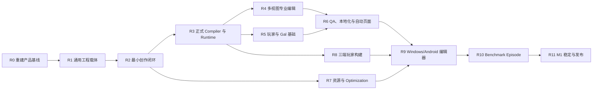

# 游戏引擎产品落地开发计划

> 生效日期：2026-08-13
> 目标版本：M1 Stable
> 上游需求：[PRD](03-prd.md)、[Gal 基础系统](11-gal-foundation-and-automation.md)、[优化规格](12-size-performance-stability.md)
> 状态权威：[M1 需求与验收追踪矩阵](90-m1-requirement-traceability.md)
> 核心原则：进度以“能否制作并交付真实游戏”衡量，不以平台 Spike、代码行数或孤立测试衡量。

## 1. 最终交付定义

M1 必须交付一套实际可用的视觉小说游戏引擎：

1. 创作者在 Windows 和 Android 上可以创建、打开和编辑同一个本地工程；
2. 工程包含角色、场景、资源、对白、选择、条件、变量、演出、配置、本地化和 QA 数据；
3. Route、Sequence、Script、Stage、Preview 和 Debugger 是同一 Canonical Project 的不同投影；
4. Compiler 将工程确定性编译为版本化 Runtime IR、Catalog 和资源 Manifest；
5. 同一 IR 在 Web、Windows、Android 玩家中产生一致剧情状态；
6. Windows 编辑器能够生成可正式分发的 Web、Windows、Android 产物；
7. 使用该引擎完成并发布一部 20–30 分钟的 Benchmark Episode；
8. 编辑器、玩家、工程和存档均通过恢复、性能、安装、升级、安全和发布审核。

在第 7 项完成前，项目只能称为开发版本，不能称为“引擎已落地”。

## 2. 执行规则

### 2.1 节点完成规则

每个节点必须同时具备：

- `Goal`：唯一、可验证的用户或引擎目标；
- `Scope`：明确包含和排除；
- `Inputs`：依赖的 Schema、模块、设计和前序节点；
- `Implementation`：具体代码、数据、UI 和迁移任务；
- `Artifacts`：可检查的工程、程序包、报告或截图；
- `Tests`：单元、契约、集成、E2E、故障和性能中适用的层级；
- `Acceptance`：可重复命令和用户任务；
- `Stop conditions`：出现何种事实必须停止扩展并修正设计。

缺任一项时节点状态最多为“进行中”。

### 2.2 状态流

`未开始 → 设计冻结 → 实现中 → 集成中 → 验收中 → 通过`

- “设计冻结”必须有 Schema/接口和验收用例；
- “实现中”不能对外宣称功能可用；
- “集成中”要求 UI 到 Domain 已连接，但尚未形成产物；
- “验收中”要求端到端链已贯通；
- “通过”要求证据已进入追踪矩阵。

### 2.3 主分支纪律

- 产品主分支只接收当前交付节点需要的变更；
- 技术实验使用可抛弃分支，必须声明服务的产品节点；
- 禁止继续堆叠不面向主线的 Spike；
- 每个 PR 只关闭一个可描述的产品/引擎结果；
- PR 描述必须列出 `REQ-*`、`AC-*`、失败路径和复现命令；
- 功能 PR 必须同时更新追踪矩阵；
- 不允许通过放宽超时、删除断言或降低设备门槛使节点变绿。

## 3. 交付拓扑

R1–R3 是最短可玩链。它们完成前，不新增资源高级算法、平台极端恢复或 P1/P2 能力。

## 4. 里程碑总览

| 里程碑 | 用户可见结果 | 进入条件 | 退出条件 |
|---|---|---|---|
| R0 重建产品基线 | 团队知道每个需求在哪里、怎样完成 | 本计划获批 | 追踪矩阵、Repo 主线、Golden 项目和 E2E 骨架存在 |
| R1 通用工程载体 | 可创建、保存、导出、重新打开任意工程 | R0 | 空项目和示例项目都可 round-trip，无固定项目假设 |
| R2 最小创作闭环 | 可制作一个 5 分钟分支短篇 | R1 | 角色/场景/对白/选择/条件/演出/预览/保存完整 |
| R3 Compiler 与 Runtime | 编辑内容可由正式 VM 运行 | R2 | Editor → Compiler → VM → Save/Load/Back 闭环 |
| R4 专业多视图 | Route/Sequence/Script/Stage 同源编辑 | R3 | 四视图和跨视图定位/撤销/同步通过 |
| R5 玩家与 Gal 基础 | 作品具有完整视觉小说玩家体验 | R3 | 玩家 UI、配置、历史、Auto、Skip、Save、输入可用 |
| R6 制作自动化 | QA、本地化、画廊/回想/音乐室自动生成 | R4+R5 | 特色生产功能端到端通过 |
| R7 Optimization | 优化结果可解释、可回退并进入构建 | R2 | 预算/Profile/资源变体/报告贯通 |
| R8 三端玩家 | 同一工程生成三端可玩产物 | R3 | Web/Windows/Android 固定路线状态一致 |
| R9 双端编辑器 | Windows/Android 完整创作 | R4+R6+R7+R8 | 双端核心任务和工程交换通过 |
| R10 验收作品 | 20–30 分钟真实游戏完成 | R9 | 三端分发包、用户测试、设备性能通过 |
| R11 M1 Stable | 可对外发布的引擎与玩家 | R10 | AC-01–AC-27 全通过且 Release Assurance 通过 |

## 5. R0：重建产品基线

### N00 产品主线与仓库基线

> 状态：通过。实现、自审、本地完整门、推送与 Draft PR Windows CI 均完成；证据见[《N00 产品主线与仓库基线审计》](91-n00-product-baseline-audit.md)。

- **Goal**：形成一个可连续集成的产品主分支，结束堆叠实验分支代替产品主线的状态。
- **Inputs**：S0.41 Web 原型、CL-03/04 已有证据、当前依赖锁。
- **Implementation**：
  1. 选择包含全部已审计代码的基线；
  2. 将实验宿主标记为 `spikes/` 或 `conformance/`，与正式应用隔离；
  3. 建立 `apps/editor`、`apps/player-web`、`apps/player-windows`、`apps/player-android`、`packages/project-domain`、`packages/project-compiler`、`packages/runtime`、`packages/build-core` 的目标边界；
  4. 为每个 workspace 定义 owner、稳定性等级和允许依赖方向；
  5. 建立产品主线 CI：format、typecheck、unit、integration、E2E、architecture、build。
- **Artifacts**：仓库结构 ADR、依赖图、绿色基线 CI。
- **Acceptance**：全新 checkout 一条命令安装、测试并启动编辑器。
- **Stop conditions**：正式包依赖 Spike App；同一语义存在两个不兼容模型；无法从干净环境复现。

### N01 需求追踪与演示工程

> 状态：通过。50 项 M1 追踪审计、七类 Golden Seed、PR 更新纪律、每周空目录演示、本地完整门和 Draft PR Windows CI 均完成。证据见[《N01 需求追踪与 Golden 基线审计》](92-n01-requirement-golden-baseline.md)。

- **Goal**：所有 P0 和 27 条验收均有 owner、实现节点、测试和证据位置。
- **Implementation**：
  1. 使用 `REQ-*` 和 `AC-*` 标识；
  2. 建立 Tiny、Branching、Media、CJK、Recovery、Size、Benchmark 七类 Golden Project；
  3. 每个 Golden Project 保存源工程、期望 IR Hash、关键状态 Hash 和构建 Manifest；
  4. 建立每周“空目录到 Web Build”演示脚本；
  5. 所有功能 PR 更新追踪矩阵。
- **Artifacts**：`fixtures/projects/*`、追踪矩阵、E2E 测试入口。
- **Acceptance**：CI 能验证追踪表无未知 REQ/AC、每项通过状态都有证据链接。

## 6. R1：通用工程载体

### N10 Canonical Project Schema

> 状态：通过。正式 `project-domain`、`.world` v1 多文件格式、S0/七类 Golden 迁移、任意工程 Editor Session 适配、本地完整门和 Draft PR Windows CI 均完成。证据见[《N10 Canonical Project Schema 审计》](93-n10-canonical-project-schema.md)。

- **Goal**：移除 `campusStoryProject` 固定假设，定义任意项目的权威数据边界。
- **Scope**：Project、Chapter、Scene、Character、Variable、Asset、Localization、Settings、UI、Plugin、Test Route、稳定 ID 和版本。
- **Implementation**：
  1. 新建平台无关 `project-domain`；
  2. 将 Project Manifest、脚本、角色/资源清单、布局 Sidecar 分为源文件；
  3. 冻结 JSON Schema 与 `.world` 文件版本；
  4. 稳定 ID 采用可生成、可校验、重命名不变的策略；
  5. 所有派生缓存可删除重建；
  6. 实现从 S0 固定快照到通用 Schema 的一次性迁移。
- **Tests**：Schema、重复 ID、未来版本只读、迁移幂等、未知字段保留、Git diff Golden。
- **Acceptance**：两个结构不同的工程可加载、保存、重载并保持语义 Hash。
- **Stop conditions**：项目语义仍从 UI state 推断；新增场景需要修改 TypeScript 常量；未知字段静默丢失。

### N11 Project Service 与事务命令

- **Goal**：所有视图通过同一命令修改项目，不直接写文件或维护第二份数据。
- **Implementation**：
  1. 定义 Create/Rename/Delete/Move Chapter/Scene/Character/Variable/Asset 命令；
  2. 定义 Insert/Update/Delete/Move Story Statement 命令；
  3. 命令包含 `commandId`、`expectedRevision`、稳定实体 ID 和结构化错误；
  4. 建立 ChangeSet、Undo/Redo、批处理和语义冲突；
  5. 将现有 SourceSession/patch 能力收敛为 Project Service 适配器；
  6. 保存只接收已提交 Project Revision。
- **Tests**：幂等、撤销重做、批处理原子性、陈旧 Revision、跨文件引用更新和故障注入。
- **Acceptance**：用命令从空 Project 创建两场景分支故事，撤销到空项目，再重做到相同 Hash。

### N12 项目首页与文件生命周期

- **Goal**：用户可以管理真实工程，而不是自动进入固定样例。
- **Implementation**：
  1. 新建、打开、最近、示例、导入、导出入口；
  2. 项目模板只提供默认值，不锁定结构；
  3. Windows 使用目录选择器；Web 使用 File System Access/OPFS；Android 后续接 SAF；
  4. 显示项目位置、Schema、脏状态、恢复状态和只读原因；
  5. 完整工程 ZIP 导入/导出防 Zip Slip；
  6. 外部文件变化检测、增量重载和三方冲突界面；
  7. 最近项目只保存引用和权限句柄，不复制权威内容。
- **Artifacts**：可下载/可 Git 管理的工程目录。
- **E2E**：新建 → 保存 → 关闭 → 重开；导出 → 清空本地状态 → 离线导入 → 重开。
- **Acceptance**：AC-08 在 Web/Windows 基础链通过；不存在固定项目 ID。

### N13 章节、场景、角色和变量管理

- **Goal**：创作者可以建立故事骨架和引用对象。
- **Implementation**：
  1. 章节/场景树的创建、删除、排序、重命名和入口设置；
  2. 角色、显示名、颜色、立绘槽位和默认表达式；
  3. Boolean/Number/String 变量、默认值、作用域和引用；
  4. 删除前引用分析和安全迁移；
  5. 手机不依赖拖拽的等价操作；
  6. 全局搜索覆盖新实体。
- **Acceptance**：从空项目建立 1 章、3 场景、2 角色、3 变量，保存重开后引用不变。

## 7. R2：最小创作闭环

### N20 Story Language P0

- **Goal**：脚本能够表达 M1 最小可玩故事。
- **Scope**：Dialogue、Narration、Choice、Label、Jump、Call/Return、Set、Condition、Wait、End、Background、Character、Audio。
- **Implementation**：
  1. 冻结语法和 CST/AST；
  2. 未知命令、注释、稳定 ID 和有效未知参数往返保留；
  3. 类型化表达式，不允许任意 JavaScript；
  4. 建立引用解析、补全、诊断、定义和引用索引；
  5. 实现所有 P0 节点的结构 Patch；
  6. Formatter 不改变语义或 ID。
- **Tests**：10 万行增量、1,000 次跨视图改写、未知插件、CJK/Ruby、嵌套条件和冲突。
- **Acceptance**：Branching Golden Project parse → edit → format → parse Hash 不变。

### N21 最小 Writer/Sequence 编辑

- **Goal**：非程序用户能完成对白、选择、条件和基础演出。
- **Implementation**：
  1. 语句卡覆盖 N20 全部 P0 类型；
  2. 插入菜单、快捷键、复制、删除、排序、批量选择、折叠；
  3. Inspector 使用类型化参数，不解析显示字符串；
  4. Choice 选项和 Condition 分支可视化编辑；
  5. 角色/变量/资源/场景引用使用稳定 ID 选择器；
  6. 错误不污染最后有效语义；
  7. 每个操作有键盘和触屏替代。
- **E2E**：创建对白 → 添加两选项 → 设置变量 → 条件进入两个结局 → 加入背景/BGM。
- **Acceptance**：不了解脚本语法的测试者能在 20 分钟内完成任务。

### N22 最小 Stage 与媒体预览

- **Goal**：创作者看到真实资源驱动的基础舞台结果。
- **Implementation**：
  1. Pixi/Canvas 场景层与 DOM 文本/UI 分离；
  2. 背景、角色槽位、表情、位置、缩放、旋转、锚点、层级；
  3. BGM/Voice/SFX/Ambient 基础播放和停止；
  4. Fade/Move/Show/Hide 基础过渡；
  5. 设计分辨率、横竖屏、安全区；
  6. 缺失/不可信资源安全占位；
  7. 当前语句、Stage 对象和 Sequence 卡同步选中。
- **Tests**：资源生命周期、Object URL 释放、错误解码、切场景、DPR、触摸命中和视觉 Golden。
- **Acceptance**：Media Golden Project 在 Preview 中正确显示和播放，不使用 CSS 假素材替代导入资源。

### N23 五分钟可玩切片 Gate

- **Goal**：第一次证明引擎主体，而不是局部组件。
- **Required artifact**：从空工程制作的 5 分钟、3 场景、2 角色、2 结局作品。
- **Required flow**：新建 → 资源导入 → 角色/变量 → 对白/选择/条件 → 演出 → 保存 → 关闭重开 → 预览完整路线。
- **Acceptance**：两名非实现者按任务脚本完成；Severity 0/1 为 0；工程不包含硬编码样例引用。
- **Gate**：N23 未通过，不进入 R4/R6/R7 的功能扩展。

## 8. R3：正式 Compiler 与 Runtime

### N30 Project Compiler

- **Goal**：将权威工程确定性编译为玩家可执行数据。
- **Implementation**：
  1. Project AST → 校验后的 Story IR；
  2. 生成 Source Map、Asset Manifest、Localization Catalog、Ending/Gallery/Replay/Music Catalog；
  3. 编译不可达、悬空引用、缺失资源和无出口诊断；
  4. 所有输出排序、版本和 Hash 确定；
  5. 增量编译按场景/资源失效；
  6. Debug 与 Release Profile 分离。
- **Artifacts**：`manifest.json`、`story.ir`、`source-map.json`、Catalog、licenses、SBOM 输入。
- **Tests**：同工程跨机器 Hash、一字符变更最小失效、错误源码定位、未来 Opcode 拒绝。
- **Acceptance**：Tiny/Branching/Media/CJK 工程均生成稳定 IR。

### N31 正式 Narrative Runtime

- **Goal**：把 VM Spike 收敛成受支持的 Runtime 包。
- **Implementation**：
  1. 将 VM-01–VM-15 契约迁入正式包；
  2. 版本化 State、PRNG、Call Stack、Scene State、Meta Progress；
  3. Effect 请求、取消、Barrier 和宿主响应协议；
  4. Save/Load、Checkpoint、History、Back/Forward；
  5. Normal/Auto/Skip Read/Skip All/Instant 调度；
  6. 结构化诊断映射到 Source Statement ID；
  7. 移除正式包对 Spike Harness 的依赖。
- **Tests**：固定向量、10k corpus、损坏/未来 Save、异步竞态、Barrier、分支截断。
- **Acceptance**：同一 IR/输入在 Node 与 Web Worker State Hash 零差异，全套测试在预算内稳定通过。

### N32 Editor Preview 接入正式 Runtime

- **Goal**：编辑器中看到的结果就是玩家 Runtime 的结果。
- **Implementation**：
  1. Preview 只消费 Compiler 输出，不直接遍历 StoryStatement；
  2. Run from Entry/Scene/Statement；
  3. 当前变量、调用栈、语句、Effect 和舞台状态可见；
  4. Step Back/Forward/Over、Continue、Run to Cursor；
  5. 热更新保留安全状态，结构变更时明确重启；
  6. Preview 和 Player 共用渲染/音频 Host Adapter。
- **Acceptance**：Editor Preview 与 Web Player 对固定输入产生相同状态和画面关键快照。

## 9. R4：专业多视图编辑

### N40 Route Map

- **Goal**：大型故事结构可理解、可定位、可诊断，但不维护第二份剧情逻辑。
- **Implementation**：章节、场景、标签、选择、条件、跳转、调用、结局自动投影；布局 Sidecar；分组/折叠/搜索/过滤/局部加载；不可达/悬空/循环；路线高亮；双击进入 Sequence。
- **Tests**：真实 10k 分支图，不使用线性轨道替代；布局删除不丢剧情；脚本增量更新保留布局。
- **Acceptance**：10k Route 在目标预算内局部编辑，修改 Script 后图在 500 ms 内同步。

### N41 Sequence

- **Goal**：提供场景内部完整的可视化语义编辑。
- **Implementation**：全部 P0 块、类型化 Inspector、运行高亮、搜索插入、批量、折叠、跨视图定位；复杂条件允许进入 Script 但不得丢失。
- **Acceptance**：Sequence 和 Script 连续互改 1,000 次，语义和稳定 ID 不漂移。

### N42 Stage 与基础时间线

- **Goal**：导演能操控镜头、角色、背景、音频和基础特效。
- **Implementation**：多轨、关键帧、缓动、运动轨迹、镜头、基础转场；Stage 操控生成语义命令；当前 Runtime 状态与时间线同步；ADV/NVL/气泡模板。
- **Acceptance**：AC-13 样例在 Editor Preview 和 Player 中一致。

### N43 七工作模式与跨视图协议

- **Goal**：Writer、Director、Flow、Production、Debug & QA、Mobile Focus、Quick Start 修改同一工程。
- **Implementation**：模式是布局/工具优先级，不是独立数据；Beginner/Pro 可逆；统一语义色/图标；减少动效；选中/上下文同步协议。
- **Acceptance**：AC-03、04、10、11、12 全部在桌面通过，移动任务另在 N91 验收。

## 10. R5：玩家与 Gal 基础

### N50 Player Shell 与输入

- **Goal**：形成可嵌入 Web/Windows/Android 的正式玩家。
- **Implementation**：标题、开始/继续、对话、选择、历史、设置、存读档、错误页；鼠标/键盘/触摸/基础手柄；响应式安全区；无障碍语义。
- **Acceptance**：同一 Player Core 被三宿主使用，不复制剧情逻辑。

### N51 Gal 配置中心

- **Goal**：所有 P0 Gal 行为可配置、可继承、可预览。
- **Implementation**：Basic/Advanced、搜索、恢复默认；默认/项目/平台层；显示、文本、推进、Auto、Skip、Save、History、Back、画面、音频、选择、路线、输入；Master/BGM/Voice/SFX/Ambient/UI；Windows/Web/Android Profile。
- **Tests**：继承优先级、撤销、非法组合、序列化、运行时热应用、平台覆盖。
- **Acceptance**：REQ-GAL 全部 P0 字段可从 UI 修改并影响 Preview/Player。

### N52 Save、History、Auto、Skip、Back/Forward

- **Goal**：特色播放控制成为玩家功能而非 VM 测试。
- **Implementation**：存档槽、自动/快速保存、截图和元数据；历史；独立 Auto 策略；四种 Skip；玩家速度；媒体分类策略；Stop Point；已读集合；分支改变截断 Forward；Barrier 解释。
- **Acceptance**：AC-15、16 在 Web Player 通过，随后在三端复用同一向量。

## 11. R6：制作自动化、QA 与本地化

### N60 Debugger 与 Story QA

- **Goal**：创作者在发布前发现结构和状态错误。
- **Implementation**：从任意入口运行；断点、单步、继续；变量、调用栈、舞台；不可达、无出口、悬空、缺失资源、无交互循环；错误跳源码；诊断抑制需有理由。
- **Acceptance**：QA Golden Project 必须检出预置错误且无误报阻断正常路线。

### N61 本地化与配音

- **Goal**：同一稳定文本 ID 支持多语言生产和运行切换。
- **Implementation**：源/目标语言、CSV/XLSX、missing/draft/reviewed/outdated/locked、运行时切换、CJK/Ruby/禁则、字体回退、Voice Asset 映射。
- **Acceptance**：CJK Golden 在导出/导入后换行和 ID 不变，三端切换语言状态一致。

### N62 自动 Route、Gallery、Replay、Music、Ending Catalog

- **Goal**：把核心差异化自动化真正接入 Compiler 和 Player。
- **Implementation**：从资源标签、故事引用和解锁条件生成 Catalog；允许标题/排序/封面/剧透/本地化覆盖；Scene Replay 使用隔离 Checkpoint；退出恢复原状态；缩略图缺失诊断；玩家流程图只显示已发现内容。
- **Acceptance**：AC-17、18、20；Catalog 不要求维护第二份手工列表。

## 12. R7：资源与 Optimization Center

### N70 完整 Asset Pipeline

- **Goal**：源素材安全、可追踪并可为构建生成平台变体。
- **Implementation**：图像/音频/视频/字体导入；MIME/魔数/容量安全；标签/搜索/引用计数；重命名；缺失/未使用/超规格；Source/Derivative DAG；平台变体；删除派生后重建。
- **Acceptance**：Asset Golden 在备份、恢复、重命名、GC、重建后引用和内容 Hash 正确。

### N71 Optimization Center

- **Goal**：优化以下载、安装、内存、加载、帧时间和稳定性联合预算驱动。
- **Implementation**：Quality First/Balanced/Small Download/Low Memory/Custom；预算面板；体积排行；重复资源；First Playable/章节/语言/语音依赖；优化解释、撤销、锁定和原始回退。
- **Acceptance**：每个建议显示输入证据、预计收益、实际收益和回退操作，不以源文件大小冒充综合收益。

### N72 Dicing 和平台资源变体集成

- **Goal**：把现有强算法转成可发布收益。
- **Implementation**：Dicing Group/Atlas/编码/Runtime Loader 接入 Build；三端格式/解码/显存/Draw Call 测量；无收益回退；差异热图和逐像素验证。
- **Acceptance**：AC-21、22、23；Golden Dicing 三端无接缝、可重建、报告完整。

## 13. R8：三端玩家与构建

### N80 Web Build

- **Goal**：一键生成可离线托管的 Web/PWA 玩家。
- **Implementation**：Release IR、资源、Service Worker、压缩、许可证、版本、Hash、调试映射策略；本地预览服务器；无网络运行。
- **Acceptance**：从空 checkout 构建，产物在两种主流浏览器离线运行固定路线。

### N81 Windows Player Build

- **Goal**：生成便携包和安装包，而不是复用编辑器开发壳。
- **Implementation**：轻量 Player Host、WebView Runtime 策略、图标/版本、安装/卸载、签名或可验证 Hash、崩溃日志和回退。
- **Acceptance**：干净 Windows VM 安装、运行、存档、升级、卸载通过。

### N82 Android Player Build

- **Goal**：生成可安装 APK/AAB 和可验证签名产物。
- **Implementation**：Player Host、私有存储、Asset Packaging/Delivery、方向/安全区、后台恢复、Keystore 向导、APK/AAB、签名验证。
- **Acceptance**：AND-L/AND-R 安装运行、前后台、存档、升级和固定路线通过。

### N83 Build Center 与 Release Manifest

- **Goal**：Windows 编辑器以统一界面构建三端并解释失败。
- **Implementation**：平台/Profile、应用 ID/版本/图标、Preflight、进度、取消、日志、产物目录、失败分类、可复现 Manifest、SBOM、Provenance、许可证/隐私/第三方声明/发布说明/校验值/回退说明。
- **Acceptance**：AC-07、26 的产物由同一 Revision、同一工程和可追溯流水线生成。

## 14. R9：Windows 与 Android 编辑器

### N90 Windows Editor Productization

- **Goal**：把 Web Editor 装入最终 Windows Host 并提供完整本地工程能力。
- **Inputs**：只有到此节点才恢复 CL-03 尚需的系统 picker、真实 WAL 强杀、更新、签名和 WIN-L 工作。
- **Implementation**：根据产品切片选择 Electron/Tauri；系统项目选择；安全 Bridge；安装/更新/回退；崩溃恢复；Build Center；WIN-L 测量。
- **Acceptance**：WS-01–WS-18、AC-01/02/08/09/14/27 的 Windows 部分通过。

### N91 Android Editor Productization

- **Goal**：Android 是完整编辑端，不是响应式预览器。
- **Implementation**：Mobile Focus、底部导航、任务化 Inspector、IME、SAF 导入导出、私有工作区、后台恢复、低内存策略、触屏替代；使用相同 Domain/Compiler/Runtime。
- **Acceptance**：AND-L/AND-R 上完成新建工程、写对白、添加分支、修改演出、预览、保存、导出；AI/AS 契约和 AC-01/02/10/14/27 Android 部分通过。

### N92 工程交换和三宿主一致性

- **Goal**：Windows、Android、Web 对同一工程和 Runtime 语义无漂移。
- **Implementation**：工程 ZIP/目录交换、Schema 迁移、IR/State/Save Hash 对照、平台 Capability 明确降级、冲突和失败可诊断。
- **Acceptance**：同一工程连续在 Windows/Android 编辑一周，Web/Windows/Android 固定输入状态零差异。

## 15. R10：Benchmark Episode

### N100 内容生产

- **Goal**：只使用 WorLd Studio 制作 20–30 分钟原创校园短篇。
- **Required content**：3+ 章节、8+ 场景、2+ 主路线、4+ 结局、角色/表情/CG/BGM/Voice/SFX、变量/条件、Save/History/Auto/Skip/Back、Gallery/Replay/Music/Ending、多语言样例。
- **Rule**：禁止直接修改生成 IR、Catalog 或构建产物绕过编辑器。
- **Artifacts**：完整源工程、素材许可、测试路线、三端产物。

### N101 创作者验证

- **Goal**：证明信息架构和工作流对目标用户可用。
- **Method**：至少 5 名目标创作者完成新建、写作、分支、演出、调试、构建任务；记录完成率、时间、错误和 Severity。
- **Acceptance**：核心任务至少 8/10 无指导完成；Severity 0/1 为 0。

### N102 设备、稳定性和一致性

- **Goal**：作品在目标设备真实可发布。
- **Tests**：WIN-L、AND-L、AND-R；冷启动、内存、帧时间、包体；2 小时 Soak；弱网/断网/损坏/磁盘不足；Save 升级；三端路线 Hash 和截图 Golden。
- **Acceptance**：AC-14、20、23、24、25、26 全通过。

## 16. R11：M1 Stable 与发布

### N110 Release Assurance

- **Goal**：编辑器和玩家具备可重复、可撤回的正式发布证据。
- **Implementation**：版本冻结、依赖审计、SBOM、Provenance、签名、恶意工程测试、安装/升级/卸载、隐私/许可证、崩溃符号、备份恢复演练、撤回和回退。
- **Acceptance**：AC-27 通过，无阻塞级数据损坏、安全、状态漂移或安装问题。

### N111 M1 Gate

M1 只有同时满足以下条件才能标记 Stable：

- `REQ-PRJ` 至 `REQ-OPT` 的 P0 状态全部为“发布完成”；
- `AC-01` 至 `AC-27` 全部通过；
- Benchmark Episode 三端正式包由同一 Revision 生成；
- Windows/Android 编辑器正式安装包通过升级和回退；
- 全仓 `check`、E2E、设备矩阵和 Release Assurance 全绿；
- 产品负责人、Architecture、QA、Security、Release 联合签字。

任何“部分通过”“待补真机”“仅原型”“已知红项”都不能带入 Stable。

## 17. 每周执行节奏

### 周一：节点冻结

- 只选择一个当前 Gate 的最小用户结果；
- 冻结 REQ/AC、Schema、失败路径和演示脚本；
- 明确不做项，防止横向扩张。

### 周二至周四：纵向实现

- 优先贯通 UI → Command → Domain → Compiler → Runtime/Storage；
- 测试与实现同 PR；
- 每天使用非固定工程运行一次主流程。

### 周五：作品演练

- 从空目录创建工程；
- 不使用开发者工具修数据；
- 生成当周可玩的 Web Build；
- 记录阻塞点进入下一节点，而不是用手工步骤掩盖。

### Gate 评审

- 演示真实产物，不演示测试日志代替产品；
- 随机选择一个非示例工程复验；
- 失败时回到当前节点，不开启新功能线。

## 18. 优先级与并行限制

最多并行三条线：

1. **主产品纵向线**：始终占主要资源；
2. **质量/测试线**：为当前节点建立证据；
3. **平台/风险线**：仅处理当前节点的确定阻塞。

禁止并行：P1/P2 功能、云服务、市场、AI、实时协作、iOS、复杂插件生态。它们在 M1 Gate 后重新评审。

## 19. 最近执行顺序

下一批工作严格按以下顺序：

1. N00：建立产品主线和正式包边界；
2. N10：通用 Canonical Project Schema；
3. N11：项目级 Command/Transaction；
4. N12：项目首页、新建/打开/导入/导出；
5. N13：章节/场景/角色/变量管理；
6. N20：补齐 Story Language P0；
7. N21：最小 Writer/Sequence；
8. N22：真实资源 Stage/Preview；
9. N23：五分钟可玩切片 Gate；
10. N30–N32：正式 Compiler/Runtime/Preview。

在 N23 通过前，CL-02/03/04 只维护已有证据，不继续新增探索 Spike。

## 20. M1 之后的需求入口

M1 Gate 通过后才允许重新规划 P1/P2。规划顺序必须重新基于真实创作者数据，而不是直接照抄当前愿景池：

1. 汇总 Benchmark Episode、5 名创作者和首批发布作品的数据；
2. 从[追踪矩阵的 P1/P2 保留登记](90-m1-requirement-traceability.md)选择问题，不先选择技术；
3. 为候选能力建立收益、复杂度、兼容、安全和迁移评估；
4. 产品负责人重新确认 M2 范围、预算和退出条件；
5. iOS、云同步、实时协作、插件市场、AI、Storylet 和高级 3D 分别建立独立 Gate；
6. M1 工程、存档和玩家兼容不得为了后续功能被静默破坏。

因此，所有 PRD 需求均有去向：P0 进入 N00–N111，P1/P2 进入 FUTURE 登记；未排期不等于删除，也不允许提前实现扰乱 M1 主线。
